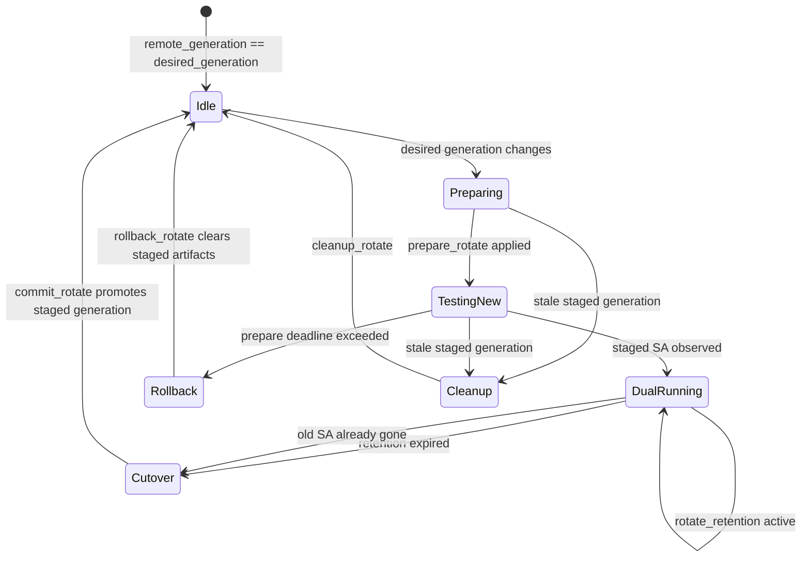

# Higgs Mesh VPN 控制平面设计

> **文档状态（2026-06）**
> Phase 0–4 已落地实现，Phase 5 路由授权与 BIRD Babel adapter 第一版已实现。
> 各 Phase 完成情况见 `../todo.md`；Phase 4（StrongSwan/IKEv2 + XFRM interface 建链）已完整实现；Phase 5 第一版已实现 route announcement / IPAM record、AuthorizedRouteSet、BIRD config generator / birdc client / process manager、daemon routing reconcile、`higgs route` 与 `higgs debug babel/routes/route` CLI，并通过 `make routing-dry-run-smoke` 验证。
> 
> **待调整：** BIRD 实例应从「每个 overlay 一个 BIRD」改为「每个 netns 一个 BIRD」。同一 netns 内的多个 overlay 共享同一路由守护进程，routing 配置从 `overlays[].routing` 上提到 `routing.instances[]` / `netns` 层级。详见下文 Phase 5 / netns 章节。

## 原始需求摘要

目标是实现一套 mesh vpn 的控制程序（控制平面）。整个网络运行在三层 p2p 互联网络，之上运行路由协议。目前的初步设计如下：

底层传输协议：
1. wireguard 
2. strongswan udp ikev2

可选的兼容层：
1. vxlan (用于实现二层网络)
2. seg6 用于封装复杂

上层路由协议：
1. **bird: babel**（Phase 5 默认后端）
2. babeld: babel（历史参考，已不再作为主路径）

控制平面主要功能：
1. 节点之间建立起一套去中心化的最终一致的配置同步机制。权限通过ed25519密钥签名实现，权限细分为：准入（主签名节点的子密钥），核准ip（主密钥签名ip分配记录，子密钥继续签名分配），公布自己节点的信息（节点的子密钥签名自己的内容）。
2. 节点之间建立底层传输协议
3. 当节点信息更改时调整传输协议
4. 对应调整路由协议，filter，准入，防火墙等等。
5. 配置seg6等

需要一些特殊的点：
1. 底层传输协议可以有线路并行，例如既有wg，又有ikev2，还可以加上gre等
2. 为了防止流量被劣化，考虑到“跳频”的功能，即如果是udp+port协议（例如wg），动态建立监听多个端口，约定好时间切换，有点像证书的rotate，不过是端口的rotate。

实现： go语言
平台： linux

## 一、架构

### 1.1 核心决策
| 方向 | 决策 | 说明 |
|------|------|------|
| 配置同步机制 | **DNS 式层级作用域 (Zone) + Signed Merkle DAG + Gossip** | 整个系统的基石 |
| 第一阶段传输 | **StrongSwan/IKEv2 + XFRM interface + BIRD Babel** | 动态路由、多 peer、namespace 和撤销清理作为主线；Phase 5 默认 BIRD 跑 Babel protocol；WireGuard 后移为可选轻量传输驱动 |
| 跳频/多线路 | Phase 6 | 高级对抗/优化特性，待控制平面稳定后再做 |
| 系统服务交互 | `vici`（StrongSwan）/ `netlink`（XFRM/路由/WG）/ `birdc`（BIRD）/ `exec`（兜底） | 按组件分层 |

### 1.1.1 文档分工

本仓库里与 gossip 相关的文档按读者分工：

- `docs/gossip-protocol.md` 是 gossip canonical 规范，面向 operator、实现者和测试作者。它描述 wire message、catalog sync、object pull、UDP chunk fallback、endpoint discovery、NAT observed path 和 trust boundary 的当前规则/目标规则。
- `docs/protocol.md` 是控制面协议总览，保留 IPsec / overlay signed record 规范，并链接到 gossip 专文。
- 本文 `docs/design.md` 是架构设计，面向长期维护者和 AI agent。它描述为什么要这样分层、哪些边界不能混、哪些历史设计已经被后续实现替代。
- 代码附近的测试和 smoke 是可执行规范。如果本文与 `docs/gossip-protocol.md` 冲突，以 `docs/gossip-protocol.md` 的当前协议规则和已通过测试为准，然后回头修本文。

gossip 维护时尤其要避免三种混淆：

- **身份与可达性混淆**：Zone trust chain / record signature 决定身份和授权；bootstrap、signed endpoint、reflector、DNS、observed UDP path 只提供联系候选。
- **hint 与完整对象混淆**：`announce` 首先是 digest hint，可以携带小而完整的 payload；不能把多条 UDP record announce 当成事务或完整性保证。
- **bulk path 与 fallback 混淆**：大对象主路径是 TCP object pull；UDP chunk fallback 只在 TCP 不可达时兜底。

### 1.2 总体架构（核心 + 插件）

```
┌──────────────────────────────────────────────────┐
│             app/higgs/  (CLI / daemon 入口)       │
│  init · keygen · join · delegate · record        │
│  verify · daemon · sync · debug · db             │
├──────────────┬───────────────┬───────────────────┤
│  pkg/core/   │ pkg/transport/│  pkg/routing/     │
│              │   drivers     │    adapters        │
├──────────────┼───────────────┼───────────────────┤
│ ✅ identity  │ ✅ ipsec      │ 🟨 bird           │
│ ✅ gossip    │   (Phase 4)   │   (Phase 5)        │
│ ✅ zone      │               │                   │
│ 🔲 merkle   │               │                   │
│ ✅ crypto    │               │                   │
├──────────────┴───────────────┴───────────────────┤
│           overlay (Phase 6 规划)                  │
│       vxlan (🔲)    seg6 (🔲)                    │
└──────────────────────────────────────────────────┘

✅ = 已实现   🟨 = 部分实现/系统闭环扩展中   🔲 = 已建目录/存根，待实现
```

---

## 二、核心设计：DNS 式层级作用域（Zone）K-V 配置系统

这是整个 higgs 控制平面最本质的创新点。**全网配置呈现为一组层级化的 K-V 数据库，权限通过 Zone 委派实现，配置支持向下覆盖继承。**

### 2.1 核心概念

**Zone（作用域）**
- 类似 DNS 域名，如 `.`（根）、`catofes.`、`pek.catofes.`、`node1.pek.catofes.`
- 每个 Zone 是一个独立的命名空间，内部包含 K-V 记录和子 Zone 委派声明
- Zone `A.B.` 的创建必须由 Zone `B.` 的当前持有者签名授权

**ZoneAuthority（Zone 的写权限主体）**
- 每个 Zone 的实际写权限主体不是单 key，而是可扩展的 `ZoneAuthority`（keyset + threshold + epoch）
- Phase 0 可先退化为 `threshold=1`，但数据模型从第一天保留多 key/轮换能力
- Phase 0 明确只接受 `threshold=1`；遇到 `threshold>1` 的 ZoneAuthority 必须拒绝并返回 `unsupported threshold`，避免把多签数据误按单签验证
- 根 key 仅用于签发/轮换 authority；日常写入使用 operational key
- `ZoneAuthority` 变更（epoch 递增）时，父 Zone 的 `Delegation` 必须同步更新 `AuthorityEpoch` + `AuthorityHash`

**Delegation（委派）**
- 父 Zone 授权的不是"某个 key"，而是"某个 ZoneAuthority"
- `Delegation` 包含：
  - `zone: pek.catofes.`
  - `authority_epoch: 3`
  - `authority_hash: 0x...`（blake2b(ZoneAuthority)）
  - `authority: ZoneAuthority{Keys: [...], Threshold: 1, Epoch: 3}`
  - `signature: 0x...`（由父 Zone 的当前持有者签名）
- 子 Zone 的 `ParentProof` 只是该 `Delegation` 的缓存副本，**唯一权威来源始终是父 Zone 中的 `delegations/<child>` 记录**

**Record（K-V 记录）**
- Zone 内的任意键值对，key 形如 `wireguard/public_key`、`routes/announcements/10.0.1.1_32`
- 每条 Record 必须由该 Zone 当前有效的 `ZoneAuthority` 中的某个 key 签名
- Record 必须带类型与版本链，`Timestamp` 仅作为审计字段，**禁止用于冲突裁决**
- 建议内置类型：
  - `node.identity`
  - `node.endpoint`
  - `wireguard.public_key`
  - `wireguard.listen_port`
  - `ipam.assignment`
  - `route.announcement`
  - `policy.uint`
  - `policy.string`
  - `policy.string_list`

**配置向下覆盖（Fallback/继承）**
- 查询 `pek.catofes./policy/mtu` 时，先在该 Zone 查找
- 若不存在，去掉最左一级，在 `catofes.` 中继续查找 `policy/mtu`
- 直到根 Zone `.` 或找到为止
- 这与 DNS 查询不同，更接近配置系统的 override/继承模型

### 2.2 一个完整的配置示例

```
. (根 Zone，由创世主密钥持有)
├── authority
│   └── ZoneAuthority{Epoch: 1, Keys: [<root-pubkey>], Threshold: 1}
├── records/
│   ├── policy/allowed-transports  → "wireguard"
│   ├── policy/default-ip-pool     → "10.0.0.0/8"
│   └── policy/mtu                 → "1420"
│
└── delegations/
    └── catofes. → Delegation{
        AuthorityEpoch: 1,
        AuthorityHash: 0x...,
        Authority: ZoneAuthority{Keys: [<alice-pubkey>], Threshold: 1, Epoch: 1},
        SignedBy: <root-pubkey>
    }

catofes.
├── authority
│   └── ZoneAuthority{Epoch: 1, Keys: [<alice-pubkey>], Threshold: 1}
├── records/
│   ├── policy/mtu                 → "1400"          ← 覆盖根的 1420
│   └── ipam/pools/10.0.1.0/24    → {delegated_to: "pek.catofes."}
│
└── delegations/
    ├── pek.catofes.  → Delegation{Authority: ZoneAuthority{Keys: [<bob-pubkey>], ...}, SignedBy: <alice>}
    └── node1.catofes. → Delegation{Authority: ZoneAuthority{Keys: [<node1-pubkey>], ...}, SignedBy: <alice>}

pek.catofes.
├── authority
│   └── ZoneAuthority{Epoch: 1, Keys: [<bob-pubkey>], Threshold: 1}
└── records/
    └── ipam/assignments/10.0.1.1/32 → {assigned_to: "node1.catofes."}  ← bob 分配的 IP

node1.catofes.
├── authority
│   └── ZoneAuthority{Epoch: 1, Keys: [<node1-pubkey>], Threshold: 1}
└── records/
    ├── identity                    → {name: "node1"}
    ├── endpoints/public            → "1.2.3.4:51820"
    ├── wireguard/public_key        → "0xnode1wgpubkey..."
    ├── wireguard/listen_port       → "51820"
    └── routes/announcements/10.0.1.1_32 → "10.0.1.1/32"
```

**验证签名链示例：**
- 读取 `node1.catofes./wireguard/public_key` 时：
  1. 取出 Record，验证 `SignedBy` 是否属于 `node1.catofes.` 的 `ZoneAuthority.Keys`
  2. 验证该 key 的 `Capabilities` 包含 `write`（或更细粒度的 `write:wireguard`）
  3. 验证 `node1.catofes.` 的 `ParentProof`（Delegation）签名者属于 `catofes.` 的 `ZoneAuthority.Keys`
  4. 验证 `catofes.` 的 `ParentProof` 签名者属于 `.` 的 `ZoneAuthority.Keys`
  5. 全部通过 → 配置可信

**查询与覆盖示例：**
- `Get("node1.catofes./wireguard/public_key")` → 命中 `node1.catofes.` 的 `wireguard/public_key`
- `Get("pek.catofes./policy/mtu")` → `pek.catofes.` 无此 key → 查 `catofes./policy/mtu` → 命中 `"1400"`
- `Get("node1.catofes./policy/allowed-transports")` → 一路回退到 `.` → 命中 `"wireguard"`

### 2.3 与 Mesh VPN 各功能的映射

| 原需求 | Zone K-V 映射 |
|--------|--------------|
| 节点准入 | 父 Zone 签发一个 `nodeX.parent.` 的 delegation（委派 ZoneAuthority） |
| 节点自宣告信息 | 节点用自身 operational key 在 `nodeX.parent.` 下写 `wireguard/*`、`endpoints/*`、`routes/*` 等 Record |
| IP 分配 | 在 Zone 下写 `ipam/pools/*` 或 `ipam/assignments/*` Record |
| 路由宣告 | `nodeX.parent./routes/announcements/<prefix>` Record |
| 全局策略 | 在 `.` 或中间 Zone 设置 `policy/*` Record，被子 Zone 继承 |
| 传输层参数 | `nodeX.parent./wireguard/*`、`nodeX.parent./ipsec/*` 等 Record |

### 2.4 Overlay / Provider / Link Policy（Phase 4+）

Phase 4 进入 StrongSwan/IKEv2 + XFRM interface 后，控制平面的核心不应退化成“发现一个节点后，管理员手写一条 VPN link”。Higgs 的目标是用已同步的 Zone 状态、节点公开能力和本地规则快速构建 mesh。因此必须把“选择哪些节点互联”和“用 StrongSwan 具体怎么建链”分层：

```text
Local MeshPolicy
        ↓
Verified NodeProfile / IPsec records
        ↓
LinkPlanner
        ↓
TransportLinkSpec
        ↓
OverlayProvider(strongswan)
        ↓
VICI + XFRM apply
```

**MeshPolicy（本地策略，不 gossip 公开）**
- 描述本节点希望连接哪些 peer、使用哪个 overlay/provider、方向、地址族、候选来源、path mode 和数量限制。
- 默认持久化在本机 daemon 配置或本地 DB policy 中；它是本节点的拓扑和安全策略，不应作为普通 public record 向全网广播。
- 支持手工 override，但第一目标是规则驱动 mesh，而不是给每个 peer 手写 link。

**Public NodeProfile / IPsec profile（可 gossip 公开）**
- 节点可以公开“我支持 IPsec，我愿意被哪些类型的 peer 尝试连接，我有哪些候选地址/端口”。
- 公开的是能力和 accept intent，不是完整连接清单。这样可让远端自动决定是否匹配自己的 MeshPolicy，同时避免泄露完整拓扑。

**OverlayProvider（具体系统驱动）**
- `provider=strongswan` 是 Phase 4 唯一实现目标，负责把 `TransportLinkSpec` 转成 VICI connection/secret、XFRM interface、地址和清理动作。
- 后续可以增加 `wireguard`、`vxlan`、`gre`、`seg6`。高层 mesh 选择规则不应依赖 StrongSwan 内部字段。
- 更高层 overlay 可以声明 underlay，例如 `vxlan` 跑在 `strongswan` overlay 之上；Phase 4 只保留模型兼容性，不实现 VXLAN。

#### 2.4.1 Public IPsec records

Phase 4 已实现以下 signed record 的模型、解析和 planner 消费路径。所有记录都由节点自身 Zone authority 签名，通过普通 gossip 同步，远端只在 `VerifyChain` / `VerifyRecord` 通过后使用。

```text
node-a.catofes./ipsec/profile
node-a.catofes./ipsec/addresses
node-a.catofes./ipsec/ports
node-a.catofes./ipsec/transport-key
```

`ipsec/profile` 示例：

```json
{
  "version": 1,
  "enabled": true,
  "provider": "strongswan",
  "ike_identity": "node-a.catofes.",
  "transport_key_fingerprint": "b2:...",
  "accept": "inbound",
  "address_families": ["ipv6", "ipv4"],
  "path_modes": ["family-redundant", "exhaustive"],
  "nat": {
    "hint": "unknown",
    "inbound_reachable": "unknown"
  },
  "updated_at": 1717171717
}
```

`accept` 由本节点通过配置项 `ipsec.accept` 设置并写入 `ipsec/profile`，作为节点级能力声明广播给所有 peer。含义：
- `none`：不接受自动 mesh 拨入；本节点只主动拨出。
- `inbound`：本节点愿意接受匹配 policy 的远端主动拨入，但自身不主动拨出。
- `bidirectional`：本节点既可接受拨入，也可主动拨出；双方都是 `bidirectional` 时用稳定 tie-break 避免重复拨号。

NAT 字段只是 hint，不是安全事实。远端必须结合地址来源、端口公告、连接结果和本地策略判断是否可达。

#### 2.4.2 地址与端口分离

IPsec endpoint 不应直接建模为单个 `ip:port`。端口后续可能在配置范围内动态选择、短期保留旧端口、甚至做较快 rotate；地址也可能来自 DNS、discovery、reflector 或本地接口扫描。Phase 4 使用三层模型：

```text
AddressCandidate      # 当前可用地址或域名解析结果
PortAdvertisement     # 当前可用 IKE/NAT-T 端口公告
ContactPoint          # AddressCandidate + PortAdvertisement 组合出的实际拨号目标
```

`ipsec/addresses` 示例：

```json
{
  "version": 1,
  "addresses": [
    {
      "id": "dns-main",
      "source": "manual-dns",
      "host": "node-a.example.com",
      "families": ["ipv6", "ipv4"],
      "refresh_seconds": 60,
      "priority": 90,
      "reachability": "public",
      "ttl_seconds": 300
    },
    {
      "id": "reflector-v4",
      "source": "reflector",
      "address": "203.0.113.10",
      "family": "ipv4",
      "priority": 60,
      "reachability": "nat-observed",
      "last_observed": 1717171717,
      "ttl_seconds": 600
    }
  ],
  "updated_at": 1717171717
}
```

地址来源：
- `manual-address`：管理员明确配置的 IP。
- `manual-dns`：管理员明确配置的域名；daemon 保存原始域名，并定期 refresh A/AAAA。
- `discovery`：可选 discovery server 返回的候选地址或域名。
- `reflector`：reflector 观察到的外部地址；主要用于 NAT/公网变化场景。
- `local`：本机接口扫描结果；适合 LAN/实验，公网默认应允许禁用。

Go 实现里 DNS/discovery host 被建模为运行时候选展开，而不是 signed record 里的固定 endpoint：`manual-dns` / `discovery` record 保留原始域名；planner 通过 resolver 把 A/AAAA 结果展开成 `AddressCandidate`，再与 `PortAdvertisement` 组合为 `ContactPoint`。这样 DNS refresh 或 discovery 返回变化只影响本地 desired-state 计算，不改变 Zone 签名记录本身。

DNS、discovery、reflector 的优先级不能写死。动态 DNS 本质上也可能只是公网反射/发现机制的包装，因此本地配置应允许指定顺序，例如：

```yaml
ipsec_address_source_order:
  - manual-address
  - manual-dns
  - discovery
  - reflector
  - local
```

当前 `AddressCandidateOptions.SourceOrder` / `AllowedSources` 已经把 source order 和本地 rule 过滤作为运行时输入；排序先看来源顺序，再看单条 `priority`。`local` 来源默认不使用 private/link-local/interface-scan 候选，只有 LAN/实验或管理员显式启用时才通过 `AllowPrivateLocal` 放行，避免公网 IPsec 误连内网地址。

`ipsec/ports` 示例：

```json
{
  "version": 1,
  "mode": "range",
  "range": {"from": 30000, "to": 30999},
  "current": {
    "generation": 42,
    "ike": {"local": 30412, "advertised": 30412, "observed": 30412},
    "natt": {"local": 30413, "advertised": 30413, "observed": 30413},
    "valid_until": 1717175317
  },
  "previous": [
    {
      "generation": 41,
      "ike": {"advertised": 30100},
      "natt": {"advertised": 30101},
      "valid_until": 1717172017
    }
  ],
  "updated_at": 1717171717
}
```

端口语义：
- `local`：本机 StrongSwan/charon 实际监听端口。
- `advertised`：希望远端拨入的端口。
- `observed`：reflector/discovery 从外部看到的端口；NAT 后可能与 local 不同。
- `current`：首选当前端口。
- `previous`：端口轮换 grace 窗口内可回退的旧端口。
- `range`：daemon 可在该范围内选择端口；也可配置固定端口。

Phase 4 当前把端口作为独立公告对象建模，并支持固定/范围/current/previous grace 的规划与 dry-run。`PlanPortRecord` 负责把本地策略、上一代公告和 grace window 转成待签名的 `ipsec/ports` payload；peer 侧继续通过 `ContactPoint` 组合当前地址候选和未过期端口候选。这里需要区分两层能力：公告/planner 层允许远端优先尝试 current，并在 current 失败/backoff 时于 grace 内回退 previous；但 `previous` 不代表本机 StrongSwan 单实例已经同时监听新旧两组入口端口。系统层 rotate 已进入 staged 数据面状态机：daemon/reconcile 会加载独立 staged CHILD_SA/XFRM interface，观测 established 后进入双 running 保留窗口。高频/对抗性 port hopping、DNAT/redirect grace 和复杂多实例 listener 策略留到 Phase 6/7。

平滑 rotate 的 Phase 4.4 目标是把 current/previous grace 变成系统可执行的 staged transition，而不只是远端选择候选端口。这里的 staged 可以按“预备/影子链路”理解：先在旧链路旁边搭一条新 generation 的候选 IPsec/XFRM 链路，确认新链路真的 established 后，再决定保留双 running、切换或回滚；它不是第三种端口，也不是立即替换旧链路。Phase 4.4 的早期 root/container 验证先跑通了 **bounded break-before-make**：旧 SA/connection 可被显式清理后再建立新 connection，证明 deadline/backoff/rollback 和 VICI/XFRM 观测闭环可用。后续 4.4.x 已把主线推进为 staged generation：新 generation 使用独立 `TransportID`、XFRM `if_id` 和 interface，`prepare_rotate` 不再要求先拆旧 SA。

当前端口 rotate 必须按两层理解：

1. **入口端口公告层**：`ipsec/ports.current.generation` 表示远端应优先尝试的新入口端口；`previous[].valid_until` 只表示远端还能尝试旧入口端口，不保证本机 StrongSwan 单实例已经同时监听 old/current。真正的 inbound 入口无断切换仍需要后续 DNAT/redirect grace 或多 listener 能力。
2. **XFRM 数据面预备层**：reconcile 发现远端 generation 变化后，派生 staged connection/CHILD_SA/interface，也就是“先并排试建的新链路”。primary/outbound 或 secondary-takeover owner 会主动建立 staged generation；`inbound` / `secondary-standby` 只加载 responder/trap staged config，不主动拨号。
3. **双 running 保留层**：下一轮 reconcile 通过 VICI `list-sas` 观测到 staged SA established 后进入 `dual_running`。旧 generation 默认按 `overlays[].reconcile.rotate_retention` 保留 1h，给 Babel/route manager 后续 metric 收敛和回滚使用；保留窗口内 secondary-standby 不会因 takeover delay 到期而抢拨。Phase 5 可通过 per-instance `RotateCutoverReady` 输入把 cutover 继续压住，直到 Babel metric、邻居和路由收敛后再允许清旧 generation。
4. **回滚和清理层**：staged SA 在 prepare deadline 前未建立则 `rollback_rotate`，只清 staged artifacts、保留旧 generation 并进入 backoff；retention 到期且 route manager 已允许 cutover，或旧 SA 已不存在且 staged SA 已 established，则 `commit_rotate` promote staged generation 并清理旧 connection/interface。

endpoint 改变由外层 reconcile 先归类：如果 ContactPoint 地址/DNS 解析结果变化但 port generation 不变，它是普通 desired spec 变化，走 `update` / `repair`，不进入 rotate 子状态机；如果 endpoint 改变同时伴随 `ipsec/ports.current.generation` 改变，则新的 endpoint 会进入 staged spec，rotate 子状态机用这条候选新链路测试新地址/端口，旧链路在 testing/retention 窗口内保持可用。



`LinkInstance` 记录 selected ContactPoint、remote/staged port generation、rotation phase（`idle`、`preparing`、`testing_new`、`dual_running`、`cutover`、`rollback`、`cleanup`）、staged ike/child name、staged interface/if_id、rollback/retention deadline 和最近 rotate error；`higgs debug links` 可显示当前 rotate phase、staged generation、staged interface、deadline 和 error。staged connection/child 名称稳定可推导：`RotateConnectionName(transportID, generation)` / `RotateChildSAName(transportID, generation)`。revocation/policy deny/transport key mismatch 仍走强制 teardown，不进入 rotate 状态机。

#### 2.4.3 本地 MeshPolicy rule DSL

为了避免复杂 YAML selector，第一版 MeshPolicy 可以使用小型 URI rule 语言。URI 只用于本地配置，不作为签名协议格式；解析后内部仍落为结构化对象。

```yaml
netns:
  default:
    kind: name
    name: h2
    create: true

routing:
  instances:
    - netns: h2
      provider: bird
      mode: managed
      control_socket: /run/higgs/bird-h2.ctl
      pid_file: /run/higgs/bird-h2.pid
      table: main
      metric_base: 100
      interface_pattern: "hgs*"

overlays:
  - name: ipsec-main
    provider: strongswan
    netns: h2
    connect:
      - "strongswan://*.catofes.?accept=bidirectional&family=dual&source=manual-dns,discovery&mode=family-redundant"
      - "strongswan://edge.catofes.?accept=bidirectional&family=dual"
    deny:
      - "strongswan://*.lab.catofes."
```

第一版 predicate 集合应保持克制：
- zone glob / exact：`*.catofes.`、`node-a.catofes.`
- label selector：`role=edge`、`tag=lab`，仅在本机已有 peer label/tag 来源后使用；示例默认使用 zone glob，避免把未实现的 tag 来源误认为远端声明。
- 远端公开意图：`accept=none|inbound|bidirectional`
- 地址族：`family=ipv4|ipv6|dual`
- 地址来源：`source=manual-address|manual-dns|discovery|reflector|local`
- 路径模式：`mode=family-redundant|exhaustive`
- 数量限制：`max_peers=N`

规则评估顺序为 deny 优先，然后按 connect 顺序匹配。正则表达式可后续作为高级能力加入，但默认使用 glob/suffix/label，便于审计。

当前 planner 已把 zone glob/exact connect/deny rule 接入 `TransportLinkSpec` 推导：rule 可按远端 `accept`、地址族、地址来源、path mode 和 `max_peers` 过滤 peer；`role` / `tag` selector 已解析但在本地 peer label 来源接入前不会匹配。`direction` 已从 MeshPolicy rule 和 overlay 配置中移除，本节点角色完全由本节点 `ipsec.accept` 和对端 `accept` 决定。

#### 2.4.4 accept intent、双栈与 NAT 处理

`ipsec.accept` 是本节点对外广播的能力声明，同时决定本节点在 mesh 中的角色。实际建链只由“本节点 accept”和“远端 accept”共同决定，不再依赖额外的 `direction` 字段。

##### accept-only 角色规则

| 本节点 accept | 远端 accept | 本节点行为 |
|---------------|-------------|-----------|
| `none` | `inbound` / `bidirectional` | 主动拨远端 |
| `inbound` | 任意 | 只加载接收/trap 配置，不主动拨 |
| `bidirectional` | `inbound` | 主动拨远端 |
| `bidirectional` | `bidirectional` | 按 peer zone 字典序 tie-break，字典序小的一方主动拨 |
| `bidirectional` | `none` | 加载接收/trap 配置，等待远端主动拨入 |
| `none` / `inbound` | `none` | 不建链 |

任意 peer 对之间最多只有一方主动拨，彻底避免双 initiator race。

配置示例：

```yaml
ipsec:
  accept: bidirectional   # 本节点能力：既能收也能发

overlays:
  - name: ipsec-main
    provider: strongswan
    netns: h2
    connect:
      - "strongswan://*.catofes.?accept=bidirectional&family=dual&source=manual-dns,discovery&mode=family-redundant"
```

`ipsec.accept` 默认值为 `inbound`，保持对旧配置的向后兼容；如果配置文件或 MeshPolicy rule 中仍出现 `direction`，启动时报错或给出明确弃用警告。

##### 双栈 path mode

- `family-redundant`：每个地址族最多选择一条 ContactPoint。当前实现只取排序后的第一个 ContactPoint 建立一条 StrongSwan link；完整实现见 2.4.4.1。
- `exhaustive`：尽量连接所有允许来源和端口组合，主要用于调试或特殊高可用场景。
- 不使用语义模糊的 `single-best` 作为第一版名称；如果后续需要单条路径，可增加 `preferred-only`，并把排序规则写清楚。

##### NAT 处理原则

- IKEv2/StrongSwan 支持 NAT-T，但“能穿 NAT”不等于“任意方向都能主动拨入”。
- NAT 后节点主动连接公网 inbound 节点通常是第一版应支持的主路径。
- 公网节点主动拨入 NAT 后节点需要 IPv6、静态端口映射、已验证 observed external port、打洞或 relay；不能仅凭 `behind_nat` hint 假装可达。
- 两端都在 NAT 后时，若无可验证公网 ContactPoint，应进入 `degraded`，debug 输出明确不可达原因。

#### 2.4.4.1 IPv4/IPv6 双链路设计（预留）

`family-redundant` 的设计目标是让两个双栈节点之间同时存在一条 IPv4 link 和一条 IPv6 link，实现地址族级冗余。当前代码只生成一个 `TransportLinkSpec` 并取首个 ContactPoint，因此该目标尚未实现。

实现双链路需要：

1. **每个 peer 每个地址族生成独立 `TransportLinkSpec`**
   - `TransportLinkSpec.TransportID` 必须包含地址族或 link index，例如 `StableTransportID(local, peer, overlayID, family)`。
   - 每个 spec 拥有独立的 XFRM `if_id` 和 interface name，例如 `hgs<hash_v4>` 和 `hgs<hash_v6>`。

2. **独立 reconcile**
   - 每个 link 有独立的 `LinkInstance`、generation、rotate phase 和 takeover 状态。
   - `ReconcileLinkInstances` 按 `TransportID` 区分 desired/current，而不是按 peer。

3. **BIRD / 路由层支持多路径**
   - BIRD Babel 在多个 `hgs*` interface 上发现同一 peer 的多个邻居。
   - 需要 ECMP 或 metric-based preference；rotate cutover 门闩需要 per-link。

4. **防火墙规则覆盖多个 interface**
   - host ingress / redirect grace 继续匹配 interface pattern（如 `hgs*`）。
   - 每个 link 的 XFRM interface 都纳入 overlay firewall 的 forward/input 规则。

5. **端口 rotate 独立进行**
   - IPv4 和 IPv6 可以使用同一组 ports record，也可以未来扩展为 per-family ports。
   - staged generation、rotate retention、takeover 都按 link 独立。

该设计保留 `max_links_per_peer` 字段的语义，但当前先按单链路实现；双链路作为后续增强，不阻塞 accept-only 改造。

#### 2.4.5 远端公告到本机 reconcile 的运行流程

远端节点从“不支持/未广播 StrongSwan”变成“广播可连接”时，本机不会因为收到某个字符串就立即修改系统网络。当前 daemon 的处理路径是：

```text
gossip announce
  -> SyncRuntime.handleAnnounceUntil
  -> VerifyChain / VerifyRecord / ApplySnapshot 或 ApplyRecordSnapshot
  -> verified active state digest 发生变化
  -> DaemonService.handleRemoteAppliedEvent
  -> notifyStateChanged
  -> PlanTransportLinks(active state + 本地 LinkGroupSpec)
  -> ReconcileLinkInstances(desired + persisted LinkInstance + driver ListSAs)
  -> ApplyReconcileAction(create/update/repair/teardown)
```

因此，远端新发布 `ipsec/profile`、`ipsec/addresses`、`ipsec/ports`、`ipsec/transport-key` 后，只有这些记录已经通过 Zone trust chain 验证并进入本地 active state，才会被 LinkPlanner 使用。LinkPlanner 会重新扫描所有 verified peer zone：缺少任一 `ipsec/*` 记录、profile disabled、本地 connect/deny rule 不匹配、accept intent 不允许、地址族/path mode 不支持、没有可拨 ContactPoint、NAT 后缺少可验证公网证据，都会变成结构化 skip reason，而不是进入 apply。

如果远端记录从“缺失/不匹配”变成“完整且匹配本地 MeshPolicy”，planner 会输出新的 `TransportLinkSpec`。reconciler 随后根据本地是否已有 `LinkInstance`、driver 是否已经能从 `ListSAs` 看到匹配 SA、desired spec hash 是否变化、是否处于 apply backoff，决定 `create`、`adopt`、`update`、`repair` 或 `noop`。daemon event drain 期间多次 state change 会合并为一次 IPsec `ListSAs` + reconcile/apply，所以同一轮收到 profile/address/port/key 多条 record 时不会对同一个 peer/group 重复加载 connection/interface。

默认 `ipsec.driver` 为 `strongswan`，但没有本地 `overlays:` link group 时 daemon 不会初始化 VICI/XFRM driver，也不会发布 `ipsec/*` records；只跑 gossip 的节点仍可无特权启动。启用 `provider: strongswan` 的 link group 后，daemon 会创建真实 `GoviciClient`、通过 VICI 控制 StrongSwan，并使用 `SystemXFRMDriver` 管理 XFRM/netns；`ipsec.vici_socket` 可覆盖 charon VICI socket 路径。daemon 还会订阅 VICI `child-updown` / `ike-updown` 事件，但事件只标记 IPsec dirty 并进入同一套 reconcile，不直接创建或删除资源。非 root 开发/CI 可显式设置 `ipsec.driver: dry-run` 来验证 desired-state、action 和 debug 输出。root/container smoke 已覆盖两个 daemon service 在 `Run` 循环中自动发布 `ipsec/*` records、经 UDP gossip 同步后触发真实 StrongSwan/VICI + XFRM bring-up，并完成 tunnel ping；daemon reconcile 级 smoke 还覆盖启动恢复观测现有 SA、唯一 SA 断言、revocation teardown、VICI SA 消失、XFRM interface 删除和 tunnel ping 失败。外部 `build/higgs daemon` 双进程验证和 gossip revocation 传播仍作为后续 hardening。

#### 2.4.6 LinkPlanner 输出

LinkPlanner 的输入：
- 本地 `MeshPolicy`。
- verified active state 中的 peer Zone、`ipsec/profile`、`ipsec/addresses`、`ipsec/ports`、`ipsec/transport-key`。
- 本地地址来源优先级、端口策略、历史连接成功/失败分数。
- revocation/tombstone 状态。

输出 `TransportLinkSpec`，供 provider 消费：

```go
type AddressCandidate struct {
    ID           string
    Source       string // manual-address, manual-dns, discovery, reflector, local
    Family       string // ipv4, ipv6
    Address      string // resolved IP, if known
    Host         string // original DNS name, if any
    Reachability string // public, nat-observed, private, unknown
    Priority     int
    ExpiresAt    int64
}

type PortAdvertisement struct {
    Generation uint64
    Kind       string // current, previous
    IKE        PortTuple
    NATT       PortTuple
    ValidUntil int64
}

type PortTuple struct {
    Local      uint16
    Advertised uint16
    Observed   uint16
}

type ContactPoint struct {
    Address AddressCandidate
    Ports   PortAdvertisement
}

type TransportLinkSpec struct {
    OverlayID    string
    Provider     string // strongswan
    LocalZone    ZonePath
    PeerZone     ZonePath
    InitiatorRole string // primary, secondary-standby, secondary-takeover, converged, ""
    PathMode     string
    ContactPoints []ContactPoint
    IKEIdentity  string
    TransportKeyFingerprint string
    XFRMIfID     uint32
    Interface    string
    LocalTunnelAddr  netip.Addr
    RemoteTunnelAddr netip.Addr
    NetNS        string
}
```

`LinkGroupSpec` 是 daemon 的 desired-state 边界，而不是 gossip 公开记录。一个 group 描述 overlay id/name、provider、目标 netns、默认 path mode、address source 优先级、最大 peer/link 数、`tunnel_address` 分配策略（`derived-link-local`、`derived-pool`、`sequential-pool`、`disabled`）以及 reconcile/backoff 策略；当前 daemon 已从一个 group 推导多条 `TransportLinkSpec`，避免把每个 peer link 都变成手工配置。本节点 initiator 角色由本节点 `ipsec.accept` 与远端 `accept` 推导，不在 group 中配置 direction。

netns 属于本机 overlay data-plane 配置，不进入 gossip。`config.yaml` 的 `netns.default` 默认是 `kind=name, name=h2, create=true`；旧名 `overlay.default_netns` / `ipsec.default_netns` 仅作为兼容别名读取。link group 通过 `netns: <name>` 引用已声明的 netns，省略时使用 `netns.default`。provider apply 时先 `EnsureNamespace`，再在 charon/state/policy 所在 host netns 创建 XFRM interface，move 到目标 overlay netns 后分配 tunnel address；已有目标 netns interface 会直接 adopt/up，host 残留会先 move 再 adopt。

**Phase 5 BIRD Babel daemon 以 netns 为边界，而不是 overlay。** 同一 netns 内的所有 overlay 共享一个 BIRD 实例；BIRD 通过 `interface_pattern`（如 `hgs*`）自动发现该 netns 下的所有 XFRM / veth 接口，统一维护一张路由表。routing 配置（table、metric、filter、control socket、pid file 等）从 `overlays[].routing` 上提到 `routing.instances[]`，每个实例绑定一个 netns。这样多个 overlay 的链路可以共同贡献 Babel 邻居和 ECMP 路径，而不会被拆成多个独立的 BIRD 实例。只有显式声明且带 Higgs 归属边界的 named ns 会被自动创建，path/host 不隐式创建。

`pkg/transport/ipsec.ApplyTransportLink` 固化了第一版 apply 顺序：ensure namespace -> load StrongSwan connection -> ensure XFRM interface -> assign local tunnel address，并返回 `ApplyPlan` 供 dry-run、debug 和失败审计使用。真实 `SystemXFRMDriver.EnsureInterface` 的默认内部语义是 host-born：host `ip link add ... type xfrm if_id ...` -> `ip link set <iface> netns <target>` -> target netns `ip link set dev <iface> addrgenmode none` -> target netns `ip link set dev <iface> up`，避免内核自动生成额外随机 IPv6 link-local；Higgs 随后显式分配确定性的 derived-link-local `/64`。`SystemXFRMDriver.StateNetNS` 默认 host；只有隔离 charon/system smoke 这类明确把 charon 放进测试 netns 的场景会覆盖它。StrongSwan provider 通过 VICI command 控制 charon：`load-conn` 加载 connection，`terminate` / `unload-conn` 做撤销清理，`list-sas` 做运行态观测；`swanctl` 只作为人工 debug 对照，不作为核心控制面的输出解析依赖。

为了避免 VICI 调用因 charon 无响应而无限挂起，所有 VICI 操作都附加可配置超时（默认 10s）。`InitiateChild` 默认使用独立 VICI client 在后台异步发起 CHILD_SA，reconcile 主路径立刻返回，同一 CHILD_SA 的并发异步请求会被合并；异步发起使用更长的超时（默认 5 分钟）以容忍 IKE 协商耗时。`LinkInstance` 进入 `connecting` 后，若已观测到部分 SA 状态或在 3 分钟建立宽限期内，reconcile 保持 noop 而不是立即进入 error/backoff，避免 StrongSwan 协商稍慢就被判定失败。repair 路径在重新 `load-conn` 并 ensure XFRM 后会显式调用 `InitiateTransportChild`，避免失败链路只反复更新 connection 配置而不重新发起 CHILD_SA。

`pkg/transport/ipsec.PlanTransportLinks` / `ReconcileLinkInstances` 提供 Phase 4.2 的纯函数核心。主路径是：verified active state + 本地 `LinkGroupSpec` 先被 planner 转成 desired `TransportLinkSpec` 和 skip reason；reconciler 再把 desired spec、持久化 `LinkInstance`、driver `ListSAs` 快照和 revocation 输入放在一起，判定 create/update/adopt/repair/teardown/noop。

daemon 已接入这条 reconcile 链路：
- state 变化后，从 active state + overlay 配置生成 desired links，查询 IPsec driver `ListSAs`，读取/保存本地 `LinkInstance`，并记录最近 action/skip 摘要。
- 启动进入主循环前，会主动执行一次 IPsec reconcile，用 active state、本地 `LinkGroupSpec`、已持久化 `LinkInstance` 和 driver SA 快照恢复 link state，而不是等待下一次 record/reload 事件。
- `reload` control event 会重新读取本地 `config.yaml`，刷新 `overlays:`、`connect/deny`、`netns.*`、`routing.instances:*`、`ipsec.driver` / `ipsec.vici_socket`、sync/log 配置并触发 reconcile；如果 reload 会改变当前 state DB 路径或 control socket 路径，则拒绝并要求重启。
- daemon drain event 队列时会合并多次 state change，同一轮 record/admin/remote apply 或 config reload 只触发一次 IPsec `ListSAs` + reconcile/apply，避免同一个 peer/group 被短时间重复加载。
- daemon sync tick 后也会做一次 IPsec observe/reconcile，用 driver `ListSAs` 把已由 StrongSwan 建立的 `connecting` link 推进到 `up`；默认频率跟随 daemon interval，root smoke 可用更短 interval 加速验证。

`LinkInstance` 是这条链路的持久化锚点，保存 desired spec hash、实际状态、XFRM `if_id`、IKE/CHILD_SA 名称、endpoint、owner、failure count、backoff 和最近错误。provider apply 成功后 create/update/repair 会把实例推进到 `connecting`，表示配置已经应用、正在等待 IKE_SA/CHILD_SA；只有后续 `ListSAs` 观测到匹配 SA 时才进入 `up`。apply 失败会写入 failure/backoff，backoff 未到期时 reconcile 不重复 apply，到期后 error/degraded link 再进入 repair。teardown 成功后 daemon 会删除本地持久化实例，因此 link group 删除、record 过期或 peer 不再可信不会留下 `removing` 状态并在下一轮重复清理。

reconcile 摘要会持久化最近 desired `TransportLinkSpec` 快照和 driver SA 快照；`higgs debug links` 重新按当前 active state + `LinkGroupSpec` 规划 desired links，再与已落盘 `LinkInstance`、上次 daemon 看到的 SA、CHILD_SA、endpoint、spec hash、local/remote identity、local/remote endpoint、reqid、if_id、backoff 和错误并排展示；link-local 地址会带 interface scope（如 `fe80::...%hgsxxxx`）展示。默认 driver 为 strongswan；无 `overlays:` 时保持 no-op，非 root 开发/CI 可显式切到 dry-run。显式 root/container smoke 已覆盖真实 VICI/XFRM apply、双 daemon service gossip 同步、`LinkInstance=up`、启动恢复观测、撤销 teardown、link-local scoped tunnel ping 和 IPv4 derived-pool tunnel ping。

`LinkInstance.Owner` 是 daemon 自动清理资源的归属边界。新建实例会保存 `manager=higgs`、group id、instance id、transport id 和派生 owner token；reconcile 对“不再 desired”的旧实例只在 owner 字段与实例字段匹配、transport id 使用 `ipsec-*`、interface 使用 `hgs*` 命名时生成 teardown。apply 层对只有 persisted instance、没有 desired spec 的 teardown 再做一次同样校验，避免 daemon 误删管理员手工创建的 StrongSwan connection 或 XFRM interface。旧状态没有 token 时仍可通过 manager/group/instance/transport/name 校验迁移，带 token 的新状态会额外校验 token。

StrongSwan connection 渲染为 route-based VPN：每条 `TransportLinkSpec` 对应一条 IKE connection 和一个 CHILD_SA，CHILD_SA 使用稳定 XFRM `if_id_in` / `if_id_out`，traffic selector 保持宽泛（IPv4 tunnel link 使用 `0.0.0.0/0`，IPv6 tunnel link 使用 `::/0`）。当 ContactPoint 使用自定义 NAT-T advertised/observed 端口时，StrongSwan 连接配置把该 NAT-T 端口写入 `remote_port`，并设置 `local_port=4500`、`encap=yes`，使初始 IKE 包走 NAT-T socket/non-ESP marker 路径；固定 500/4500 场景仍兼容。`load-conn` 调用会输出结构化 debug 日志，并自动脱敏 `pubkeys`/`privkey`/`data` 等敏感字段。Phase 4 只证明 peer-to-peer tunnel link 可用；多前缀授权、route filter 和 Babel import/export 留给 Phase 5。

撤销或删除 link 时使用 `TeardownTransportLink` 的可审计顺序：先 terminate IKE_SA/CHILD_SA，再 unload StrongSwan connection，最后删除通过 `LinkInstance.Owner` 校验的 Higgs 管理 XFRM interface。daemon 在 teardown 成功后删除本地持久化 `LinkInstance`，让后续 state-change 或 restart reconcile 看到一个干净的 no-desired/no-instance 状态，而不是重复执行同一个 teardown。

撤销优先级最高：peer Zone 或父 delegation tombstone 后，LinkPlanner 必须立即停止输出该 peer 的 specs，并要求 provider teardown 已存在 SA/interface；teardown 成功后本地 `LinkInstance` 被移除，避免 endpoint fallback、rekey 或下一轮 reconcile 把撤销 peer 重新拉起。

#### 2.4.7 Bidirectional 首拨失败接管（Phase 4.5）

双方 `accept` 都是 `bidirectional` 时，先用稳定 tie-break（peer zone 字典序）选出 primary initiator，避免正常情况下双向同时拨号。选主只解决“正常情况下谁先拨”这个问题，不改变信任关系，也不把 secondary 排除出链路：secondary 仍会规划 desired spec 并加载 responder/trap 配置，保证 primary 拨过来时能接住。

选主规则是纯本地、确定性的，两端无需额外协商：

1. 每个节点用自己的 zone 和 peer zone 做字符串比较。
2. 字典序较小的一侧得到 `initiator_role=primary`，负责主动 initiate。
3. 字典序较大的一侧得到 `initiator_role=secondary-standby`，初始 reconcile 返回 `noop/bidirectional_standby`，只等待对端拨入。
4. 如果任意一侧已经通过 `ListSAs` 观测到匹配 SA，则优先 adopt，角色进入 `converged`，不再纠结谁先拨。

例如 `node-a.catofes.` 与 `node-b.catofes.` 都是 `bidirectional` 时，`node-a.catofes.` 字典序更小，所以 A 是 primary；B 是 secondary-standby。A 主动拨 B，B 只加载 responder/trap。若 A 长时间无法建立 IKE_SA/CHILD_SA，B 才能按下面的 takeover 规则临时接管主动拨号，避免稳定排序把链路永久卡死在单侧不可达、单侧防火墙或单侧 NAT 映射异常上。

**接管不引入新 gossip record：** 4.5 不新增 signed health record。secondary 只依据本机 `ListSAs`、本地 `LinkInstance` 超时、最近失败和 active state 计算接管。Phase 6/7 再考虑低频 signed/runtime health hint。

**Planner 角色模型：**

`InitiatorRoleForPeer` 只使用本节点 `ipsec.accept` 与远端 `accept`；双方都是 `bidirectional` 时使用稳定 tie-break，输出 initiator role：

- `primary`：字典序较小侧，正常主动拨号。
- `secondary-standby`：字典序较大侧，reconcile 初始 noop，reason `bidirectional_standby`。
- `secondary-takeover`：接管激活中。
- `converged`：已有匹配 SA，双方退出接管状态机。
- `cooldown`：接管失败后冷却期。

当本节点 `accept=none` 且远端 `accept=inbound|bidirectional` 时，本节点总是 `primary`；本节点 `accept=inbound` 时从不主动拨号，role 为空。`bidirectional + remote accept=inbound` 也不需要 tie-break，因为远端只声明接收，本机可以直接作为主动方。

`TransportLinkSpec` 增加 `InitiatorRole`（hash 中排除）；`LinkInstance` 记录 `InitiatorRole`、`TakeoverPhase`、`TakeoverStartedAt`、`TakeoverUntil`、`LastTakeoverError`、`ObservedInitiator`。

**接管触发条件（保守边界）：**

- 双方 profile 都必须 `accept=bidirectional`；其他 accept 组合不参与 takeover。
- primary 连续失败次数、`connecting` 超时或长期未观测到匹配 SA 达到阈值后，secondary 才可接管；`takeoverDelay` 从 `LinkGroupSpec.Reconcile.Backoff` 派生，至少 2-3 个 backoff 周期，最小 60s。
- secondary 接管前复用 planner 已过滤的 ContactPoint；缺少 ContactPoint 时返回 `takeover_no_contact_point`。
- revocation、record 过期、transport key/profile mismatch、policy deny 时禁止 takeover；这些属于信任/授权失败，不是连通性失败。

**Reconcile/Adopt 规则：**

- 已有匹配 SA 时优先 adopt，无论当前角色都进入 `up` 并标记 `converged`。
- takeover 有 lease（默认 5min）与 cooldown（默认 2min）：secondary 接管成功后维持稳定窗口；takeover 超时或失败后进入 cooldown，期间不反复 apply；cooldown 过期后可 retry。
- primary 后续恢复时若已有 SA 则 adopt，不会立刻抢回主动权导致重连风暴。

**Debug 输出：** `higgs debug links` 显示 `initiator_role`、`takeover_phase`、`takeover_until`、`observed_initiator`、`takeover_error`。reconcile noop reason 区分 `bidirectional_standby`、`takeover_delay_active`、`takeover_no_contact_point`、`takeover_cooldown_active`、`secondary_takeover_pending`。

### 2.5 签名规范（必须无歧义）

**Domain Separator（防止跨对象签名重放）：**
- Record: `"higgs.record.v1"`
- Delegation: `"higgs.delegation.v1"`
- ZoneAuthority: `"higgs.authority.v1"`
- Gossip message: `"higgs.gossip.v1"`

**Record 签名内容（canonical serialization）：**
```text
Sign(
  "higgs.record.v1",
  zone,       // e.g. "node1.catofes."
  key,        // e.g. "wireguard/public_key"
  type,       // e.g. "wireguard.public_key"
  value_hash, // blake2b(value)
  version,    // uint64, per-zone-per-key
  prev_hash,  // blake2b(prev_record) or nil
  timestamp,  // int64, audit only
  signer_key_id // blake2b(signer_pubkey), for lookup
)
```

**Delegation 签名内容：**
```text
Sign(
  "higgs.delegation.v1",
  parent_zone,
  child_zone,
  authority_epoch,
  authority_hash, // blake2b(ZoneAuthority)
  expires_at,
  signer_key_id
)
```

### 2.6 Merkle DAG + Gossip 在此模型下的实现

**Merkle Tree 组织：**
- 每个 Zone **独立维护一棵 Merkle Tree**，包含三部分：
  1. `authority_hash`: 本 Zone 的 ZoneAuthority hash
  2. `delegations_tree`: 所有子 Zone 的 delegation 记录
  3. `records_tree`: 本 Zone 的所有 K-V 记录（每条 key 只取最新 active record）
- Zone 的 Root Hash = Hash(authority_hash + delegations_root + records_root)
- **全局状态** = 所有 Zone Root Hash 再组成一棵顶层 Merkle Tree（或简单排序后的哈希链）
- 这样设计的好处：Gossip 时只需交换顶层全局 hash 和变更 Zone 的 hash，同步粒度最细

**Version 链模型（per-zone-per-key）：**
- `Version` 是 **per-zone-per-key** 的版本号，不是整个 Zone 的全局版本
- `PrevHash` 指向同一个 Zone + Key 的上一版本 Record hash；普通同步把它作为审计/调试字段，而不是冷启动接受最新状态的硬依赖
- 同 key 冲突时：Version 更高者胜；Version 相同但内容不同 → 进入 `fork/conflict`，不自动裁决，需 Zone owner（或上级 Zone）签发修正记录
- 如果收到更高版本且签名有效的 Record，可直接提升为 active；只有本地正好持有直接前驱且对方提供了 `PrevHash` 时，才检查 `PrevHash` 是否匹配
- `Timestamp` 仅作为审计字段，不参与最终裁决
- ZoneRoot 由每个 key 的 latest active record 计算：
  ```text
  ZoneRoot = Hash(authority_hash + delegations_root + sorted(latest_record_hashes))
  ```
- 旧版本记录在 `RecordHistory` 中保留有限窗口作为审计/调试 log，但 active state 只使用每个 key 的 latest non-conflict record；普通同步主路径不维护 pending 补前驱状态

**Gossip 架构边界：**
- 详细 wire / sync 规则见 `docs/gossip-protocol.md`。
- UDP control path 只负责 bounded summary、catalog page、fetch request、state-change hint 和小而完整的 opportunistic payload。
- TCP object pull 是完整 Zone snapshot / record 的 bulk 主路径；UDP chunk fallback 是 TCP pull 的兜底，不是默认 bulk path。
- Catalog sync 负责回答“双方有哪些 Zone digest 不同”；object sync 负责拉取不同 Zone 的完整对象。
- 收到 skeleton、digest-only announce 或部分 record 后，session 必须保持 pending；只有本地 `ZoneRoot` 与期望 digest 匹配，或者完整 object pull/chunk apply 成功后，该 Zone 才算完成。

**Gossip 安全边界**
- 仅接受 bootstrap 列表、已验证节点、显式 allowlist 节点的同步连接
- `FETCH_ZONE` 前先验证 zone path 是否位于可信根树下
- 限制单次同步资源：最大 Zone 数、最大 Record 数、最大字节数
- 收到的数据先进入 `quarantine store`，签名链通过后再提升到 `active store`
- 状态分层必须明确：`untrusted received data` -> `verified candidate state` -> `active network state`

**同步流程：**
1. 节点 A/B 交换 catalog summary；如果 `catalog_root` 一致，本轮结束。
2. 如果 root 不同，双方通过 bounded catalog pages 定位不同 Zone digest。
3. 对不同 Zone，接收方通过 object pull 拉取完整 Zone snapshot；TCP 不可达时才请求 UDP chunk fallback。
4. 数据进入 candidate state，本地逐条验证签名链（Delegation → Authority → Record）。
5. 验证通过且 root digest 匹配 → 提升到 active store → 重新计算本地 hash → 继续 Gossip。

**并发与冲突：**
- Zone 天然有单一持有者，同一 Zone 内的写入冲突应由该持有者避免。
- 若因网络分区恢复等原因检测到同一 Zone 同一 key 的冲突：
  1. `Version` 更高者胜；
  2. `Version` 相同但内容不同，进入 `fork/conflict`；
  3. `fork/conflict` 不自动裁决，需 Zone owner（或上级 Zone）签发修正记录。
- `Timestamp` 仅作为审计字段，不参与最终裁决。

**Merkle 实施分层（降低 Phase 1 风险）**
- Phase 1A: `ZoneRoot = hash(sorted(records + delegations + authority))`，hash 不同直接拉完整 Zone
- Phase 1B: 引入 per-record hash diff
- Phase 2+: 再上完整 Merkle path/proof 增量同步

---

## 三、核心数据结构（Phase 0 必须定义）

```go
// ZonePath 作用域路径，如 "pek.catofes."
type ZonePath string

func (zp ZonePath) Parent() ZonePath   // "pek.catofes." → "catofes."
func (zp ZonePath) IsRoot() bool      // "."

// Permission 能力枚举
type Permission string
const (
    PermWrite       Permission = "write"
    PermWriteWireGuard Permission = "write:wireguard"
    PermWriteRoute  Permission = "write:route"
    PermDelegate    Permission = "delegate"
    PermAllocateIP  Permission = "allocate-ip"
)

type DelegationScope string
const (
    DelegationScopeDirectChild DelegationScope = "direct-child"
    DelegationScopeSubtree     DelegationScope = "subtree" // 预留，Phase 0 拒绝
)

// Capability key 的能力声明
type Capability struct {
    Permissions []Permission
    KeyPrefix   string // 可选：限制只能写特定 key 前缀
}

// AuthorizedKey ZoneAuthority 中的授权 key
type AuthorizedKey struct {
    Key          ed25519.PublicKey
    NotBefore    int64
    NotAfter     int64
    Capabilities []Capability
}

// ZoneAuthority Zone 的写权限主体（支持轮换、多 key、门限）
type ZoneAuthority struct {
    Zone      ZonePath
    Epoch     uint64
    Keys      []AuthorizedKey
    Threshold uint8
}

// Delegation 委派记录：父 Zone 授权子 Zone 由哪个 ZoneAuthority 管理
type Delegation struct {
    ZoneName       ZonePath
    Scope          DelegationScope // Phase 0 只接受 direct-child；subtree 为后续跨层委派预留
    AuthorityEpoch uint64
    AuthorityHash  []byte      // blake2b(ZoneAuthority)
    Authority      ZoneAuthority
    ExpiresAt      *time.Time

    SignedBy       ed25519.PublicKey // 父 Zone Authority 中的某个 key
    Signature      []byte
}

// Record K-V 记录
type Record struct {
    Zone      ZonePath
    Key       string
    Type      string
    Value     []byte
    ValueHash []byte        // blake2b(value)
    Version   uint64        // per-zone-per-key version chain
    PrevHash  []byte        // 指向同 zone+key 上一版本
    Timestamp int64         // 审计字段，不参与冲突裁决

    SignedBy  ed25519.PublicKey // 必须是该 Zone 当前 ZoneAuthority.Keys 中的某个 key
    Signature []byte            // domain + zone + key + type + value_hash + version + prev_hash + timestamp + signer_key_id
}

// ZoneState 一个 Zone 的完整本地状态
type ZoneState struct {
    Path           ZonePath
    Authority      *ZoneAuthority         // 本 Zone 当前 authority
    ParentProof    []*Delegation          // 父级到根的 proof chain（缓存，非权威）
    Delegations    map[ZonePath]*Delegation // 子 Zone 的委派
    Records        map[string]*Record     // key → latest active record
    RecordHistory  map[string][]*Record   // key → version chain（审计）
    MerkleRoot     []byte                 // 缓存的 Merkle Root Hash
}

// NetworkState 全局网络状态（所有 Zone 的集合）
type NetworkState struct {
    Zones map[ZonePath]*ZoneState
    // 全局 Merkle Root = MerkleTree(sorted(每个 Zone.MerkleRoot))
    GlobalRoot []byte
}

// NodeIdentity 本节点身份
type NodeIdentity struct {
    PrivateKey ed25519.PrivateKey
    PublicKey  ed25519.PublicKey

    // 本节点被授权管理的 Zone 列表（通常只有一个，如 node1.catofes.）
    ManagedZones []ZonePath
}

// Endpoint 网络端点
type Endpoint struct {
    IP       net.IP
    Port     uint16
    Scope    string // "global", "site", "link"
    Priority int
}

// TransportLink 传输层链路定义
type TransportLink struct {
    Type       string // "wireguard", "ipsec", "gre"
    LocalPort  uint16
    RemotePort uint16
    Params     map[string]string
}

// LinkInstance 路由适配器消费的链路实例，不直接耦合 PeerView
type LinkInstance struct {
    ID         string
    Peer       ZonePath
    Transport  string
    Interface  string
    LocalAddr  netip.Addr
    RemoteAddr netip.Addr
    Metric     uint32
    State      string
}

// PeerView 从配置系统推导出的对等节点视图
type PeerView struct {
    NodeID           []byte
    Zone             ZonePath
    PublicKey        []byte         // wg pubkey
    TunnelAllowedIPs []netip.Prefix // WG 只放 tunnel IP /32 或 /128
    AnnouncedRoutes  []netip.Prefix // 业务路由，交给 BIRD Babel
    Endpoints        []Endpoint
    Links            []TransportLink
}
```

---

## 四、验证逻辑（必须精确定义）

### 4.1 VerifyRecord(r, zone)

```text
1. 找到 zone 当前有效的 ZoneAuthority
2. 检查 r.SignedBy 是否属于 authority.Keys（按 key_id 匹配）
3. 找到匹配的 AuthorizedKey，检查其 Capabilities：
   a. 是否包含全局 PermWrite；或
   b. 是否包含 PermWrite<Type>（如 write:wireguard）；或
   c. 是否包含匹配 r.Key 前缀的 Capability
4. 检查 AuthorizedKey 的 NotBefore <= now <= NotAfter
5. 重新计算 value_hash = blake2b(r.Value)，与 r.ValueHash 比对
6. 验证 Signature：
   domain="higgs.record.v1" + zone + key + type + value_hash + version + prev_hash + timestamp + signer_key_id
7. 检查 Version：
   a. 如果是同 key 的新版本，Version 必须 > current_version
   b. 如果 Version == current_version 但 hash 不同，标记为 fork/conflict
   c. 如果 Version < current_version，拒绝（旧版本攻击）
8. 检查 PrevHash：
   a. 如果本地当前 active record 正好是 `Version-1`，且新 Record 携带了 PrevHash，则 PrevHash 必须匹配当前 active record 的 hash
   b. 如果本地缺少直接前驱，但新 Record 签名有效且 Version 更高，则直接 fast-forward；完整历史审计由保留窗口或后续 archive/checkpoint 机制承担
```

### 4.2 VerifyDelegation(d, parentZone)

```text
1. 找到 parentZone 当前有效的 ZoneAuthority
2. 检查 d.SignedBy 是否属于 parentZone.Authority.Keys
3. 检查签名者的 Capabilities 是否包含 PermDelegate
4. 检查签名者的 NotBefore/NotAfter
5. 重新计算 authority_hash = blake2b(d.Authority)，与 d.AuthorityHash 比对
6. 验证 Signature：
   domain="higgs.delegation.v1" + parent_zone + child_zone + authority_epoch + authority_hash + expires_at + signer_key_id
7. 检查 Scope：
   a. Phase 0 只接受 `direct-child`，并要求 d.ZoneName 的 Parent() == parentZone（防路径欺骗）
   b. `subtree` 为后续跨层委派预留；Phase 0 必须拒绝并返回 unsupported delegation scope，避免把跨层数据误按直接子委派验证
```

### 4.3 VerifyChain(zonePath)

```text
1. 从 zonePath 开始向上回溯：
   current = zonePath
   while current != ".":
     a. 获取 current 的直接父委派（ParentProof 按“当前 Zone → 根 Zone”的顺序缓存，因此 ParentProof[0] 是父 Zone 对 current 的 Delegation）
     b. 验证该 Delegation 的 VerifyDelegation(d, current.Parent())
     c. current = current.Parent()
2. ParentProof 只是缓存，权威来源始终是父 Zone 中的 `delegations/<child>` 记录；两者不一致时以父 Zone active state 为准
3. 根 Zone "." 的 Authority 必须自签（或通过本地可信配置锚定）
4. 任何一环验证失败 → 整个 Zone 树不可信
```

---

## 五、关键技术选型

| 组件 | 当前实现 | Phase 4+ 规划 | 备注 |
|------|----------|--------------|------|
| Go 版本 | 1.25+ | — | 泛型、slog、标准库增强 |
| 序列化（Gossip） | MessagePack（`higgs.gossip.m1\n...`），短期兼容旧 JSON magic | Protobuf 可选后续优化 | Phase 3.6 已切 MessagePack + 1200-byte UDP budget；proto 文件仅作协议形状参考 |
| 序列化（Record 值） | JSON | — | 具体 record 格式（endpoint、policy 等）均为 JSON |
| 配置文件 | YAML（`config.yaml`） | — | 默认 `./config.yaml`，可用 `HIGGS_CONFIG` 覆盖 |
| 本地存储 | `bbolt` | — | 纯 Go，无 CGO；按 Zone 分 bucket |
| 哈希 | `blake2b-256`（`golang.org/x/crypto`） | — | 用于 KeyID、RecordHash、ZoneRoot |
| 签名 | ED25519（标准库） | — | 密钥加密存储：AES-GCM + bcrypt |
| Daemon / 单 writer | `higgs daemon` + Unix control socket | systemd / 远程管理预留 | Phase 3 最小形态已实现 |
| StrongSwan / IKEv2 控制 | 🟨 VICI driver 边界、dry-run apply、`list-sas` snapshot、root/container daemon-run gossip smoke 已实现 | CLI 进程级 smoke、重启恢复、撤销闭环 | 动态路由主线传输；`swanctl` 只做人肉 debug 对照 |
| XFRM / netns 控制 | 🟨 exec-based `SystemXFRMDriver` + preflight + dry-run apply 已实现 | 后续可替换/增强为 netlink provider | 管理 XFRM interface、地址和 namespace；系统 smoke 显式 root 运行 |
| WG 控制 | _未实现_（Phase 7 可选） | `wgctrl-go` | 轻量 fallback，不作为动态路由主线 |
| 路由协议 | 🟨 Phase 5 第一版 | `bird` + `birdc` | config generator、birdc client、process manager、daemon reconcile、`higgs route`/`debug babel/routes/route` 已落地；container root smoke、per-peer whitelist、策略路由、rotate cutover gate 后续补齐 |
| 防火墙 | 🟨 第一版已实现 | `nftables` 优先，`iptables` 兜底 | `pkg/firewall/` 已落地：按 instance/netns 生成 owner-bound filter/NAT plan，host ingress + redirect grace，nft/iptables CLI driver，dry-run/reconcile/debug；root/container smoke 待联合 BIRD 验证 |

---

## 六、当前实现现状（Phase 0–5 第一版）

### 已落地

| 模块 | 包路径 | 状态 |
|------|--------|------|
| 核心数据结构（Zone / Authority / Delegation / Record） | `pkg/core/zone/` | ✅ 完整 |
| 签名与验证（VerifyRecord / VerifyDelegation / VerifyChain） | `pkg/crypto/` | ✅ 完整 |
| blake2b 哈希 / KeyID / RecordHash / ZoneRoot | `pkg/crypto/` | ✅ 完整 |
| 身份管理（ED25519 生成、加密存储、NodeID） | `pkg/core/identity/` | ✅ 完整 |
| bbolt 持久化（LoadNetwork / SaveNetwork / 元数据） | `pkg/core/zone/` | ✅ 完整 |
| NetworkState：Get（fallback 继承）/ Put / PutAt | `pkg/core/zone/` | ✅ 完整 |
| 配置化身份初始化 | `app/higgs/identity_bootstrap.go` | ✅ `managed_zone` / `identity.key_path` identity overlay、空 DB pending bootstrap state、reload 不可变校验和 pending 签名 gating 已实现 |
| Gossip 传输层（UDP、magic frame、MessagePack codec，短期兼容旧 JSON magic） | `pkg/core/gossip/` | ✅ 完整 |
| Anti-replay（nonce + 时间戳 ±5min 窗口） | `pkg/core/gossip/` | ✅ 完整 |
| 速率配额（每 peer 字节 + 对象 token bucket） | `pkg/core/gossip/` | ✅ 完整 |
| Zone 摘要与快照同步 | `pkg/core/gossip/` | ✅ 完整 |
| Relay fanout（变更后对其他 peer 触发轻量 sync） | `app/higgs/sync.go` | ✅ 完整 |
| Peer 动态发现（endpoint record 扫描、TTL/grace 管理） | `pkg/core/gossip/` | ✅ 完整 |
| Bootstrap 准入 / 新节点首次接入死锁修复 | `pkg/core/gossip/transport.go` | ✅ 完整 |
| Daemon 单 writer（长期 gossip、事件队列、control socket） | `app/higgs/daemon.go` / `app/higgs/daemon_sync.go` | ✅ 已实现，admin 写入、IPsec state-change hook、单 UDP reader、事件循环和 per-peer `SyncSession` FSM 已接入 |
| CLI（init / join / keygen / delegate / record / verify / daemon / sync / debug / db / route） | `app/higgs/` | ✅ 完整 |
| 配置文件（YAML + 环境变量覆盖；`overlays[].routing` 将移除，改为 `netns` + `routing.instances[]`） | `app/higgs/config.go` | 🟨 待按 per-netns BIRD 调整 |
| Route Announcement / IPAM record 解析与校验 | `pkg/routing/records.go` | ✅ 完整 |
| AuthorizedRouteSet（assignment/announcement 授权、重叠裁决） | `pkg/routing/authorization.go` | ✅ 第一版完整 |

### 进行中/预留（Phase 4+）

| 模块 | 包路径 | 状态 |
|------|--------|------|
| StrongSwan / XFRM 建链 | `pkg/transport/ipsec/` + `app/higgs/ipsec_reconcile.go` | 🟨 主体已完成：IPsec public record 公告、Address/Port/ContactPoint 模型、LinkPlanner + skip reason、LinkInstance reconcile（create/update/adopt/repair/teardown/noop）、dry-run/VICI SystemXFRMDriver provider、VICI IKE_SA/CHILD_SA bring-up（4.3）、daemon `Run` 循环 gossip 同步后真实 VICI/XFRM + tunnel ping（4.3）、daemon 级重启恢复及撤销闭环（4.3）、bounded break-before-make 端口轮换（4.4）、bidirectional takeover（4.5）。外部 `build/higgs daemon` 双 OS 进程 smoke 仍作为后续 hardening |
| WireGuard 建链 | `pkg/transport/wireguard/` | 🔲 仅 doc.go，后移为可选 fallback |
| BIRD 路由适配器 | `pkg/routing/bird/` | 🟨 第一版已落地：config generator、filter renderer、router-id derivation、birdc client、process manager、preflight；真实 BIRD bring-up 和 container smoke 待验证 |
| Firewall 规则同步 | `pkg/firewall/` + `app/higgs/firewall_reconcile.go` | 🟨 第一版已实现：overlay/host instance 按 netns 区分，nft/iptables CLI driver 在对应 netns 执行，owner scope 用 `host`/`<netns>`，apply 时重建 nft table 清除 stale rules；dry-run/reconcile/debug 已落地；root/container smoke 待联合 BIRD 验证 |
| Merkle DAG 增量同步 | `pkg/core/merkle/` | 🔲 仅 doc.go |
| 多签 Authority（Threshold > 1） | `pkg/core/zone/types.go` | ⚠️ 数据结构已定义，运行时拒绝 |
| Delegation 撤销（tombstone） | `pkg/core/zone/` + `app/higgs/` | ✅ 已实现 |
| 细粒度 Capability 执行 | `pkg/crypto/sign.go` | ⚠️ 结构已定义，校验仅检查 PermDelegate/PermWrite；`route.announcement` 已映射到 `PermWriteRoute` |
| Public IP Reflector | `pkg/core/gossip/discovery.go` | ✅ HTTP client + local smoke |

---

## 七、Phase 6 事件驱动 Daemon 设计要点

Phase 6 已将 daemon 同步层从「阻塞式 `syncRound` + 双 UDP 收包 goroutine」改造成「单一 UDP reader + 事件循环 + per-peer `SyncSession` 状态机」，并默认启用（`eventLoopSync = true`）。旧 `syncRound` 路径仍保留在 `eventLoopSync = false` 模式下作为应急回退。这是结构性重构，不改变 gossip wire 协议，但改变了 daemon 内部的事件调度、超时和状态持久化边界。

### 7.1 为什么必须重构

当前实现里，`startGossipPacketReceiver` 开的专门收包 goroutine 与 `syncRound` 里直接调 `transport.Receive()` 会在同一个 UDP socket 上并发读包。这导致两类故障：

1. **并发 map race**：`ReplayWindow.prune()` 与另一个 goroutine 的 `ReplayWindow.Check()` 同时访问 `seen` map，触发 `fatal error: concurrent map iteration and map write`。
2. **响应被抢**：`syncRound` 等待的 `PONG`/`ANNOUNCE` 可能被专门收包 goroutine 截胡并 buffer 到 `packetCh`，而 `syncRound` 阻塞时 daemon 主循环无法处理 `packetCh`，造成无意义 timeout。

给 `ReplayWindow` 加锁只能避免 crash，不能解决第二类设计缺陷。因此 Phase 6 改为单一 reader。

### 7.2 新架构

```text
UDP socket
    │
    ▼
startGossipPacketReceiver  (唯一调用 transport.Receive() 的 goroutine)
    │
    ▼
Packet Demuxer ──► SyncSession FSM ──► Daemon Event Loop
```

- **唯一 reader**：所有 UDP 包先经过 replay/quota/allowlist 校验，再进入 demuxer。
- **Demuxer**：按 `peer_id` 把包路由到对应 `SyncSession`，未命中则作为 unsolicited 包处理。
- **SyncSession FSM**：每个目标 peer 一个会话，显式状态包括 `Idle`、`PingSent`、`AwaitingAnnounce`、`FetchingLocal`、`ObjectPulling`、`ChunkFallback`、`Completed`、`Failed`。
- **事件循环**：daemon 主 goroutine 在 `packetCh`、`d.Events`、内部 `syncEventCh`、timer channel、object-pull result channel 之间 select，纯分发，不阻塞 I/O。

### 7.3 状态机与超时

超时从「socket read deadline」改为「显式 timer 事件」：

- `RoundTimeout`：整轮超时，基于 peer 估计 RTT 动态计算：`max(5s, kRound * RTT + ObjectPullBudget + jitter)`。
- `PacketQuietTimeout`：UDP 静默期，基于 peer 估计 RTT 动态计算：`max(250ms, kQuiet * RTT + jitter)`。它不是轮询间隔，也不应是 oversized object 的主发现机制。digest mismatch 应尽快触发 object pull；quiet timeout 只用于丢包、迟到 UDP payload 或 fallback 收尾。
- `BackoffRetry`：peer 可再次尝试的时间点。

当前已实现的 `SyncSession` 以 `CatalogSummary` 的 `PING` / `PONG` 为入口，完整 digest list 只作为兼容读取字段保留。状态含义如下：

| 状态 | 含义 |
|------|------|
| `Idle` | 没有活跃 round，等待 `SyncTimerEvent`。 |
| `SummarySent` | 已发送本地 `CatalogSummary`，等待对端 `PONG` summary 或入站 `PING` 派生出的 summary 事件。 |
| `CatalogDiffing` | 已发现 catalog root 不同，通过 `FETCH_CATALOG_PAGE` / `CATALOG_PAGE` 分页比较 sorted catalog；page diff 出的不同 Zone 立即进入 object pull。 |
| `FetchingLocal` | 对端请求本地 Zone，已发送 bounded `ANNOUNCE` / snapshot，等待 quiet timeout 结束本轮。 |
| `ServingPeerFetch` | 响应对端 catalog page / fetch 请求，发送本地 catalog page 或兼容小 payload。 |
| `AwaitingAnnounce` | 兼容旧 hint / skeleton / digest-only 路径，等待对端小 payload 或 fallback 信号；不再作为 catalog diff 的 correctness baseline。 |
| `ObjectPulling` | page diff 得出不同 Zone 后，异步 TCP object pull 正在拉完整 snapshot。 |
| `ChunkFallback` | TCP object pull 失败后，已请求 `FETCH_ZONE{ChunkFallback:true}`，等待 UDP chunk 重组完成。 |
| `Completed` / `Failed` | 终态，触发持久化、backoff 或后续 state-change hook。 |

当前实现的简化转换是：

```text
SyncTimerEvent
  -> SummarySent
  -> CatalogSummaryReceived
       -> Completed                 (catalog_root 相同)
       -> CatalogDiffing            (catalog_root 不同)
  -> CatalogPageReceived*           (bounded page diff)
  -> ObjectPulling                  (按 diff 拉完整 Zone snapshot)
  -> ChunkFallback                  (仅 TCP 不可达时)
  -> Completed / Failed
```

对应事件包括 `CatalogSummaryReceivedEvent`、`CatalogPageReceivedEvent`、`CatalogPageTimeoutEvent`，动作包括 `SendFetchCatalogPageAction`、`SendCatalogPageAction`。`ANNOUNCE` 在新状态机里退回 hint / wakeup 角色：它可以触发一次 summary round，可以携带小而完整的 opportunistic payload，但不能作为 catalog diff 或完整对象事务的 correctness baseline。收到 skeleton、digest-only announce 或部分 record 后，session 必须保持 pending；只有本地 `ZoneRoot` 与 catalog diff 记录的 expected root 匹配，或完整 object pull / chunk apply 成功后，Zone 才算完成。

### 7.4 MTU / TCP Pull / UDP Chunk 的集成

重构后这些能力作为 FSM 事件处理：

- 发送 snapshot 超预算 → 发 digest-only `ANNOUNCE` 或 skeleton hint，接收方基于 digest mismatch 触发 TCP object pull。
- TCP object pull 改为异步 worker pool，完成后 post `ObjectPullResultEvent`。
- TCP 不可达 → 进入 `ChunkFallback`，发送 `FETCH_ZONE{ChunkFallback:true}`，接收 `object_chunk` 事件驱动重组。
- 多条 UDP record announce 不能作为完整 Zone 事务；如果一个 Zone 需要拆成多条 record datagram 才能达到目标 root，正确路径是 object pull，record announce 只能作为小对象优化。

### 7.5 状态变更与持久化边界

所有状态变更只允许在 daemon 事件循环 goroutine 中发生。`SyncSession` 的 FSM 核心只读当前状态并输出动作列表，动作由事件循环统一执行。可以在 worker goroutine 中执行的只有：UDP 读包、TCP object pull I/O、DNS 解析、可选的批量 crypto verify；这些 worker 必须以事件形式把结果回注事件循环，禁止直接持有 `stateFile`、`NetworkState` 或 `Transport` 的可变引用。

旧代码在 `handlePacketUntil` / `syncRound` 里用 `defer saveState()`，落盘时机隐式。新设计只在明确状态转换时落盘：

- `Completed` / `Failed`
- 应用 `ANNOUNCE` 后 digest 发生变化
- control/admin 事件处理完成后

所有落盘仍在 daemon 主 goroutine 串行执行。

### 7.6 文档与实现

详细设计见 `../docs/phase6-event-driven-design.md`，可执行任务见 `../todo.md` Phase 6。

实施路线与各 Phase 任务见 `../todo.md`。
