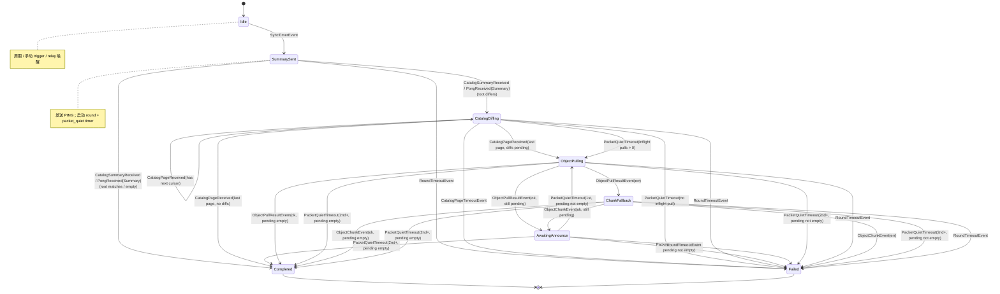

# Higgs Gossip 协议

> **文档状态（2026-06）**
> 本文是 Higgs gossip 的 canonical 文档。它描述当前实现、已确认的问题，以及 bounded UDP control + catalog sync 规则。若现有代码与本文冲突，应以已通过测试的当前协议规则为准，然后回头修本文。

本文面向两类读者：
- 人类 operator / reviewer：理解 Higgs 如何同步 signed Zone state，如何处理 NAT、MTU 和大对象。
- 实现者 / AI agent：明确哪些语义不能再混在一起，避免继续把 unbounded list 或 bulk payload 塞进单个 UDP datagram。

---

## 1. 核心边界

Higgs gossip 只传播已签名的 Zone 状态。进入 active state 的数据必须通过 Zone authority、parent delegation、record signature 和 root digest 验证；传输路径只负责把对象交到验证层。

当前和目标协议都遵守三层传输角色：

| 层 | 载体 | 角色 | 不能承担的职责 |
|----|------|------|----------------|
| UDP control | `ping` / `pong` / `fetch_catalog_page` / `catalog_page` / `announce` / `fetch_zone` | 交换 bounded summary、分页 catalog、请求对象、发送 digest hint | 不依赖 IP fragmentation，不承载 unbounded list，不把 UDP record 流作为正确性前提 |
| TCP object pull | 短连接 MessagePack | 拉取完整 Zone snapshot 或完整 record object | 不改变 trust boundary，不跳过签名验证 |
| UDP chunk fallback | `object_chunk` | TCP object pull 不可达时的兜底完整对象传输 | 不作为默认 bulk path，不承载未验证的部分状态 |

硬规则：

- UDP datagram 默认预算是 `1200` bytes；任何 UDP message 都必须先按 wire size 预算打包。
- 所有 list 都必须 bounded：announce digest、catalog page 都不能假设一包装得下；旧 Ping/Pong digest/fetch list 已删除。
- `announce` 是 hint，只携带 digest；不能依赖 UDP announce payload 完成一个 Zone。
- 大对象默认走 TCP object pull；UDP chunk fallback 只在 TCP pull 明确失败或不可达后使用。
- relay 只在本地 verified active state 实际变化后触发；收到 hint 本身不是 relay 条件。

---

## 2. Wire 格式

默认 UDP wire codec 是 MessagePack，消息以 magic prefix 开头：

```text
higgs.gossip.m1\n<msgpack payload with version=1>
```

短期兼容读取旧 JSON magic `higgs.gossip.v1\n`。未知 magic 返回 `unsupported_codec`，未知 `version` 返回 `unsupported_wire_version`。

消息通用字段：

```go
type Message struct {
    Version   int
    Type      MessageType
    PeerID    string
    Nonce     uint64
    Timestamp int64

    Ping             *Ping
    Pong             *Pong
    FetchCatalogPage *FetchCatalogPage
    CatalogPage      *CatalogPage
    FetchZone        *FetchZone
    FetchRecord      *FetchRecord
    Announce         *Announce
    ObjectChunk      *ObjectChunk
}
```

接收端必须拒绝：
- magic / version 不支持。
- `peer_id`、`nonce`、`timestamp` 为空。
- body 字段数量不等于一。
- wire size 超过本地 `max_datagram_bytes`。

`FetchCatalogPage` / `CatalogPage` 已在当前 wire schema 中实现，用于替代 `PING` / `PONG` 上的完整 digest list。

---

## 3. Catalog 同步

### 3.1 为什么需要 catalog

旧实现把完整 `ZoneDigest[]` 放进 `PING` / `PONG`。这在小网络可用，但 Zone 数增多后会超过 1200-byte datagram 预算，导致 `ErrMessageTooLarge`。当前实现已经把主同步入口改为 `CatalogSummary` + bounded catalog page；旧 digest/fetch 兼容字段已删除。`ANNOUNCE` 只保留 hint 语义；实际对象同步由 TCP object pull 和必要时的 UDP chunk fallback 完成。

因此 gossip v1 的下一步规则是引入 **Catalog**：

```text
Catalog = sorted list of ZoneDigest
CatalogRoot = hash(sorted(zone_path + zone_root))
```

`PING` / `PONG` 只交换 bounded summary，不再承诺携带完整 digest list。

### 3.2 Summary round

当前形态：

```text
PING { catalog_root, zone_count, optional first_page }
PONG { catalog_root, zone_count, optional first_page }
```

字段含义：

```go
type CatalogSummary struct {
    CatalogRoot []byte
    ZoneCount   int
    FirstPage   *CatalogPage // optional, currently not emitted by default
    NextCursor  string       // optional
}
```

如果双方 `catalog_root` 相同，round 可以直接完成。若不同，进入 catalog page diff。

### 3.3 Page diff

第一版采用简单分页，不直接上 Merkle range tree：

```text
FETCH_CATALOG_PAGE { cursor }
CATALOG_PAGE       { catalog_root, entries[], next_cursor }
```

`cursor` 第一版是稳定的 sorted catalog offset，空 cursor 表示第一页。`entries[]` 必须按 `max_datagram_bytes` 打包，不能超过预算；如果单条 entry 都装不进一页，发送方 fail closed 并记录诊断。

接收方对每页做本地 diff：

- 本地没有该 Zone：加入 `FETCH_ZONE` 候选。
- root 不同：加入 `FETCH_ZONE` 候选。
- 对端缺少本地 Zone：本端后续通过 relay/announce hint 让对端发现，或等待对端反向 round。

page diff 是 correctness baseline。后续大规模优化可以引入 Merkle range tree，但不是第一版必需。

### 3.4 Merkle range tree 作为后续优化

Merkle range tree 是把按 ZonePath 排序的 catalog 分成范围，每个范围有 hash。双方先比较大范围 hash，相同范围整段跳过，只递归不同范围。

它适合非常多 Zone 且只有少量变化的网络，但需要额外定义 range 切分、range id、空 range hash、恶意 peer 限流和超预算 range response。当前优先实现 sorted digest pages。

---

## 4. Object 同步

发现不同 Zone 后，接收方拉取完整对象：

```text
FETCH_ZONE { zone, expected_root }
TCP object pull { zone, expected_root }
OBJECT_PULL_RESPONSE { full ZoneSnapshot }
```

`FETCH_ZONE` 是兼容控制请求和 UDP chunk fallback 请求，不要求发送方把完整 snapshot 塞进普通 UDP announce。当前 catalog 主路径在 page diff 得出不同 Zone 后立即启动 TCP object pull；发送方可以用 `ANNOUNCE` 返回 digest hint，但接收方只在本地 root 对账成功后才算完成。

如果 TCP object pull 不可达，接收方可以请求：

```text
FETCH_ZONE { zone, expected_root, chunk_fallback: true }
```

发送方再用 `object_chunk` 发送完整对象 fallback。chunk 必须带 object type、Zone、root hash、content hash、total/index 和 payload。接收端只在所有 chunk 到齐、content hash 匹配、root/signature 验证通过后 apply。

---

## 5. Announce 与 Relay

`announce` 的目标语义：

```go
type Announce struct {
    Zones []ZoneDigest // bounded hint
}
```

约束：

- `announce` 可以唤醒对端做 catalog diff。
- `announce` 不承诺携带完整 Zone。
- 小 snapshot / record 可以作为优化，但 correctness 仍由 root digest 对账决定。
- UDP announce 不能组成对象事务。
- relay fanout 只在 apply 后本地 active digest 变化时触发，并排除来源 peer。

---

## 6. Endpoint 与 NAT

节点通过 signed endpoint record 传播长期可拨地址：

```text
<node-zone>/sync/endpoint/udp
```

endpoint record 是普通 Zone record，通过 gossip 同步和签名验证进入 active state。reflector、interface scan、manual advertise 都只是本节点生成 endpoint record 的输入。

NAT / observed path 规则：

- signed endpoint record 表示长期、可传播、由 Zone 签名的候选地址。
- observed UDP path 是本地 runtime reachability cache，不写入 signed endpoint record。
- `publish_endpoints: false` 的 NAT/outbound-only 节点不发布 direct endpoint；公网 peer 可用 verified observed path 回复它。
- 可达性不替代身份；transport source address 不参与 Zone trust 验证。

---

## 7. 运行形态与事件驱动状态机

推荐长期运行入口是 `higgs daemon`。当前实现已完成 Phase 6 事件驱动重构：单一 UDP reader、per-peer `SyncSession` 状态机、daemon 事件循环串行处理所有状态变更。

### 7.1 单 reader 与事件循环

- 单一 UDP reader：只有 `startGossipPacketReceiver` 调用 `transport.Receive()`。
- Packet demux：按 `peer_id` 分发给活跃 `SyncSession`，未命中则走 unsolicited path。
- 单 writer：control socket 写入、sync apply、endpoint publish、relay、object pull result 都经 daemon event loop 串行处理。
- object pull worker 只能产生事件，不能直接写 `stateFile` 或 `NetworkState`。

`sync run` 是兼容入口，内部复用 daemon service。`sync serve` / `sync once` 保留用于 smoke 和排查，但长期节点应使用 daemon。

### 7.2 SyncSession 状态机

每个目标 peer 同时最多只有一个 `SyncSession`。状态机不执行 I/O，只返回 `SyncAction` 由事件循环执行。

#### 状态

| 状态 | 含义 |
|------|------|
| `Idle` | 没有活跃同步会话 |
| `PingSent` | 旧入口保留状态；现代事件路径通常从 `Idle` 直接进入 `SummarySent` |
| `SummarySent` | 已发 `PING`（携带 `CatalogSummary`），等 `PONG` 或对方主动发来的 catalog summary |
| `CatalogDiffing` | 双方 catalog root 不同，正在分页请求 / 接收 catalog page |
| `AwaitingAnnounce` | 等待 object pull / chunk fallback 后的迟到事件与 quiet 收尾；不作为正确性主路径 |
| `ObjectPulling` | catalog diff 发现差异后，正在异步 TCP object pull |
| `ChunkFallback` | TCP pull 失败或不可达，已发 `FETCH_ZONE{ChunkFallback:true}`，等 UDP chunk |
| `Completed` | 本轮同步成功结束 |
| `Failed` | 超时、错误或被 backoff |

Responder 不属于 `SyncSession` 主状态机。入站 `FETCH_CATALOG_PAGE`、普通 `FETCH_ZONE`、TCP object pull 和 UDP chunk fallback 响应由 daemon 只读 responder 处理。

#### 事件

| 事件 | 来源 |
|------|------|
| `SyncTimerEvent` | 周期 timer / 手动 trigger / relay 唤醒 |
| `PongReceivedEvent` | 收到带 `CatalogSummary` 的 `PONG` |
| `CatalogSummaryReceivedEvent` | 收到带 `Summary` 的 `PING` |
| `CatalogPageReceivedEvent` | 收到 `CATALOG_PAGE` |
| `CatalogPageTimeoutEvent` | catalog page 请求超时 |
| `PacketQuietTimeoutEvent` | UDP 静默期 timer 触发 |
| `RoundTimeoutEvent` | 整轮超时 timer 触发 |
| `ObjectPullResultEvent` | 异步 TCP object pull 完成 |
| `ObjectChunkEvent` | UDP chunk fallback 完成或失败 |

`ANNOUNCE` 是 hint ingress：它可以创建或唤醒 active pull session，但不会直接作为 `SyncSession` 的对象同步事件。`FETCH_*` 是只读 responder 请求，不改变 active pull 状态。

#### 状态机图



#### 状态转换表

| 事件 | 当前状态 | 下一状态 | 动作 / 说明 |
|------|----------|----------|-------------|
| `SyncTimerEvent` | `Idle` | `SummarySent` | 发送 `PING`；启动 `round` 与 `packet_quiet` timer |
| `CatalogSummaryReceived` / `PongReceived` with `Summary` (root matches) | `SummarySent` | `Completed` | 无差异，结束本轮 |
| `CatalogSummaryReceived` / `PongReceived` with `Summary` (root differs) | `SummarySent` | `CatalogDiffing` | 发送 `FETCH_CATALOG_PAGE`；重启 `packet_quiet` |
| `CatalogPageReceived` (has next cursor) | `CatalogDiffing` | `CatalogDiffing` | diff 当前页；启动差异 zone 的 object pull；请求下一页 |
| `CatalogPageReceived` (last page, diffs pending) | `CatalogDiffing` | `ObjectPulling` | 启动所有差异 zone 的 object pull |
| `CatalogPageReceived` (last page, no diffs) | `CatalogDiffing` | `Completed` | 结束本轮 |
| `CatalogPageTimeoutEvent` | `CatalogDiffing` | `Failed` | 记录 backoff |
| `PacketQuietTimeout` (inflight pulls > 0) | `CatalogDiffing` | `ObjectPulling` | 静默期到，进入 object pull 阶段 |
| `PacketQuietTimeout` (no inflight pull) | `CatalogDiffing` | `Failed` | catalog page 等待超时 |
| `PacketQuietTimeout` (1st, pending not empty) | `AwaitingAnnounce` | `ObjectPulling` | 启动异步 TCP pull |
| `PacketQuietTimeout` (2nd+, pending empty) | `AwaitingAnnounce`/`ObjectPulling`/`ChunkFallback` | `Completed` | 等待迟到 UDP / pull 后静默，结束本轮 |
| `PacketQuietTimeout` (2nd+, pending not empty) | `AwaitingAnnounce`/`ObjectPulling`/`ChunkFallback` | `Failed` | 超时仍有缺失 |
| `ObjectPullResultEvent{ok}` (pending empty) | `ObjectPulling` | `Completed` | apply snapshot；结束本轮 |
| `ObjectPullResultEvent{ok}` (still pending) | `ObjectPulling` | `AwaitingAnnounce` | apply snapshot；继续等 UDP |
| `ObjectPullResultEvent{err}` | `ObjectPulling` | `ChunkFallback` | 发送 `FETCH_ZONE{ChunkFallback:true}` |
| `ObjectChunkEvent{ok}` (pending empty) | `ChunkFallback` | `Completed` | apply snapshot；结束本轮 |
| `ObjectChunkEvent{ok}` (still pending) | `ChunkFallback` | `AwaitingAnnounce` | apply snapshot；继续等 |
| `ObjectChunkEvent{err}` | `ChunkFallback` | `Failed` | 记录 backoff |
| `RoundTimeoutEvent` | 任意活跃状态 | `Failed` | 取消 `packet_quiet`；记录 backoff |

入站 `FETCH_CATALOG_PAGE` / `FETCH_ZONE` 不在表中，因为它们由只读 responder 直接处理，不驱动 active pull FSM。

### 7.3 PacketQuietTimeout 是否还在？

**还在，但已从“固定的 250 ms socket 读超时”升级为 RTT-aware 的 timer 事件。**

旧代码（`app/higgs/sync.go` 的 `syncRound`）把 UDP socket read 限制在 250 ms，用于在阻塞 read 里能检查 context 取消。事件驱动重构后：

- 固定 250 ms 读超时已消失：只有 `startGossipPacketReceiver` 读 socket，停止通过 `ctx`/`stopCh` 控制，不再需要 250 ms 轮询。
- `PacketQuietTimeoutEvent` 是显式 timer 事件，由 `TimerManager` 在 `packet_quiet` 到期时投递到事件循环。
- 时长按 peer 估计 RTT 动态计算：

```text
PacketQuietTimeout(peer) = max(
    MinPacketQuietTimeout,       // 250 ms
    kQuiet * estimatedRTT(peer)  // kQuiet = 3
)
```

- 首次 RTT 未知时使用 `InitialRTT`（默认 1 s）。
- 收到 `PONG` 后根据 `PONG_received_at - PING_sent_at` 更新 RTT。
- 每次收到 catalog summary / catalog page 或 object pull / chunk fallback 有效结果时**重置 `quietCount` 并重启 `packet_quiet` timer**，避免在 burst 期间过早进入 TCP object-pull 或失败收尾。

`quietCount` 机制：

- 第 1 次 `PacketQuietTimeout`：认为 UDP burst 结束；若仍有 pending zones，从 `AwaitingAnnounce` 进入 `ObjectPulling`。
- 第 2 次及以上：认为 object pull / chunk fallback 后的迟到窗口也结束；若 pending 为空则 `Completed`，否则 `Failed`。

### 7.4 动作执行顺序

`SyncSession.OnEvent` 返回的动作由 daemon 事件循环统一执行，顺序保证：

1. 先全部 `ApplySnapshot` / `ApplyRecordSnapshot`
2. 然后 `SaveState`
3. 最后 send / start timer / record backoff

避免在错误中间状态落盘。

详细架构设计与实现背景见 `phase6-event-driven-design.md`。

---

## 8. 安全与资源限制

- Anti-replay：`nonce + timestamp` 窗口。
- Allowlist：入站 `peer_id` 必须来自 bootstrap 或本地 verified Zone chain。
- Quota：按 peer 计 byte/object token。
- UDP size：发送前 preflight，接收时拒绝超预算。
- Object pull：短超时、响应大小上限、全局和 per-peer inflight 上限。
- Chunk fallback：短 TTL 重组缓存、最大对象大小、hash 校验、quota 计费。
- Rejected cache：坏 digest/object 在 TTL 内不重复拉取。

---

## 9. 当前实现差距

当前代码已经实现：

- MessagePack UDP framing 和 1200-byte budget。
- `PING` / `PONG` 的 `CatalogSummary`、`FETCH_CATALOG_PAGE` / `CATALOG_PAGE` bounded catalog page。
- `FETCH_ZONE` / `ANNOUNCE` / `OBJECT_CHUNK` 基础消息；`FETCH_ZONE` 只作为只读响应或 UDP chunk fallback 请求，不再由响应里的反向 fetch list 驱动。
- `ANNOUNCE.Zones` 的发送预算保护；单项超预算时 fail closed 并记录 datagram diagnostics。
- TCP object pull 与 UDP chunk fallback。
- daemon 单 reader、事件循环和 per-peer `SyncSession` FSM；完整状态机见第 7 节。
- `sync status --verbose` / `debug peer` 输出最近 catalog root、zone count、page cursor、page entries 和 rejected reason。

仍需向本文收敛：

- 后续大规模 catalog 可评估 Merkle range tree，当前第一版使用 sorted page cursor。
- `announce` 已收敛为 state-change digest hint，不再作为 payload carrier。

对应执行项见 `../todo.md` Phase 3.6.8。
