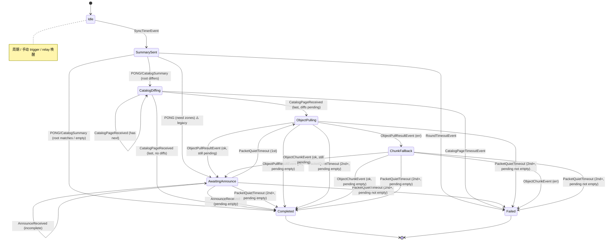
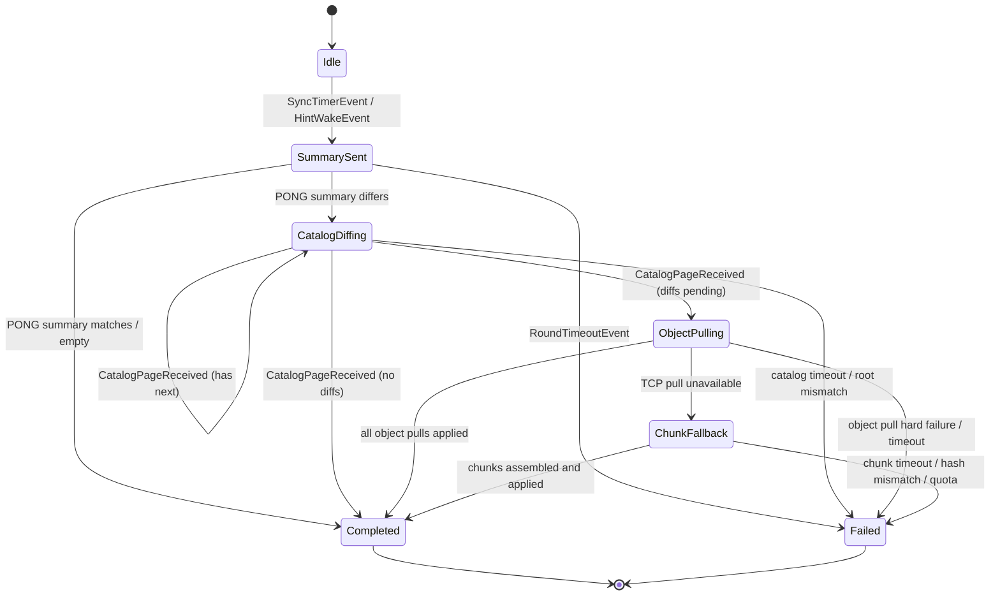

# Higgs Gossip 协议与设计

> **本文档状态：2026-07**  
> 描述当前 gossip 实现的设计、协议与架构。专注于 gossip 控制面本身，不涉及 IPsec/overlay 等上层应用。

Higgs gossip 是 Higgs 控制面中负责在节点之间同步签名 Zone 状态的协议层。它不关心上层应用的语义——只负责把已签名的 Zone authority、delegation、record 和 revocation 高效、安全地传播到全网节点。

---

## 目录

1. [架构概览](#1-架构概览)
2. [核心数据结构](#2-核心数据结构)
3. [Wire 协议](#3-wire-协议)
4. [Catalog 同步协议](#4-catalog-同步协议)
5. [对象传输](#5-对象传输)
6. [SyncSession 状态机](#6-syncsession-状态机)
7. [UDP 传输层](#7-udp-传输层)
8. [端点发现](#8-端点发现)
9. [Relay 机制](#9-relay-机制)
10. [安全与资源限制](#10-安全与资源限制)
11. [Daemon 事件驱动架构](#11-daemon-事件驱动架构)

---

## 1. 架构概览

### 1.1 设计原则

Higgs gossip 仅传播**已签名的 Zone 状态**。任何进入 active state 的数据都必须通过 Zone authority、parent delegation、record signature 和 root digest 的完整验证；传输路径只负责把对象交到验证层。

### 1.2 三层传输角色

| 层 | 载体 | 角色 | 不能承担的职责 |
|----|------|------|----------------|
| UDP control | `ping` / `pong` / `fetch_catalog_page` / `catalog_page` / `announce` / `fetch_zone` | 交换 bounded summary、分页 catalog、请求对象、发送变更 hint | 不依赖 IP fragmentation，不承载 unbounded list，不把多 datagram record 流作为正确性前提 |
| TCP object pull | 短连接 MessagePack | 拉取完整 Zone snapshot 或完整 record object | 不改变 trust boundary，不跳过签名验证 |
| UDP chunk fallback | `object_chunk` | TCP object pull 不可达时的兜底完整对象传输 | 不作为默认 bulk path，不承载未验证的部分状态 |

### 1.3 硬规则

- UDP datagram 默认预算 **1200 bytes**；任何 UDP message 都必须先按 wire size 预算打包。
- 所有 list 都必须 bounded：Zone digest list、FetchZones、announce digest、records、catalog page 都不能假设一包装得下。
- `announce` 是 hint，可以携带小而完整的 payload；不能依赖多条 UDP record announce 才完成一个 Zone。
- 大对象默认走 TCP object pull；UDP chunk fallback 只在 TCP pull 明确失败或不可达后使用。
- relay 只在本地 verified active state 实际变化后触发；收到 hint 本身不是 relay 条件。

### 1.4 事件驱动架构

Gossip 运行于事件驱动的 daemon 架构中：

```
┌──────────────────────────────────────────────────────┐
│                    Daemon Event Loop                    │
│                                                        │
│  ┌────────────┐    ┌──────────────┐   ┌───────────┐   │
│  │UDP Receiver│───▶│ Packet Demux │──▶│ SyncSession│   │
│  │(single)    │    │ (per-peer)   │   │ (FSM)     │   │
│  └────────────┘    └──────────────┘   └─────┬─────┘   │
│                                             │         │
│  ┌────────────┐    ┌──────────────┐         │         │
│  │TimerManager│───▶│ Sync Events  │◀────────┘         │
│  └────────────┘    └──────┬───────┘                   │
│                           │                           │
│                  ┌────────▼────────┐                  │
│                  │  Action Executor │                  │
│                  │ (apply/send/…)   │                  │
│                  └─────────────────┘                   │
└──────────────────────────────────────────────────────┘
```

关键特征：
- **单一 UDP reader**：只有 `startGossipPacketReceiver` 调用 `transport.Receive()`
- **串行事件处理**：所有状态变更经 daemon event loop 串行处理，无需额外锁
- **FSM 无 I/O**：`SyncSession.OnEvent` 不执行 I/O，只返回 `SyncAction` 由事件循环执行

### 1.5 目标重构：读写分离与 hint 语义

当前实现仍保留了早期兼容路径：`PONG.FetchZones`、`FETCH_ZONE -> ANNOUNCE`、UDP snapshot/record announce、`ServingPeerFetch` / `FetchingLocal` 等逻辑混在同一个 `SyncSession` 状态机中。这让一个 per-peer session 同时表达两件事：

- **主动读路径**：本节点正在向 peer 拉取 catalog / object。
- **被动服务路径**：peer 正在向本节点请求 catalog page / object。

后续重构目标是把这两条路径拆开：

| 路径 | 职责 | 是否改变 `SyncSession` 主状态 |
|------|------|------------------------------|
| Active pull FSM | 发起 `PING`，比较 catalog，启动 TCP object pull / UDP chunk fallback，apply 验证后的对象 | 是 |
| Read-only responder | 响应 `FETCH_CATALOG_PAGE`、TCP object pull、必要时响应 UDP chunk fallback | 否 |
| Hint ingress | 接收 `ANNOUNCE` / relay hint，决定是否唤醒一次 active pull | 否；最多创建或唤醒主动同步 |

最终语义：

- `FETCH_*` 是只读请求，响应方直接从本地 verified state 读数据并返回，不进入“服务中”会话状态。
- `ANNOUNCE` 只表示“我这里可能有新 digest/object”，不作为完整同步的正确性前提。
- 大对象主路径是 TCP object pull；UDP chunk fallback 只在 TCP 不可达时传完整对象。
- 收到 hint 不触发 relay；只有本地 active state 真正 apply 成功并发生变化后，才按 relay 规则通知其他 peer。
- 旧协议兼容字段逐步删除：`Ping.Zones` / `Pong.Zones` / `Pong.FetchZones` 不再参与现代同步状态机。

---

## 2. 核心数据结构

### 2.1 ZoneDigest 与 Catalog

```go
type ZoneDigest struct {
    Zone     ZonePath // zone 路径，如 "node-a.catofes."
    RootHash []byte   // 该 zone 的 merkle root hash
}
```

Catalog 是全量 ZoneDigest 的排序列表，用于快速比较两节点状态是否一致：

```
Catalog = sorted list of ZoneDigest
CatalogRoot = hash(sorted(zone_path + zone_root))
```

### 2.2 CatalogSummary

摘要信息，用于 PING/PONG 的第一轮交换：

```go
type CatalogSummary struct {
    CatalogRoot []byte       // catalog 根 hash
    ZoneCount   int          // zone 总数
    FirstPage   *CatalogPage // 可选：第一页数据（默认不发送）
    NextCursor  string       // 可选：下一页游标
}
```

### 2.3 CatalogPage

分页数据，用于逐页比较 catalog 差异：

```go
type CatalogPage struct {
    CatalogRoot []byte       // 所属 catalog 的根 hash
    Entries     []ZoneDigest // 本页 zone digest 条目
    NextCursor  string       // 下一页游标；空表示最后一页
}
```

### 2.4 Message 通用结构

所有 UDP gossip 消息共享同一个外层结构：

```go
type Message struct {
    Version   int         // wire version，当前为 1
    Type      MessageType // 消息类型
    PeerID    string      // 发送方 peer ID
    Nonce     uint64      // 防重放随机数
    Timestamp int64       // Unix 时间戳（秒）

    // 具体 body（恰好一个非空）
    Ping             *Ping
    Pong             *Pong
    FetchZone        *FetchZone
    FetchRecord      *FetchRecord
    FetchCatalogPage *FetchCatalogPage
    CatalogPage      *CatalogPage
    Announce         *Announce
    ObjectChunk      *ObjectChunk
}
```

接收端必须拒绝：
- magic / version 不支持
- `peer_id`、`nonce`、`timestamp` 为空
- body 字段数量不等于一
- wire size 超过本地 `max_datagram_bytes`

### 2.5 具体消息类型

```go
type Ping struct {
    Summary *CatalogSummary // 当前节点的 catalog 摘要
    Zones   []ZoneDigest    // (legacy) 旧协议 digest list，待删除
}

type Pong struct {
    Summary    *CatalogSummary // 当前节点的 catalog 摘要
    Zones      []ZoneDigest    // (legacy) 旧协议 digest list，待删除
    FetchZones []ZonePath      // (legacy) 旧协议反向请求列表，待删除
}

type FetchCatalogPage struct {
    Cursor string // 分页游标；空表示第一页
}

type FetchZone struct {
    Zone          ZonePath // 需要拉取的 zone
    ChunkFallback bool     // 是否请求 UDP chunk fallback
}

type FetchRecord struct {
    Zone    ZonePath
    Key     string
    Version uint64 // 可选：指定版本
}

type Announce struct {
    Zones     []ZoneDigest     // zone digest hint（bounded）
    Snapshots []ZoneSnapshot   // legacy 小 payload 优化，目标状态不再依赖
    Records   []RecordSnapshot // legacy 小 payload 优化，目标状态不再依赖
}

type ObjectChunk struct {
    Object     ObjectPullRequestType // "zone" 或 "record"
    Zone       ZonePath
    Key        string
    Version    uint64
    RootHash   []byte
    ObjectHash []byte    // 完整对象的 content hash
    Index      uint16    // 当前分片索引（从 0 开始）
    Total      uint16    // 总分片数
    Data       []byte    // 分片 payload
}
```

### 2.6 ZoneSnapshot

完整的 Zone 状态快照，通过 TCP object pull 或 UDP chunk fallback 传输：

```go
type ZoneSnapshot struct {
    Zone          ZonePath
    Authority     *ZoneAuthority
    ParentProof   []*Delegation              // 父 zone 的 delegation 证明链
    Delegations   map[ZonePath]*Delegation   // 子 zone delegation
    Revocations   map[ZonePath]*DelegationRevocation // 子 zone 撤销
    Records       map[string]*Record         // 当前记录（按 key）
    RecordHistory map[string][]*Record       // 历史记录
}
```

---

## 3. Wire 协议

### 3.1 编解码

默认 UDP wire codec 是 **MessagePack**，消息以 magic prefix 开头：

```
higgs.gossip.m1\n<msgpack payload with version=1>
```

- 短期兼容读取旧 JSON magic `higgs.gossip.v1\n`
- 未知 magic → `unsupported_codec`
- 未知 `version` → `unsupported_wire_version`

### 3.2 Datagram 预算

- 默认最大 datagram 大小：**1200 bytes**
- 发送前预检 wire size，超过则拒绝并记录 datagram diagnostics
- 接收端对超预算消息直接返回 `ErrMessageTooLarge`

### 3.3 MessageType

| 类型 | 值 | 方向 | 用途 |
|------|-----|------|------|
| `ping` | 主动 | 双向 | 发起同步、携带 CatalogSummary |
| `pong` | 响应 | 双向 | 响应 ping、携带 FetchZones |
| `fetch_catalog_page` | 请求 | 双向 | 请求 catalog 分页 |
| `catalog_page` | 响应 | 双向 | 返回 catalog 分页数据 |
| `fetch_zone` | 请求 | 双向 | 请求 zone snapshot |
| `fetch_record` | 请求 | 双向 | 请求单条 record |
| `announce` | 主动 | 双向 | 主动推送 zone/record 数据 |
| `object_chunk` | 主动 | 双向 | UDP 分片传输大对象 |

---

## 4. Catalog 同步协议

Catalog 同步是整个 gossip 同步的核心，分为三个阶段：

```
Phase 1: Summary Round（摘要交换）
Phase 2: Page Diff（分页比较）
Phase 3: Object Pull（对象拉取）
```

### 4.1 Phase 1: Summary Round

```
节点 A                         节点 B
  │                              │
  │──── PING {catalog_root} ────▶│
  │                              │
  │◀─── PONG {catalog_root} ─────│
  │                              │
```

- A 向 B 发送 `PING`，携带本地的 `CatalogSummary`（`catalog_root` + `zone_count`）
- B 回复 `PONG`，也携带自己的 `CatalogSummary`
- 如果双方 `catalog_root` 相同 → 立即完成，无需后续操作
- 如果一方 catalog 为空 → 立即完成
- 如果 `catalog_root` 不同 → 进入 Phase 2

### 4.2 Phase 2: Page Diff

```
节点 A                         节点 B
  │                              │
  │──── FETCH_CATALOG_PAGE ────▶│
  │       {cursor: ""}          │
  │                              │
  │◀─── CATALOG_PAGE ───────────│
  │    {entries[], next_cursor} │
  │                              │
  │──── FETCH_CATALOG_PAGE ────▶│
  │       {cursor: "3"}         │
  │                              │
  │◀─── CATALOG_PAGE ───────────│
  │    {entries[], next_cursor} │
  │                              │
```

- 分页使用 sorted catalog offset 作为 cursor
- 空 cursor → 第一页
- 非空 `next_cursor` → 还有更多页
- 接收方逐页做本地 diff：
  - 本地没有该 Zone → 加入 `FETCH_ZONE` 候选
  - root hash 不同 → 加入 `FETCH_ZONE` 候选
  - 对端缺少本地 Zone → 等对端反向同步时发现

**分页前提**：每页 `entries[]` 打包后的 wire size 不得超过 datagram budget（默认 1200 bytes）。如果单条 entry 都装不进一页，发送方 `fail closed` 并记录诊断。

### 4.3 同时服务对端（目标语义）

当节点正在主动同步 peer 时，仍可能收到同一个 peer 的读取请求，例如 `FETCH_CATALOG_PAGE` 或 object pull 请求。目标行为是：

- responder 直接读取本地 verified state 并返回响应。
- responder 不修改 active pull FSM 的 state、pending zones、quiet count 或 object pull inflight 集合。
- 如果主动 FSM 正在等待 `PONG`、`CATALOG_PAGE` 或 object pull 结果，它继续等待自己的事件。
- responder 的错误只记录为发送/读取诊断，不把主动同步轮次标记为失败。

这意味着 `ServingPeerFetch` / `FetchingLocal` 不应继续作为主 FSM 状态存在。它们表达的是“别人正在读我”，不是“我主动读别人”的进度。

### 4.4 Hint 与主动同步

`ANNOUNCE` 是 hint，不是对象同步主路径。现代路径应按以下方式处理：

```
收到 ANNOUNCE / relay hint
  → 校验消息基本格式、peer、quota、防重放
  → 记录 hint digest / source / time
  → 如果没有活跃 session，创建或唤醒 active pull FSM
  → active pull 通过 catalog diff + object pull 获取完整对象
  → apply 成功且 active state 变化后，才触发 relay
```

`ANNOUNCE` 可以保留 bounded digest 信息，用于低成本唤醒和观测；不应依赖 UDP announce 中的 snapshot/records 才能完成正确同步。

---

## 5. 对象传输

### 5.1 TCP Object Pull（默认路径）

当 catalog page diff 发现 zone 不同时，接收方启动 **TCP object pull**：

```
接收方                 发送方
  │                      │
  │──── FETCH_ZONE ─────▶│
  │    {zone, expected}  │
  │                      │
  │◀─── TCP connect ─────│
  │    MessagePack       │
  │    ZoneSnapshot      │
  │                      │
```

- 默认使用短连接 TCP，MessagePack 编码
- 4 字节大端长度前缀 + payload
- 请求大小上限 1 MiB，响应大小上限 8 MiB
- 完成后对 snapshot 做完整签名和信任链验证
- 对发送方而言，这是只读响应：读取本地 verified snapshot，编码返回，不改变 active sync FSM。

### 5.2 UDP Chunk Fallback（兜底路径）

当 TCP object pull 失败（超时、不可达等），接收方请求 UDP chunk fallback：

```
接收方                         发送方
  │                              │
  │──── FETCH_ZONE ─────────────▶│
  │    {zone, chunk_fallback: t} │
  │                              │
  │◀─── OBJECT_CHUNK (1/3) ─────│
  │    {index:0, total:3}       │
  │◀─── OBJECT_CHUNK (2/3) ─────│
  │    {index:1, total:3}       │
  │◀─── OBJECT_CHUNK (3/3) ─────│
  │    {index:2, total:3}       │
  │                              │
```

约束：
- 最大对象大小：8 MiB（`maxChunkObjectBytes`）
- 重组缓存 TTL：2 分钟（`chunkAssemblyTTL`）
- 所有 chunk 到齐后做 content hash 校验
- 校验通过后再做 root hash / 签名验证
- 缺少任意 chunk → 丢弃，等下次重新请求

### 5.3 旧 UDP snapshot/record announce 路径（待删除）

旧路径中，`PONG.FetchZones` 会让对端发送 `FETCH_ZONE`，响应方再用 `ANNOUNCE` 携带 snapshot/record；如果 UDP 放不下，还会通过 eager object pull 提前启动 TCP 拉取。这套链路有两个问题：

- `FETCH_ZONE`/`ANNOUNCE` 同时承担读取响应、hint 和兼容传输，语义混杂。
- `ServingPeerFetch` / `FetchingLocal` 会污染主动同步 FSM，造成时序问题。

目标状态下，现代同步不再走 `PONG.FetchZones -> FETCH_ZONE -> ANNOUNCE snapshot`。对象获取统一由 active pull FSM 启动 TCP object pull；TCP 不可达时再请求 UDP chunk fallback。`ANNOUNCE` 只保留 hint 语义。

---

## 6. SyncSession 状态机

每个对端 peer 同时最多拥有一个 active pull `SyncSession` 实例。状态机不执行 I/O，只根据事件推导动作列表，由 daemon 事件循环统一执行。

Responder 不属于 `SyncSession` 主状态机。入站 `FETCH_CATALOG_PAGE`、TCP object pull 和 UDP chunk fallback 响应由 daemon 的只读 responder 路径处理。

### 6.1 状态定义

```
┌─────────────────────────────────────────────────────────────────────┐
│                         SyncSession States                          │
├──────────────────┬──────────────────────────────────────────────────┤
│ Idle             │ 没有活跃同步会话                                  │
│ SummarySent      │ 已发 PING（携带 CatalogSummary），等待对方响应      │
│ CatalogDiffing   │ 双方 catalog root 不同，正在逐页比较              │
│ AwaitingAnnounce │ legacy/过渡状态：等待 UDP announce 或兼容路径剩余数据；目标状态下应删除或仅作 hint 等待                 │
│ ObjectPulling    │ 正在异步 TCP object pull                         │
│ ChunkFallback    │ TCP pull 失败，等待 UDP chunk                    │
│ Completed        │ 本轮同步成功结束                                  │
│ Failed           │ 超时、错误或正在 backoff                          │
└──────────────────┴──────────────────────────────────────────────────┘
```

### 6.2 完整状态机图



目标状态机应进一步收敛为：



目标状态机不包含 `ServingPeerFetch` / `FetchingLocal`，也不需要因为收到 `FETCH_*` 而改变 active pull 状态。

### 6.3 事件列表

| 事件 | 来源 |
|------|------|
| `SyncTimerEvent` | 周期 timer / 手动 trigger / relay 唤醒 |
| `PongReceivedEvent` | 收到 `PONG`；或收到不带 `Summary` 的 `PING`（被转换为此事件） |
| `CatalogSummaryReceivedEvent` | 收到带 `Summary` 的 `PING` |
| `CatalogPageReceivedEvent` | 收到 `CATALOG_PAGE` |
| `FetchCatalogPageReceivedEvent` | 收到 `FETCH_CATALOG_PAGE`；目标状态下迁出 FSM，改为 responder 事件 |
| `CatalogPageTimeoutEvent` | catalog page 请求超时 |
| `FetchZoneReceivedEvent` | 收到 `FETCH_ZONE`；目标状态下仅保留 chunk fallback responder 或删除普通路径 |
| `AnnounceReceivedEvent` | 收到 `ANNOUNCE`；目标状态下作为 hint 唤醒 active pull，不直接 apply snapshot/record |
| `PacketQuietTimeoutEvent` | UDP 静默期 timer 触发 |
| `RoundTimeoutEvent` | 整轮超时 timer 触发 |
| `ObjectPullResultEvent` | 异步 TCP object pull 完成 |
| `ObjectChunkEvent` | UDP chunk fallback 完成或失败 |

### 6.4 超时与 RTT 感知

FSM 使用 RTT 感知的超时计算，避免在网络延迟高时过早超时：

```
PacketQuietTimeout(peer) = max(250ms, 3 × estimatedRTT(peer))
RoundTimeout(peer) = max(5s, 5 × estimatedRTT(peer)) + 5s (object pull budget)
```

- 首轮 RTT 未知时使用 `InitialRTT`（默认 1s）
- 收到 `PONG` 后根据 `PONG_received_at - PING_sent_at` 更新 RTT
- RTT 使用指数加权移动平均（EWMA）：`new_rtt = (7 × old_rtt + sample) / 8`

### 6.5 QuietCount 机制

`quietCount` 跟踪 PacketQuietTimeout 的触发次数：

- **第 1 次**: 认为 UDP burst 结束；若有 pending zones，从 `AwaitingAnnounce` → `ObjectPulling`
- **第 2 次及以上**: 认为 object pull / chunk fallback 后的迟到窗口也结束；pending 为空则 `Completed`，否则 `Failed`

在目标 catalog 协议下，`AwaitingAnnounce` 应尽量消失：主动同步以 catalog diff 和 object pull 为准，hint 只负责唤醒，不负责完成同步。

每次有效数据到达（PONG、catalog page、announce）都会重置 `quietCount = 0`。

### 6.6 动作执行顺序

`SyncSession.OnEvent` 返回的 `SyncAction` 由 daemon 事件循环按以下顺序执行：

1. **Apply snapshots/records**（可能有多个 apply）
2. **SaveState**（仅当 apply 成功后 persist）
3. **Reconcile pending**（检查 pending zone 是否已经满足）
4. **Send messages**（PING/PONG/ANNOUNCE/FETCH_CATALOG_PAGE/CATALOG_PAGE/FETCH_ZONE）
5. **Start async object pulls**
6. **Start/cancel timers**
7. **Record backoff**

---

## 7. UDP 传输层

### 7.1 Transport 结构

`gossip.Transport` 是 UDP 传输层的核心实现，管理以下内容：

| 组件 | 用途 |
|------|------|
| `knownPeers` | 入站白名单（peer ID allowlist） |
| `outboundAddrs` | 出站地址簿（每个 peer 可能有多个地址） |
| `lastSeenAddrs` | 临时入站地址缓存（用于回退发送） |
| `observedPaths` | 已验证的短寿命入站 UDP 路径（NAT 探测结果） |
| `addrStates` | 每个 peer 每个地址的 reachability 状态 |
| `replay` | 防重放窗口 |
| `quotas` | 每个 peer 的 token bucket 配额 |

### 7.2 发送流程

```
1. 获取 peer 的出站地址列表
2. 按 reachability 排序：最近成功 > 未尝试 > 失败中 > backoff 中
3. 如果出站地址为空，尝试 lastSeenAddr / observedPath
4. 填充 nonce + timestamp（如果为零）
5. MessagePack 编码
6. 检查 wire size ≤ maxMessageBytes
7. 检查 quota
8. 依次尝试每个地址，第一个成功则返回
```

### 7.3 接收流程

```
1. 读取 UDP datagram
2. 检查 size ≤ maxMessageBytes
3. MessagePack 解码
4. 验证 peerID 在 knownPeers 中
5. 检查 quota
6. 检查 replay（nonce + timestamp）
7. 更新 lastSeenAddr
8. 标记地址成功
```

### 7.4 地址 Reachability 管理

每个 peer 的每个出站地址都有独立状态：

- 成功计数 + 最后成功时间
- 失败计数 + 最后失败时间
- backoff 到期时间

短时间连续失败会触发指数 backoff（base 500ms，max 30s）。地址排序时 backoff 中的地址排在最后。

### 7.5 入站白名单管理

- **静态**：bootstrap 配置中的 peer ID
- **动态**：从 verified Zone state 中发现的 peer（通过 Zone 信任链自动加入）

`AddKnownPeerID` 只添加 peer ID 到白名单，不添加出站地址。`AddPeer` / `SetPeerAddrs` 同时添加白名单和出站地址。

---

## 8. 端点发现

### 8.1 端点记录

节点通过 signed endpoint record 传播自己的可拨地址：

```
<node-zone>/sync/endpoint/udp
```

Endpoint record 是普通 Zone record，通过 gossip 同步和签名验证进入 active state。

```json
{
  "endpoints": [
    {"address": "203.0.113.10", "port": 33434, "scope": "global", "priority": 100, "protocol": "udp"},
    {"address": "2001:db8::1", "port": 33434, "scope": "global", "priority": 80, "protocol": "udp"}
  ],
  "ttl_seconds": 10800,
  "grace_seconds": 600,
  "updated_at": 1717171717
}
```

### 8.2 端点来源

| 来源 | 优先级 | 说明 |
|------|--------|------|
| `advertise` (显式配置) | 100 | 管理员显式配置的地址 |
| `reflector` (公网反射) | 50 | 通过公网 IP reflector 获取的外部地址 |
| `interface` (接口扫描) | 10-20 | 本机接口地址（IPv4 默认 20，IPv6 默认 10） |

### 8.3 端点发布周期

- `reflector_interval`（默认 5m）：重新收集端点和反射器查询
- `endpoint_refresh`（默认 30m）：地址不变时的租约续期间隔
- `endpoint_ttl`（默认 3h）：端点记录的 TTL
- `endpoint_grace`（默认 10m）：旧地址保留窗口

### 8.4 NAT / Observed Path

- **Signed endpoint record**：长期、可传播、由 Zone 签名的候选地址
- **Observed UDP path**：本地 runtime reachability cache，不写入 signed endpoint record
- 接收端从每次成功接收的 UDP 数据包记录源地址，作为临时反向路径
- Observed path 有 TTL（默认 3 分钟），过期自动清除
- `publish_endpoints: false` 的 NAT/outbound-only 节点不发布 direct endpoint

### 8.5 Public IP Reflector

内置 reflector 列表用于自动发现公网 IP：

```
https://api.ipify.org
https://myip.ipip.net
https://ddns.oray.com/checkip
...
```

配置 `reflectors: auto` 使用内置列表。查询结果每个 IP 族取一个（IPv4 + IPv6），并发查询，成功后取消仍在进行的请求。

---

## 9. Relay 机制

当一轮同步导致本地 active state 发生变化时，节点向其他已知 peer 发起 relay：

```
1. 完成与 peer-A 的同步
2. 检查本地的 ZoneDigest 是否变化
3. 如果变化，遍历出站同步 peer 列表
4. 跳过来源 peer (peer-A)
5. 跳过 relay fanout 上限后的 peer（max = 8）
6. 跳过已有活跃 session 的 peer
7. 跳过 backoff 中的 peer
8. 为每个符合条件的 peer 创建 SyncSession 并触发 SyncTimerEvent
```

Relay 的 key 约束：

- **仅在本地 active state 实际变化后触发**，收到 hint / announce 本身不触发 relay
- relay fanout 上限为 8 个 peer（`maxRelayFanoutPerUpdate`）
- 两次 relay 之间至少有 1 秒的最小间隔（`relayMinInterval`）

---

## 10. 安全与资源限制

### 10.1 Anti-Replay

每条消息携带随机 `nonce` 和 `timestamp`。接收方检查两者：

- **时间戳窗口**：消息时间戳必须在接收方本地时钟的 ±5 分钟内，否则返回 `ErrMessageExpired`
- **Nonce 唯一性**：窗口内不得存在相同的 `(peer_id, nonce)` 对，否则返回 ErrReplay 语义错误

发送方在 `nonce` 和 `timestamp` 为零时自动填充（64 位随机数 / Unix 秒）。

### 10.2 速率配额

每个 peer 都有令牌桶配额：

| 资源 | 默认速率 | 默认突发 |
|------|----------|----------|
| 字节 | 256 KiB/s | 256 KiB |
| 对象 (zone/record) | 128/s | 128 |

超过任一限制返回 `ErrQuotaExceeded`，数据包被丢弃。

### 10.3 签名验证

所有 Zone 数据（authority、delegation、record）都经过密码学签名。Gossip 层本身不验证签名，委托给 `zone` 和 `crypto` 包：

- `VerifyChain`：确保 Zone 的 delegation 链追溯到配置的 root public key
- `VerifyRecord`：确保每条 record 由 Zone authority 签名
- `VerifyDelegation`：确保子 delegation 由 parent authority 签名

任何密码学检查失败的数据在到达 active storage 之前被拒绝。

### 10.4 其他资源限制

| 限制 | 默认值 | 说明 |
|------|--------|------|
| `max_message_bytes` | 1200 | 单个 UDP datagram 上限 |
| `max_sync_zones` | 16 | 每次 apply 最多 zone 数 |
| `max_sync_records` | 1024 | 每次 apply 最多 record 数 |
| UDP chunk max | 8 MiB | 最大 chunk fallback 对象 |
| Chunk assembly TTL | 2 min | UDP chunk 重组超时 |
| round timeout | ≥5s | 整轮超时（RTT 感知）|
| TCP pull timeout | 5s | object pull 超时 |

### 10.5 Rejected Cache

对端推送的错误 digest / object 会进入 rejected cache（TTL 默认 10 分钟），在 TTL 内不重复拉取。这防止反复请求已知错误数据。

---

## 11. Daemon 事件驱动架构

### 11.1 事件循环主流程

```
daemon Run() 主循环:
  ┌──────────────────────────────────────────────────────────┐
  │  1. processEvents() – 处理 Events channel 中的所有排队事件 │
  │  2. 检查 stateFile change (digest 变化 → 重新加载状态)      │
  │  3. 检查 endpoint publish timer                           │
  │  4. 检查 sync timer (handleSyncTimerEventLoop)           │
  │  5. 检查 IPsec / routing reconcile timer                  │
  │  6. 等待：Events / packetCh / syncEvents / timer          │
  └──────────────────────────────────────────────────────────┘
```

### 11.2 事件来源

| 来源 | 通道 | 说明 |
|------|------|------|
| 控制请求 | `d.Events` | control socket 操作（record_put, delegate_issue 等） |
| UDP 数据包 | `packetCh` | `startGossipPacketReceiver` 收到的 gossip 消息 |
| 同步事件 | `d.syncEvents` | SyncSession 的 FSM 事件 |
| 定时器 | `timer.C` | 周期同步、endpoint publish、IPsec reconcile |
| Object pull 结果 | `d.objectPullResults` | 异步 TCP pull 完成通知 |

### 11.3 Packet Demux

入站 UDP packet 经过 `routePacket` 分发：

```
Packet → routePacket()
  ├── 匹配活跃 SyncSession → PacketEvent → 由 session 的 FSM 处理
  └── 无匹配 → UnsolicitedPacketEvent → 由 handlePacket 处理
```

对于有 SyncSession 的场景，具体消息类型转换：

| 入站消息 | 转换事件 |
|----------|----------|
| PING (有 Summary) | `CatalogSummaryReceivedEvent` |
| PING (无 Summary) | 回退到 `PongReceivedEvent` |
| PONG | `PongReceivedEvent` |
| FETCH_ZONE (非 chunk) | direct read-only responder；不进入 active `SyncSession` |
| FETCH_ZONE (chunk) | 走旧 handlePacket 路径 |
| FETCH_CATALOG_PAGE | direct read-only responder；不进入 active `SyncSession` |
| CATALOG_PAGE | `CatalogPageReceivedEvent` |
| ANNOUNCE | `AnnounceReceivedEvent` |
| OBJECT_CHUNK | 走全局 chunk assembly |

### 11.4 TimerManager

`TimerManager` 管理所有 SyncSession 相关的定时器：

| Timer 类型 | 用途 | 超时计算 |
|------------|------|----------|
| `round` | 整轮超时 | `max(5s, 5 × RTT) + 5s` |
| `packet_quiet` | UDP 静默检测 | `max(250ms, 3 × RTT)` |
| `catalog_page` | catalog 分页超时 | 同 round timer |

当 session 完成或失败时，所有关联 timer 被取消。

### 11.5 状态变更通知链

```
SyncSession 完成 + state changed
  → completeSyncSession()
    → updateDiscoveredPeers()
    → notifyStateChanged()
      → flushRevocationCleanup()
      → mark ipsecDirty, routingDirty, firewallDirty
      → flush firewall → flush routing → flush IPsec reconcile
    → relaySyncToPeers()
```

---

## 附录：关键配置

Gossip 相关配置项及默认值：

| 配置键 | 默认值 | 说明 |
|--------|--------|------|
| `gossip.listen_addr` | `[::]:33434` | UDP 绑定地址 |
| `gossip.max_datagram_bytes` | `1200` | UDP datagram 预算 |
| `gossip.max_sync_zones` | `16` | 每次 apply 最多 zone |
| `gossip.max_sync_records` | `1024` | 每次 apply 最多 record |
| `gossip.advertise_addrs` | (自动) | 显式发布地址 |
| `gossip.reflectors` | `auto` | 公网 IP reflector |
| `gossip.reflector_interval` | `5m` | reflector 查询间隔 |
| `gossip.endpoint_ttl` | `3h` | 端点记录 TTL |
| `gossip.endpoint_refresh` | `30m` | 端点租约续期间隔 |
| `gossip.filter_private_ipv4` | `true` | 过滤 RFC1918 地址 |
