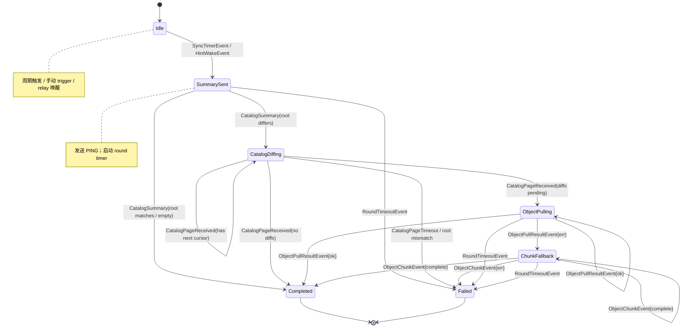

# Phase 6: Event-Driven Daemon / Sync State Machine Design

> **文档状态（2026-06）**  
> 本文档描述 Phase 6 对 Higgs daemon 同步层的事件驱动重构设计。当前 wire 协议保留 `PING`/`PONG`/`FETCH_ZONE`/`FETCH_RECORD`/`FETCH_CATALOG_PAGE`/`CATALOG_PAGE`/`ANNOUNCE`/`object_chunk`，但 `PING/PONG` 已收敛为 catalog summary，不再携带旧 digest / fetch list 兼容字段。
>
> **实现状态：** 6.0 事件驱动控制面重构已完成（代码位于 `app/higgs/sync_session.go`、`app/higgs/packet_demux.go`、`app/higgs/timer_manager.go`、`app/higgs/daemon_sync.go`），event-loop 是 daemon 与 `sync once` 的唯一收包调度路径；旧 `syncRound` / `handlePacketUntil` 回退路径已删除。

## 1. 背景与问题

当前 daemon 里有两个 goroutine 同时从同一个 UDP socket 读包：

1. `startGossipPacketReceiver`：专门收包 goroutine，把包推到 `packetCh`。
2. `SyncRuntime.syncRound`：在等 `PONG`/`ANNOUNCE` 时直接调用 `transport.Receive()`。

这带来三类问题：

- **并发数据 race**：`ReplayWindow.prune()` 遍历 map 时，另一个 goroutine 在 `Check()` 里写 map，触发 `fatal error: concurrent map iteration and map write`。
- **响应被抢**：`syncRound` 等的 `PONG` 可能被专门收包 goroutine 拿走、塞进 `packetCh`；而 `syncRound` 阻塞时 daemon 主循环无法处理 `packetCh`，导致无意义 timeout。
- **主循环被阻塞**：`syncRound` 里混着 UDP 收发、TCP object pull、状态 apply、持久化；object pull 等 I/O 会卡住整个 daemon。

Phase 6 的结构性修复是：**单一 UDP reader + 显式 per-peer 同步会话状态机 + 事件驱动主循环**。

## 2. 总体架构

```text
┌─────────────────────────────────────────────────────────────┐
│                     UDP Socket (one)                        │
└───────────────────────────┬─────────────────────────────────┘
                            │ ReadFromUDP
┌───────────────────────────▼─────────────────────────────────┐
│              startGossipPacketReceiver                      │
│  (single goroutine; replay/quota/allowlist check here)      │
└───────────────────────────┬─────────────────────────────────┘
                            │ *Packet
┌───────────────────────────▼─────────────────────────────────┐
│                    Packet Demuxer                           │
│  - route to active SyncSession by peer_id                   │
│  - or enqueue as UnsolicitedPacket event                    │
└───────────────────────────┬─────────────────────────────────┘
                            │ events
┌───────────────────────────▼─────────────────────────────────┐
│              Daemon Event Loop (single goroutine)           │
│  selects on:                                                │
│    packetCh, d.Events, syncEventCh, timerCh,                │
│    objectPullResultCh                                       │
│  dispatches events to SyncSession FSMs                      │
└───────────────────────────┬─────────────────────────────────┘
                            │ actions
┌───────────────────────────▼─────────────────────────────────┐
│              SyncSession per target peer                    │
│  Idle → SummarySent → CatalogDiffing → ObjectPulling → ...  │
└─────────────────────────────────────────────────────────────┘
```

关键约束：

- **只有 `startGossipPacketReceiver` 调用 `transport.Receive()`**。
- 所有 UDP 包通过 `Packet Demuxer` 分发。
- daemon 主循环只做事件分发，不阻塞在 I/O。
- 每个目标 peer 同时最多只有一个 `SyncSession`。

## 3. SyncSession 状态机

### 3.1 状态

| 状态 | 含义 |
|------|------|
| `Idle` | 该 peer 没有活跃同步会话 |
| `PingSent` | 旧入口保留状态；现代路径通常直接进入 `SummarySent` |
| `SummarySent` | 已发 `PING` 和本地 `CatalogSummary`，等待对端 summary |
| `CatalogDiffing` | catalog root 不同，正在分页请求 / 接收 catalog page |
| `ObjectPulling` | catalog diff 发现差异后，正在异步 TCP object pull |
| `ChunkFallback` | TCP pull 失败或不可达，已发 `FETCH_ZONE{ChunkFallback:true}`，等 UDP chunk |
| `Completed` | 本轮同步成功结束 |
| `Failed` | 超时、错误或被 backoff |

只读 responder 不属于 `SyncSession` 状态。`FETCH_CATALOG_PAGE`、普通 `FETCH_ZONE`、TCP object pull 和 UDP chunk fallback 响应都直接读取本地 verified state，不改变 active pull FSM。

### 3.2 事件

| 事件 | 来源 |
|------|------|
| `SyncTimerEvent{peerID}` | daemon 周期 timer / manual trigger / relay 唤醒 |
| `PongReceivedEvent{peerID, pong}` | 收到带 `CatalogSummary` 的 `PONG` |
| `CatalogSummaryReceivedEvent{peerID, summary}` | 收到带 `CatalogSummary` 的 `PING` |
| `CatalogPageReceivedEvent{peerID, page}` | 收到 `CATALOG_PAGE` |
| `CatalogPageTimeoutEvent{peerID}` | catalog page 请求超时 |
| `RoundTimeoutEvent{peerID}` | 整轮超时 timer 触发；基于该 peer 估计 RTT 动态计算 |
| `ObjectPullResultEvent{sessionID, zone, snapshot, err}` | 异步 TCP object pull 完成 |
| `ObjectChunkEvent{sessionID, zone, chunk}` | 收到 `object_chunk` 且匹配活跃 transfer |
| `StateFileChangedEvent{}` | fsnotify/inotify 检测到 state 文件被外部程序修改 |

`ANNOUNCE` 是 hint ingress；收到 hint 后只创建或唤醒 active pull，不直接作为完整对象同步事件。

### 3.3 状态机图



**图释（中文）：**

- 每个 peer 的 active pull 会话从 `Idle` 开始，由周期、手动触发或 hint 唤醒进入 `SummarySent`。
- `SummarySent` 收到对端 catalog summary 后，如果 root 一致则完成；如果不同则进入 `CatalogDiffing`。
- `CatalogDiffing` 逐页请求 catalog page，并立即为不同 zone 启动 TCP object pull。
- `ObjectPulling` 成功 apply 后完成或继续等待其他 pull 结果；TCP 不可达时进入 `ChunkFallback`。
- `FETCH_*` 响应不进入这张状态机，由只读 responder 处理。

### 3.4 状态转换表

| 事件 | 当前状态 | 下一状态 | 动作 |
|------|----------|----------|------|
| `SyncTimerEvent` | `Idle` | `SummarySent` | 发送 `PING`；启动 `RoundTimeout` |
| `CatalogSummaryReceived` / `PongReceived` | `SummarySent` | `Completed` | catalog root 一致或为空，无需拉取 |
| `CatalogSummaryReceived` / `PongReceived` | `SummarySent` | `CatalogDiffing` | catalog root 不同，发送 `FETCH_CATALOG_PAGE` |
| `CatalogPageReceived` | `CatalogDiffing` | `CatalogDiffing` / `ObjectPulling` / `Completed` | diff 当前页；有下一页继续请求；有差异则启动 object pull |
| `CatalogPageTimeoutEvent` | `CatalogDiffing` | `Failed` | 记录 backoff、last_error、save state |
| 入站 `FETCH_ZONE` | 任意 | 不改变 active FSM | read-only responder 直接读 verified state；普通请求回 snapshot，chunk fallback 请求回 object chunks |
| 入站 `ANNOUNCE` | 任意 | 不直接 apply | 作为 hint 记录并唤醒 active pull；正确性路径仍走 catalog diff + object pull/chunk fallback |
| `ObjectPullResultEvent{ok}` | `ObjectPulling` | `ObjectPulling` / `Completed` | apply snapshot；若还有 inflight pull 继续等，否则完成 |
| `ObjectPullResultEvent{err}` | `ObjectPulling` | `ChunkFallback` | 发送 `FETCH_ZONE{ChunkFallback:true}` |
| `ObjectChunkEvent{complete}` | `ChunkFallback` | `ChunkFallback` / `Completed` | 重组完成、apply；若还有 chunk fallback 继续等，否则完成 |
| `RoundTimeoutEvent` | 任意活跃状态 | `Failed` | 记录 backoff、last_error、save state |
| `UnsolicitedPacketEvent` | 任意 | 不变 | 路由到 event-loop unsolicited responder / hint ingress |

### 3.5 动作（Actions）

`SyncSession.OnEvent` 返回的动作由 daemon 事件循环执行：

- `SendPing{peerID}`
- `SendFetchZone{peerID, zone, chunkFallback}`
- `StartObjectPull{sessionID, peerID, zone}`
- `ApplySnapshot{snapshot}`
- `SaveState{reason}`
- `RecordBackoff{peerID, err}`
- `StartTimer{peerID, kind, deadline}` / `CancelTimer{peerID, kind}`

动作执行顺序由事件循环保证：先全部 apply，再 save，再 send，避免在错误中间状态落盘。

## 4. 关键模块

### 4.1 Packet Demuxer

```go
// app/higgs/packet_demux.go
func routePacket(
    packet *gossip.Packet,
    sessions map[string]*SyncSession,
) SyncEvent {
    if session, ok := sessions[packet.Message.PeerID]; ok {
        return PacketEvent{Session: session, Packet: packet}
    }
    return UnsolicitedPacketEvent{Packet: packet}
}
```

- 只按 `peer_id` 路由，不解释 message type。
- `SyncSession` 内部再按 message type 处理。
- 未命中活跃 session 的包走 event-loop unsolicited 路径：`PING`/`FETCH_*` 由只读 responder 处理，`ANNOUNCE` 进入 hint ingress。
- **特殊处理 `PING`**：`handlePacketEventSyncSession` 收到命中活跃 session 的 `PING` 时，会把 summary 转成 `CatalogSummaryReceivedEvent`，同时直接回 `PONG` summary。若 summary 不同，本端会请求对端 catalog page。

### 4.2 Timer Manager

```go
// app/higgs/timer_manager.go
type TimerManager struct {
    clock Clock
    timers map[timerKey]*time.Timer
}

type timerKey struct {
    peerID string
    kind   string // "round", "catalog_page", "backoff"
}

func (tm *TimerManager) Start(peerID, kind string, deadline time.Time)
func (tm *TimerManager) Cancel(peerID, kind string)
func (tm *TimerManager) CancelAll(peerID string)
```

- timer 触发后向 `syncEventCh` post 对应事件，而不是直接回调。
- session 进入 `Completed`/`Failed` 时取消该 peer 所有 timer。
- 支持 fake clock 注入测试。

### 4.3 Async Object Pull

```go
// app/higgs/objectpull.go
func startObjectPullWorker(
    ctx context.Context,
    requests <-chan ObjectPullRequest,
    results chan<- ObjectPullResultEvent,
    maxInflight int,
)
```

- 每个 `StartObjectPull` action 塞入 worker pool。
- worker 完成 TCP pull 后把结果事件发回事件循环。
- `SyncSession` 跟踪每个 zone 的 inflight pull，防止重复请求同一对象。

### 4.4 State Mutation Boundary（状态变更边界）

为了后续并发安全，必须明确：**所有状态变更只允许在 daemon 事件循环 goroutine 中发生**。`SyncSession` 的 `OnEvent` 返回动作列表，但动作本身由事件循环统一执行；FSM 核心只读当前状态、输出下一状态和动作，不直接触碰可变状态。

**必须在事件循环内串行执行的状态变更：**

- `NetworkState` apply：`ApplySnapshot`、`ApplyRecordSnapshot`
- peer state 更新：`recordPeerSyncAt`、`recordVerifiedObservedPath`、backoff、last error
- `saveState()` 落盘
- `Transport` 运行时表更新：`AddKnownPeerID`、`SetPeerAddrs`、`SetObservedPeerPaths`、`lastSeenAddrs`
- IPsec / BIRD / routing 的 desired-state 计算与 reconcile 触发
- `udpChunkAssemblies`、`rejectedDigests` 等运行时缓存

**可以在 worker goroutine 中执行、但结果必须以事件回注的：**

- UDP 读包（单 reader，已在事件循环入口）
- TCP object pull 的网络 I/O
- DNS 解析
- 较重的批量 crypto verify（可选，结果以 `VerifyDoneEvent` 回注）

事件循环是唯一的 single writer。任何 worker 都不应直接持有 `stateFile`、`NetworkState` 或 `Transport` 的可变引用。后续若引入 read-only snapshot 并发验证，也只在事件循环把验证结果 apply 到 mutable state 时才写状态。

### 4.5 MTU / UDP Chunk / TCP Pull 的状态机集成

发送侧：

1. `sendSnapshots()` 不再把 snapshot/record 塞进 ordinary `ANNOUNCE`；它只发送 bounded digest hint。完整对象通过 TCP object pull 获取，TCP 不可达且收到 `FETCH_ZONE{ChunkFallback:true}` 时再发送 `object_chunk`。
2. 事件循环按顺序执行 action；UDP send 失败不影响状态机，只记录统计。

接收侧：

1. 收到 `ANNOUNCE` hint 后唤醒 active pull，由 catalog diff 判断缺失对象。
2. FSM 进入 `ObjectPulling`，启动异步 TCP pull。
3. TCP 失败 → 进入 `ChunkFallback`，发送 `FETCH_ZONE{ChunkFallback:true}`。
4. 收到 `object_chunk` → `ObjectChunkEvent`；在 `ChunkFallback` 状态重组；完整后 apply。

## 5. RTT-Aware 超时设计（回答：250ms 是否太短）

固定 250ms 等待对高 RTT 链路（跨国、卫星、无线回传）显然不够。设计改为**按 peer 估计 RTT 动态计算**。

### 5.1 估计 RTT

每个 `SyncSession` / peer 状态维护一个 `estimatedRTT`：

```
RTT_sample = PONG_received_at - PING_sent_at
estimatedRTT = (1 - α) * estimatedRTT + α * RTT_sample   (α = 0.125)
RTTVariance  = (1 - β) * RTTVariance  + β * |RTT_sample - estimatedRTT| (β = 0.25)
```

- 首次同步时 RTT 未知，用保守初始值 `initialRTT`（可配置，默认 1s）。
- 收到 `PONG` 后立即校准，后续所有 timer 用新值。
- 若连续丢包/超时，estimatedRTT 不衰减，避免在拥塞链路上误判。

### 5.2 Catalog Page Timeout

```
CatalogPageTimeout(peer) = max(
    MinCatalogPageTimeout,          // 可配置，默认 250ms
    kCatalogPage * estimatedRTT(peer) + jitter  // kCatalogPage 默认 3，jitter 0~200ms
)
```

**计时器重启时机**：

- 收到 `PONG` / catalog summary 后会校准 RTT；若 catalog root 不同，进入 `CatalogDiffing` 并启动 `CatalogPageTimeout`。
- 每次请求下一页 catalog page 时重启 `CatalogPageTimeout`。
- Object pull / chunk fallback 不使用 quiet timer；它们必须返回明确结果，否则由整轮 `RoundTimeout` 兜底。

示例：

| 链路 RTT | CatalogPageTimeout |
|----------|-------------------|
| 5ms（同机架） | 250ms |
| 50ms（同城） | 350ms + jitter |
| 200ms（跨洲光纤） | 850ms + jitter |
| 600ms（跨国/拥塞） | 2.0s + jitter |

含义：发出 `FETCH_CATALOG_PAGE` 后，若在 `CatalogPageTimeout` 内没收到对应 peer 的 catalog page，本轮失败并记录 backoff。高 RTT 链路不会过早判定 catalog page 丢失。

### 5.3 整轮超时 `RoundTimeout`

```
RoundTimeout(peer) = max(
    MinRoundTimeout,                // 可配置，默认 5s
    kRound * estimatedRTT(peer) + ObjectPullBudget + jitter  // kRound 默认 5
)
ObjectPullBudget 默认 5s（单个大 zone 的 TCP 传输预算）
```

示例：

| 链路 RTT | RoundTimeout |
|----------|--------------|
| 5ms | 5s + jitter |
| 200ms | 6s + jitter |
| 600ms | 8s + jitter |

`RoundTimeout` 是整轮（包括 object-pull / chunk fallback）的硬上限；`CatalogPageTimeout` 只约束 catalog page 请求。二者独立 timer。

### 5.4 与旧代码 250ms 读超时的区别

旧代码 `receiveWithDeadline` 把 UDP socket 每次 read 限制在 250ms，是为了在阻塞 read 里能检查 context 取消。事件驱动重构后：

- 只有 `startGossipPacketReceiver` 读 socket；
- 它收到包后直接通过 channel 交给事件循环；
- 自身停止通过 `stopCh` / `ctx` 控制，不再需要 250ms 轮询 read deadline。

因此 **250ms 这个读超时将消失**，取而代之的是基于 RTT 的 timer 事件。

## 6. Daemon Event Loop 语义（回答：本地更新、落盘、并发安全）

### 6.0 Run 主循环流程

`DaemonService.Run` 启动后会拉起若干辅助 goroutine，但**所有状态变更都收敛到主 goroutine 的单一循环**中：

```text
初始化
  ├── 打开 UDP Transport
  ├── startGossipPacketReceiver()     # 单 goroutine 读 UDP → packetCh
  ├── startObjectPullServer()         # TCP object pull 监听
  ├── objectPullPool.Start()          # 异步 object pull worker pool
  └── startControlServer()            # Unix socket control server
        ↓
主循环 for {
  1. processEvents() 先把 d.Events 里已有的控制事件全部 drain 处理完
  2. 检查并触发：endpoint publish timer / sync timer / IPsec reconcile / routing reconcile
  3. reloadStateIfChanged() 检查外部是否改动了 state DB
  4. nextTimerWait() 计算到下一个 timer 的等待时间
  5. select { 等待事件或 timer }
     ├── d.Events          # control/admin 事件（record_put / delegate / join / sync_trigger 等）
     ├── packetCh          # UDP gossip 包
     ├── d.syncEvents      # SyncSession 产生的事件（PongReceived / CatalogPageReceived / Timer / ObjectPullResult 等）
     ├── d.objectPullResults # TCP object pull 完成结果 → 转成 syncEvents
     └── timer.C           # 到达下一个计划 timer 时间，回到循环顶部触发
}
```

#### 6.0.1 为什么要先 `processEvents()` drain 一轮？

`processEvents()` 在主循环体开头做一个**非阻塞 drain**：把 `d.Events` channel 里已经排队的事件全部处理完再检查 timer。这样可以保证：

- 控制事件（如 `sync_trigger`）立即生效，不会被下一轮 sync timer 的精度影响；
- `record_put`、delegate 等事件触发 `notifyStateChanged()` 后，紧接着的 sync timer 能看到最新 digest；
- 避免“收到事件 → 先 sleep 等 timer → 再处理”的延迟。

`processEvents()` 内部设置 `d.drainingEvents = true`，处理完后再 `flushIPsecReconcile()` / `flushRoutingReconcile()`，把 drain 期间累积的 IPsec/routing 变更一次性 reconcile。

#### 6.0.2 主循环 select 的 five cases

| case | 来源 | 处理方式 |
|------|------|----------|
| `d.Events` | control socket / CLI / 内部 admin 事件 | `handleEvent()` 在锁内串行处理；若 `event.Reply != nil` 把结果写回；`stop=true` 时退出循环 |
| `packetCh` | `startGossipPacketReceiver` | 包装成 `daemonEventPacket`，交给 `handlePacketEvent()`；错误只记录统计 |
| `d.syncEvents` | `SyncSession` FSM / `TimerManager` | `handleSyncEvent()` 在锁内驱动对应 peer 的 session，执行返回的 actions |
| `d.objectPullResults` | object pull worker pool | 通过 `objectPullResultToEvent()` 转成 `ObjectPullResultEvent` 再塞进 `d.syncEvents`；channel 满则丢弃并记录 warning |
| `timer.C` | `nextTimerWait()` 计算的等待时间 | 回到循环顶部，由下一步的 timer 检查逻辑触发 sync / endpoint / reconcile |

#### 6.0.3 Timer 调度策略

主循环维护多个 `next*Time` 时间点：

- `nextSync`：下一次 outbound sync 触发时间；可被控制事件、`sync_trigger`、state 文件变化、endpoint publish 重置为 `now`。
- `nextEndpointPublish`：下一次本地 endpoint 发现与发布；默认 5 分钟。
- `nextIPsecReconcile` / `nextRoutingReconcile`：周期性 reconcile；也会被 `ipsecDirty` / `routingDirty` 即时触发。

`nextTimerWait()` 取这些时间点中最近的一个与当前时间差值，作为 select 的等待上限。这样**不需要为每个 timer 单独启 goroutine**，所有 timer 都通过同一个 `time.Timer` 等待，到期后回到循环顶部统一处理。

#### 6.0.4 事件处理的并发边界

- **主 goroutine**：唯一写状态、`saveState()`、apply snapshot、修改 `NetworkState` 的 goroutine。
- **UDP reader goroutine**：只读 socket，把包 push 到 `packetCh`，不碰状态。
- **Control server goroutine**：只 accept Unix socket conn，把请求包装成 `daemonEvent` push 到 `d.Events`，不碰状态。
- **Object pull workers**：只做 TCP 网络 I/O 和序列化/反序列化，结果 push 到 `d.objectPullResults`，不碰状态。
- **Timer goroutine**：`TimerManager` 内部 goroutine 只在 timer 到期时向 `d.syncEvents` post 事件，不碰状态。

因此，**任何 worker 都不持有 `stateFile` 或 `NetworkState` 的可变引用**，单 writer 模型成立。

### 6.1 单 goroutine 串行处理

daemon 主循环每次从 channel 取出一个事件，处理到完成，再取下一个。因此：

- 同一时刻只有一个事件在修改状态。
- 读取本地 digest/records 构造 `PING`/`ANNOUNCE` 时，状态不会被并发修改。
- 不需要对 `NetworkState` 加锁；事件循环就是锁。

### 6.2 本地 endpoint / record 更新如何触发 announce

以公网 IP 变化为例：

1. `endpointPublishTimer` 事件到达事件循环。
2. 事件处理函数在循环 goroutine 内：扫描 interface/reflector → 签名新 `sync/endpoint/udp` → 写入 `NetworkState` → `saveState()`。
3. digest 变化 → 调用 `notifyStateChanged()`，向事件循环 post 多个 `SyncTimerEvent{peerID}`。
4. 每个 peer 的 `SyncSession` 后续发 `PING` 携带最新 digest，把更新传播出去。

整个流程从 IP 发现、签名、写 state、落盘到触发 outbound sync，全在事件循环里完成。

### 6.3 收到远端 ANNOUNCE 如何落盘

1. UDP reader 把包交给 Packet Demuxer。
2. Demuxer 路由到对应 `SyncSession`。
3. `SyncSession` 生成 `ApplySnapshot` action。
4. 事件循环执行 `ApplySnapshot`，在循环 goroutine 内修改 `NetworkState`。
5. 若 digest 变化 → 事件循环执行 `saveState()`。
6. 同时触发 `notifyStateChanged`，向其他 peer post relay session。

### 6.4 发送时如何保证本地数据不被同时改

事件循环构造 `PING`/`ANNOUNCE` 时，读取的是当前 `NetworkState` 的一致视图。因为：

- 事件循环是单 goroutine；
- worker（object pull、DNS 等）不直接改状态；
- 本地 `record put`、timer 事件、远端 packet 事件都排队处理。

如果本地更新事件在「构造 PING」之前被处理，PING 携带新 digest；如果在之后被处理，则本轮 PING 携带旧 digest，下一轮或 relay 会传播新状态。这是最终一致性，不是 bug。

### 6.5 CLI 命令如何进入事件循环

CLI 有两种工作模式：

**daemon 运行时（推荐）：**

1. CLI 检测到 control socket 存在（`HIGGS_CONTROL_SOCKET`、/run/higgs/higgs.sock 或 data_dir/higgs.sock）。
2. 通过 Unix domain socket 发送控制请求（`record_put`、`delegate_issue`、`delegate_revoke`、`join_accept`、`sync_trigger`、`reload`、`shutdown` 等）。
3. control server goroutine `serveControl` 收到请求后，把请求封装成 `daemonEvent`，通过 `d.Events` channel 排进 daemon 主循环。
4. 主循环串行处理该事件：
   - `record_put` / `delegate_issue` / `delegate_revoke` / `join_accept`：先 `loadState()`，在内存中修改，签名，写回 `NetworkState`，`saveState()`，然后 `notifyStateChanged()` 触发 outbound sync。
   - `sync_trigger`：把 `nextSync` 重置为 now，forceSync=true，立即开始一轮同步。
   - `reload`：重新读 config，校验 state path / control socket path 没变，加载最新 state，触发 reconcile。
5. 处理完成后通过 `event.Reply` channel 把结果写回 control conn，CLI 收到响应。

这样所有写操作都走事件循环，保证 single-writer。

**daemon 未运行时（恢复/开发模式）：**

1. CLI 没找到 control socket，退化为直接读写 state DB。
2. 这是离线操作，不进入任何事件循环；下次 daemon 启动或周期性 reload 时才能发现这些变更。
3. 不建议在 daemon 运行期间使用此模式，否则可能和 daemon 的内存状态/写盘竞争。

### 6.6 外部程序直接改 state 文件怎么办

**当前行为（旧代码）：**

daemon 每轮 sync（默认 60s；`sync run` 兼容命令默认 5s）调用 `reloadStateIfChanged()` 比较磁盘 digest 与内存 digest；如果不同则加载最新 state。因此外部直接改 state 文件最多延迟一个 sync interval 才会被 daemon 感知。

**bbolt 的锁能做什么、不能做什么：**

bbolt 使用文件级 `flock`，同一时刻只允许一个进程以写模式打开 DB。因此：

- ✅ **能防止文件损坏**：两个 higgs 进程不会同时把不一致的数据刷进同一个 bbolt 文件。
- ❌ **不能解决语义冲突**：进程 A 打开 DB、读入内存、修改、保存；进程 B 同时也打开 DB 会被阻塞，等 A 释放锁后才能写。B 写入的是基于「A 保存前旧状态」的修改，A 的内存状态却不会自动刷新，下一次 A 保存就可能覆盖 B 的更新（last-write-wins）。
- ❌ **不能同步内存视图**：daemon 的 `NetworkState` 缓存在内存中，另一个进程写 DB 后 daemon 不会立刻知道，必须靠 reload / watcher。
- ❌ **可能阻塞**：当前 `OpenBoltStore` 使用默认 options（`bolt.Open(path, mode, nil)`），`Timeout` 为 0 表示无限等待。如果 daemon 正在保存，CLI 直接写 DB 会挂起直到锁释放。

所以 bbolt 的锁只是「文件不损坏」的底线，不是「可以随便多写」的通行证。

**问题：**

- 延迟不可控：本地更新后可能要等 5s 才传播。
- 写冲突风险：daemon 正在 `saveState()` 时外部程序同时写文件，可能产生损坏或覆盖。
- 不触发即时 relay：外部写入后，在 daemon 下次 reload 前，其他 peer 不会收到更新。

**Phase 6 推荐方案：**

1. **首选路径**：所有写操作都通过 control socket 交给 daemon。CLI 已经默认这样工作。
2. **监控兜底**：daemon 对 state 文件路径加 `fsnotify` / `inotify` watcher。
   - 文件内容变化（mtime/size/digest 任一变化）→ post `StateFileChangedEvent` 到事件循环。
   - 事件循环收到后 `loadState()`，若 digest 变化则 `notifyStateChanged()`，立即触发 outbound sync 和 relay。
3. **并发保护**：
   - daemon `saveState()` 前先对 state 文件加 `flock`（互斥锁）。
   - 外部工具如果也遵守 `flock`，可避免并发写；不遵守则至少 daemon 写期间不会被覆盖。
   - reload 前再次比较 digest/mtime，发现文件在内存状态生成后又被改动才重新加载，避免无意义重载。
4. **明确不支持**：多个 writer 同时绕过 control socket 直接写 state DB 是未定义行为；文档会写明「daemon 运行期间请通过 control socket 写入」。

**状态机角度：**

`StateFileChangedEvent` 对同步状态机的影响等同于本地 `record_put` 完成后的 `notifyStateChanged()`：事件循环为所有需要同步的 peer post `SyncTimerEvent`，启动新的 `SyncSession` 把新 digest 发出去。

## 7. 与现有组件的关系

| 组件 | 变化 |
|------|------|
| `Transport.Receive()` | 只由 `startGossipPacketReceiver` 调用 |
| `Transport.Send()` | 不变，事件循环中调用 |
| `ReplayWindow` | 加互斥锁作为安全网；单 reader 后理论上无并发，但保留锁和 race 测试 |
| `PeerQuotas` | 仍在 `Transport.Receive()` / `Send()` 中检查，无需大改 |
| `objectPullTCPServe` | 不变，仍是独立 TCP server goroutine |
| unsolicited responder / hint ingress | event-loop 内处理 unsolicited `PING`、`FETCH_*`、`ANNOUNCE`；不再依赖旧 `handlePacketUntil` |
| `relaySync` | 改为 post `SyncTimerEvent` 创建独立 session |
| `sync once` CLI | 仍可工作：创建 session，block on `session.Done()` channel |

## 8. 状态持久化边界

旧代码在 `handlePacketUntil` 和 `syncRound` 里用 `defer saveState()`，导致落盘时机隐式且分散。新设计明确：

- **落盘时机**：
  - `SyncSession` 进入 `Completed` 或 `Failed`
  - 应用 `ANNOUNCE` 后 digest 发生变化
  - control/admin 事件处理完成后
- **不落盘**：
  - 单纯收到 `PING`/`PONG` 且状态未变
  - chunk 接收但未完整重组
  - timer 触发但状态未变
- daemon 主 goroutine 串行执行所有 `SaveState`，避免并发写 DB。

## 9. Race 修复清单

本次重构顺带修复以下已有 race（`go test -race ./...` 暴露）：

1. `ReplayWindow` map 并发读写 → 加 `sync.Mutex`。
2. `NetworkState.ConfigureRecordValidation` 被多 goroutine 写 → 改为 load 时初始化或加锁。
3. `recordPeerSyncAt` / `recordDatagramTooLarge` / `isRejectedDigestActive` 对 `syncPeerState` map 并发读写 → 在 daemon 单 writer 边界内序列化，或对 map 加锁。
4. `ApplySnapshot` 写 map 与 `VerifyChain` 读 map 并发 → 应用 snapshot 前先做深度拷贝或冻结读取视图。

## 10. 测试策略

1. **SyncSession 单元测试**：表驱动，覆盖所有状态转换，无网络/I/O。
2. **Demuxer 单元测试**：验证包路由到活跃 session 或 unsolicited。
3. **Timer Manager 单元测试**：fake clock，验证取消、重入、并发安全。
4. **Daemon 事件循环测试**：fake transport + fake clock，验证单 reader、session 生命周期、cross-traffic。
5. **RTT-aware timeout 测试**：fake clock 下模拟 RTT 600ms，验证 `CatalogPageTimeout` 自动放大到 2s 左右，不提前判定 page timeout。
6. **Race 回归测试**：启动两个 goroutine 同时 `Receive()` 应该不再发生；已有 `TestReplayWindowConcurrentCheck`。
7. **现有 smoke 全量回归**：`phase2-smoke`、`object-pull-smoke`、`chain-relay-smoke`、`nat-observed-smoke` 均通过。

## 11. 验收标准

- [x] 全仓库只有一个 goroutine 调用 `transport.Receive()`（event-loop 唯一路径）。
- [x] 旧 `eventLoopSync=false` / `syncRound` 回退路径已删除。
- [x] `SyncSession` 单元测试覆盖：summary/catalog diff、object-pull、chunk fallback、timeout、backoff、RTT-aware timeout。
- [x] smoke 覆盖：`phase2-smoke`、`object-pull-smoke`、`chain-relay-smoke`、`nat-observed-smoke`。
- [x] `docs/phase6-event-driven-design.md` 存在且与实现一致。
- [x] `todo.md` Phase 6 已更新。
