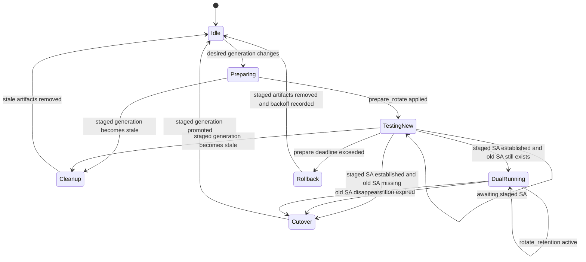
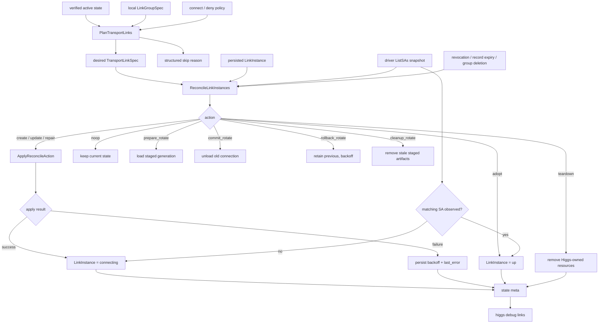
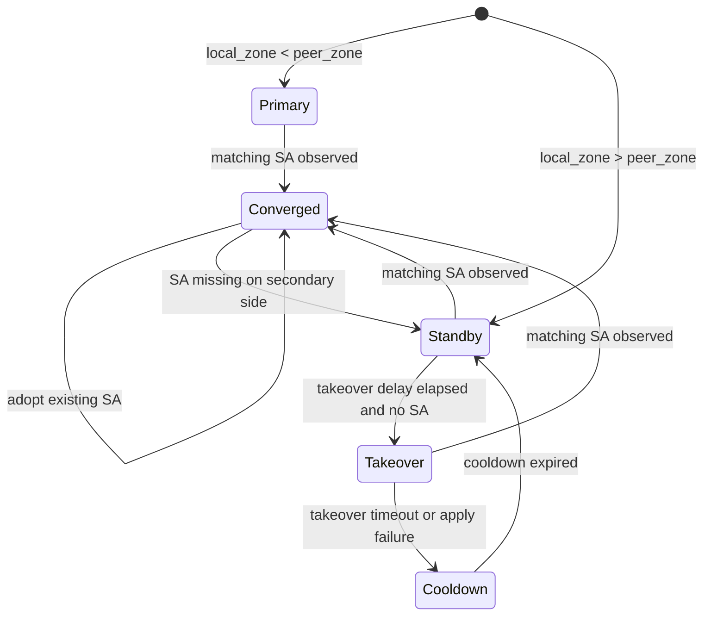

# Higgs 协议总览

> **文档状态（2026-06）**  
> 本文是 Higgs 控制面协议入口，保留跨模块总览和 IPsec / overlay signed record 规范。Gossip wire、sync round、catalog 分页、object pull、chunk fallback、endpoint discovery 和 NAT observed path 的细节已独立到 [`docs/gossip-protocol.md`](gossip-protocol.md)。

Higgs 的控制面由两层组成：

- **Signed Zone state**：Zone authority、delegation、record、revocation 和 derived root digest 构成全网可验证事实。
- **Runtime apply**：daemon 从 verified active state 派生 IPsec/XFRM、BIRD/Babel、firewall、health 和 observer 的本机 desired state。

不要把“状态传播协议”和“本机 apply 逻辑”混在一起：gossip 只负责传播并验证 signed state；StrongSwan、XFRM、BIRD、firewall 等系统动作只在本机 daemon reconcile 阶段执行。

---

## 1. Gossip 状态同步

Gossip 是 Higgs 在 peer 之间同步 signed Zone state 的协议。详细规范见 [`docs/gossip-protocol.md`](gossip-protocol.md)。这里仅保留总边界：

- UDP control message 必须 bounded，不能承载 unbounded list 或 bulk object。
- 下一步目标同步模型是 `catalog_root + catalog page diff + object pull`。
- `announce` 是 state-change hint + optional small payload，不是完整对象事务。
- 完整 Zone snapshot / record object 默认通过 TCP object pull 获取；UDP chunk fallback 只在 TCP 不可达时兜底。
- signed endpoint record、reflector、DNS、bootstrap 和 observed UDP path 只影响可达性候选，不替代 Zone trust chain。
- relay 只在本地 verified active state 发生实际 digest 变化后触发。

关键运行入口：

| 入口 | 用途 |
|------|------|
| `higgs daemon` | 推荐长期运行入口；单 UDP reader、事件循环、control socket、endpoint publish、relay、object pull worker |
| `higgs sync run` | 兼容入口，内部复用 daemon service |
| `higgs sync once <peer>` | 手动单轮同步 / smoke / 排查 |
| `higgs sync serve` | 被动 UDP 服务，主要用于旧 smoke 和排查 |

---

## 2. IPsec / Overlay 公告协议（当前实现边界）

本节描述 Phase 4 当前使用的 IPsec/StrongSwan mesh 控制面记录和 daemon 处理边界。它们仍然是普通 Zone Record，通过本文前述 gossip 协议同步和验证；gossip 只负责传播 signed state，不直接解释或执行 StrongSwan 配置。真正的建链由本机 daemon 的 LinkPlanner 和 `provider=strongswan` 驱动完成。

Phase 4 的关键边界：
- 公开记录只表达节点的 IPsec 能力、accept intent、地址候选、端口公告和 transport key。
- 本地 MeshPolicy 规则不通过 gossip 公开；它属于本节点拓扑和安全策略。
- 地址与端口分离公告。远端运行时把 AddressCandidate 与 PortAdvertisement 组合成 ContactPoint 后再拨号。
- StrongSwan/VICI/XFRM apply 的身份、授权、transport key、profile 和 revocation 判断必须来自 verified active state。DNS、reflector、discovery server 可以作为运行时地址候选来源；这些地址候选不单独构成信任依据，最终仍需匹配 verified active state 中声明的 peer identity / transport key，并通过 IKEv2 认证。
- VICI socket、`charon`、XFRM interface、`CAP_NET_ADMIN`/root、UDP 端口可用性等 preflight 只决定本机是否能 apply；它们不是 gossip 记录，也不参与 Zone trust chain。
- daemon 只自动修改或清理能通过 `LinkInstance.Owner` 验证的本机资源。owner 必须绑定 `manager=higgs`、link group、instance id、transport id 和 owner token；旧状态没有 token 时仍要求字段匹配并使用 Higgs 的 `ipsec-*` transport id / `hgs*` interface 命名约定。

### 2.1 Record key 与类型

`pkg/transport/ipsec` 已实现这些 record 的 Go 结构、解析/校验、ContactPoint 组合逻辑、planner/reconcile 核心和本机 StrongSwan/XFRM preflight 检测；daemon 仍必须只在记录已经通过 Zone trust chain 验证后使用它们。

当前 record：

| Key | Type | 用途 |
|-----|------|------|
| `ipsec/profile` | `ipsec.profile.v1` | 公开本节点 IPsec 能力、IKE identity、accept intent、NAT/reachability hint |
| `ipsec/addresses` | `ipsec.addresses.v1` | 公开地址来源与当前候选；包括 DNS 源、手工 IP、discovery、reflector、local |
| `ipsec/ports` | `ipsec.ports.v1` | 公开 IKE/NAT-T 端口策略、当前端口、旧端口 grace、observed external port |
| `ipsec/transport-key` | `ipsec.transport_key.v1` | 将 IKE public key / cert fingerprint 绑定到节点 Zone trust chain |
| `ipsec/overlays/<overlay_id>` | `ipsec.overlay_intent.v1` | 公开本节点愿意把节点级 IPsec capability 用于哪个 overlay/path，避免本地 connect 只匹配节点能力造成 overlay 错配 |

这些记录必须由节点自身 Zone 签名，例如 `node-a.catofes.` 只能为自己的 `ipsec/*` 记录签名。父 Zone 的 delegation/revocation 仍然决定该节点是否被全网信任；一旦 Zone 被撤销，远端必须停止使用其 IPsec records，并 teardown 对应 LinkInstance。

`ipsec/profile`、`ipsec/addresses`、`ipsec/ports` 和 `ipsec/transport-key` 是节点级能力层；它们说明“这个节点能跑 IPsec、这些 endpoint/key 可用”。它们不单独授权某个 overlay 建链。`ipsec/overlays/<overlay_id>` 是 overlay/link intent 层；它说明“这个节点愿意在该 overlay/path 上使用节点级能力”。planner 必须同时验证节点 capability、本地 connect/deny policy 和远端 overlay intent 后才建立 `TransportLinkSpec`；缺少 intent 时输出 `missing_overlay_intent`，path/provider 不兼容时输出 `overlay_intent_mismatch`。

下一版链路身份以 `LinkID` 为唯一基础 ID：`LinkID = hash(sorted(local_zone, peer_zone), overlay_id, path_key)`。`path_key` 第一版为 `default`、`family:ipv4` 或 `family:ipv6`；后续可扩展到多出口、多 provider 或显式 path index。`LinkID` 两端一致、无方向、不随 rotate generation 改变；`LinkInstance`、routing、health 和 debug 应以它为稳定主键。StrongSwan connection、CHILD_SA、XFRM `if_id`、interface name 和 owner token 都是 runtime 派生资源名，而不是逻辑身份本身：

```text
RuntimeConnectionID = "ipsec-" + short(hash(LinkID, generation, provider, "runtime"))
ChildSAName         = RuntimeConnectionID + "-child"
XFRMIfID            = uint32(hash(LinkID, generation, provider, "xfrm-if-id"))
InterfaceName       = "hgs" + hex(XFRMIfID)
OwnerToken          = hash(LinkID, RuntimeConnectionID, "owner-token")
```

`"runtime"`、`"xfrm-if-id"`、`"owner-token"` 等字符串是 domain separator。实际系统资源名必须使用短名：StrongSwan connection/CHILD_SA 用 `ipsec-<12hex>` / `ipsec-<12hex>-r<generation>` 一类格式，Linux XFRM interface 继续使用 `hgs<8hex>`，满足接口名长度限制。Tunnel address 从 `LinkID + address_epoch + mode + pool? + lower/higher` 派生；`address_epoch=0` 表示稳定地址，staged rotate 若需要 old/new 同 family 双 running 则使用 generation 作为 address epoch，避免 `derived-pool` 在同一 netns 复用旧地址。`sequential-pool` 仅作为 legacy 兼容模式保留。

### 2.2 `ipsec/profile`

示例：

```json
{
  "version": 1,
  "enabled": true,
  "provider": "strongswan",
  "ike_identity": "node-a.catofes.",
  "transport_key_fingerprint": "b2:...",
  "accept": "inbound",
  "address_families": ["ipv6", "ipv4"],
  "path_modes": ["family-redundant", "exhaustive"],
  "nat": {
    "hint": "unknown",
    "inbound_reachable": "unknown"
  },
  "updated_at": 1717171717
}
```

字段语义：
- `enabled`：是否允许自动 IPsec mesh 使用该 profile。
- `provider`：第一版只接受 `strongswan`。
- `ike_identity`：IKE 层身份，默认等于 Zone FQDN。
- `transport_key_fingerprint`：引用 `ipsec/transport-key` 中的 public key/cert。
- `accept`：`none`、`inbound`、`bidirectional`。它是公开的连接意图摘要，不是完整拓扑。
- `address_families`：该节点愿意用于 IPsec 的地址族。
- `path_modes`：该节点可接受的 path mode。
- `nat.hint`：`public`、`behind_nat`、`unknown`。它只是 hint，不是安全事实。
- `nat.inbound_reachable`：`true`、`false`、`unknown`。只有配合已验证 ContactPoint 才能作为拨入依据。

### 2.3 `ipsec/addresses`

地址记录不包含端口。daemon 会从多个来源生成 AddressCandidate，远端按本地优先级和 rule 过滤。

```json
{
  "version": 1,
  "addresses": [
    {
      "id": "dns-main",
      "source": "manual-dns",
      "host": "node-a.example.com",
      "families": ["ipv6", "ipv4"],
      "refresh_seconds": 60,
      "priority": 90,
      "reachability": "public",
      "ttl_seconds": 300
    },
    {
      "id": "manual-v6",
      "source": "manual-address",
      "address": "2001:db8::10",
      "family": "ipv6",
      "priority": 100,
      "reachability": "public",
      "ttl_seconds": 3600
    },
    {
      "id": "reflector-v4",
      "source": "reflector",
      "address": "203.0.113.10",
      "family": "ipv4",
      "priority": 60,
      "reachability": "nat-observed",
      "last_observed": 1717171717,
      "ttl_seconds": 600
    }
  ],
  "updated_at": 1717171717
}
```

地址来源：
- `manual-address`：管理员显式配置的 IP。
- `manual-dns`：管理员显式配置的域名。记录必须保留域名本身；运行时按 `refresh_seconds` 解析 A/AAAA。
- `discovery`：可选 discovery server 返回的候选地址或域名。
- `reflector`：反射服务看到的外部地址，常用于 NAT/公网变化场景。
- `local`：本机接口扫描结果。公网场景默认应允许禁用。

实现上，`pkg/transport/ipsec` 将 DNS/discovery host 解析作为运行时输入处理：signed record 保留 `host`，`ResolveAddressCandidates` / `ResolveContactPoints` 在传入 resolver 时才把 `manual-dns` 或 `discovery` host 的 A/AAAA 展开为可拨号的 `AddressCandidate` / `ContactPoint`，并保留原始域名、family、TTL/refresh 元数据。没有 resolver 的 dry-run 仍可读取域名记录，但不会把未解析域名误当成 IP endpoint。

DNS 不是天然最高优先级。动态 DNS 很多时候只是 public reflector/discovery 的另一种外壳，因此本地配置必须允许调整 source order 或在 MeshPolicy rule 中限制 source。当前 Go 实现通过 `AddressCandidateOptions.SourceOrder` 和 `AllowedSources` 做来源排序/过滤，先按 source order，再按单条 priority 排序；`AllowPrivateLocal` 默认 false，公网默认不会把 local 私网、loopback、link-local 或 ULA 候选用于 IPsec 拨号。

### 2.4 `ipsec/ports`

端口记录不包含 IP。节点可以固定端口，也可以在配置范围内选择端口并公告。端口轮换时同时保留 current 与 previous grace，远端在 grace 内可回退旧端口。

```json
{
  "version": 1,
  "mode": "range",
  "range": {"from": 30000, "to": 30999},
  "current": {
    "generation": 42,
    "ike": {"local": 30412, "advertised": 30412, "observed": 30412},
    "natt": {"local": 30413, "advertised": 30413, "observed": 30413},
    "valid_until": 1717175317
  },
  "previous": [
    {
      "generation": 41,
      "ike": {"advertised": 30100},
      "natt": {"advertised": 30101},
      "valid_until": 1717172017
    }
  ],
  "updated_at": 1717171717
}
```

端口字段：
- `local`：本机 StrongSwan/charon 监听端口。
- `advertised`：希望远端拨入的端口。
- `observed`：reflector/discovery 看到的外部端口。NAT 后可能不同于 `local`。
- `generation`：端口选择代数，用于判断新旧公告。
- `valid_until`：端口公告过期时间；过期后远端不得继续尝试。

`pkg/transport/ipsec.PlanPortRecord` 是第一版本地端口选择边界：未配置时发布标准 500/4500；固定端口按配置发布；范围端口按 `generation` 稳定选择一组 IKE/NAT-T 端口；轮换时把上一代 `current` 带入 `previous` 并设置 grace `valid_until`。peer 端只把未过期的 `current` / `previous` 与 address candidates 组合成 `ContactPoint`，不把端口写死到地址里。

UDP 500/4500 是 IKE/NAT-T 的传统默认值，但 Higgs 协议层不能把它们写死。StrongSwan 当前的实际边界是：`charon.port` / `charon.port_nat_t` 控制本地监听端口，`swanctl.conf` connection 的 `remote_port` 可指定远端端口；自定义 server port 是 NAT-T socket 语义，provider 应把 peer 的 NAT-T advertised/observed port 写入 `remote_port`，并保持 `encap=yes`，而不是把 IKE advertised port 当成 UDP-encapsulated ESP 的入口。MOBIKE 默认可能把会话漂移到 NAT-T 端口；Higgs 管理的 StrongSwan connection 会显式 `mobike=no`，减少端口观测歧义。当前已经实现的系统 rotate 是 **staged 数据面 generation**：daemon/reconcile 为新 generation 加载独立 CHILD_SA/XFRM interface，观测 staged SA 后进入双 running 保留窗口。staged 的意思是“预备/影子”：先在旧链路旁边搭一条候选新链路，确认可用后再切换、保留或回滚；它不是第三种端口。但这仍不等于本机 StrongSwan 单实例能同时监听 old/current advertised inbound 端口。入口端口双接收需要后续 DNAT/redirect grace 或多 listener 能力，Phase 7 只保留高频/对抗性 port hopping。

Phase 4.4/4.4.x 的端口 rotate 状态机分为两层协议语义：

- **入口端口 generation**：`ipsec/ports.current.generation` 是远端 planner 看到的新入口端口代数。`previous[].valid_until` 是旧入口端口的公告 grace，表示远端还可以尝试 old port；它不保证本机 StrongSwan 单实例正在同时监听 old/current。真正让 inbound 入口无断接收 old/current，需要后续 DNAT/redirect grace 或多 listener 能力。
- **数据面 staged generation**：reconcile 看到远端 generation 变化时，不直接覆盖现有 `LinkInstance`，而是派生 staged `TransportLinkSpec`。staged spec 是“预备新链路”的规格，使用独立 `TransportID`、XFRM `if_id` 和 interface；旧 SA/interface 在 staged 建立期间保持可用。

当前代码中的状态、动作和持久化字段如下：

| Phase | 进入条件 | Reconcile action / reason | 系统动作 | 退出条件 |
|-------|----------|---------------------------|----------|----------|
| idle | `RemoteGeneration == desired generation` 且无 staged generation | `noop` / 常规 create-update-repair-adopt 路径 | 保持或修复当前 generation | 远端 `ipsec/ports.current.generation` 改变 |
| preparing | 远端 generation 改变，且无现存 staged generation | `prepare_rotate` / `remote port generation changed` | 生成 staged connection/CHILD_SA/interface；primary/outbound/takeover owner 主动 initiate，inbound/standby 只加载 responder/trap | 下一轮进入 `testing_new`，或发现 stale staged generation |
| testing_new | staged generation 已落盘但 VICI `ListSAs` 尚未观测到 staged SA | `prepare_rotate` / `awaiting staged sa` | 重试/确认 staged config，不拆旧 generation | staged SA established -> `dual_running`；deadline 超时 -> `rollback` |
| dual_running | staged SA established，旧 SA 仍存在，`rotate_retention` 未到期，或 route manager 尚未允许切换 | `noop` / `rotate retention active` 或 `route_cutover_pending` | 新旧 generation 并行；旧 generation 保留给 Babel/route manager 收敛和回滚 | retention 到期且 route manager 允许 cutover，或旧 SA 已不存在 |
| cutover | staged SA established，且无需继续保留旧 generation | `commit_rotate` / `staged sa established` | promote staged generation 为当前 generation；terminate/unload/delete 旧 connection/interface | 回到 idle |
| rollback | staged SA 在 prepare deadline 前未建立，或 apply 失败进入 backoff | `rollback_rotate` / `staged sa deadline exceeded` | 只清 staged artifacts，旧 generation 保持可用，记录 `LastError`、`FailureCount`、`BackoffUntil` | backoff 到期后可重新 prepare |
| cleanup | staged generation 与当前 desired generation 不一致，或 spec 更新留下旧 rotated connection | `cleanup_rotate` / `stale staged generation` 或 `old rotated connection after spec update` | 清理过期 staged/旧 connection，不 promote | 回到 idle 或重新 prepare |

状态机图：



Initiator 规则：

- `primary` 或 `secondary-takeover` 负责主动建立 staged generation。
- `secondary-standby` 和 responder-only 角色只加载 responder/trap staged config，不主动拨号。
- `secondary-takeover` 已拥有 takeover lease 时按主动 owner 处理，可以 staged initiate。
- `secondary-standby` 在 staged/`dual_running` deadline 未到期时返回 `rotate_staged_active` / `rotate_retention_active` noop，不会因为 takeover delay 到期而抢拨；只有当前 owner 超时且没有可用 staged/old SA 时，才回到 4.5 takeover 逻辑。

持久化和观测字段：

- `RemoteGeneration`：当前已采用的远端 port generation。
- `StagedGeneration`：正在测试或保留的 staged port generation。
- `RotatePhase`：`preparing`、`testing_new`、`dual_running`、`rollback`、`cleanup` 或空值 idle。
- `StagedIKEName` / `StagedChildSAName`：由 `RotateConnectionName(transportID, generation)` 和 `RotateChildSAName(transportID, generation)` 派生。
- `StagedInterfaceName` / `StagedXFRMIfID`：staged generation 独立 XFRM 数据面身份。
- `RotateDeadline`：在 `testing_new` 中表示 prepare timeout；在 `dual_running` 中表示旧 generation retention 截止时间。
- `LastError`、`FailureCount`、`BackoffUntil`：rollback/apply failure 后的节流和诊断信息。

配置窗口要分清职责：`ipsec.port_previous_grace` 覆盖“远端还能尝试旧入口端口”的窗口；`overlays[].reconcile.rotate_retention` 覆盖“本地新旧 XFRM/Babel 数据面并行”的窗口，默认 1h。配置校验要求 previous grace 至少覆盖 rotate retention。Phase 5 route/Babel manager 可通过 `ReconcileInputs.RotateCutoverReady[instance_id]=false` 明确阻止 retention 到期后的 `commit_rotate`，此时 reconcile 返回 `noop` / `route_cutover_pending` 并继续保留旧 generation；未提供该输入时保持 Phase 4 默认行为，retention 到期即可切换。revocation、policy deny、record expiry、transport key/profile mismatch 仍走强制 teardown，不进入 rotate 状态机。

endpoint 变化与 rotate 的关系由 reconcile 的判断顺序决定：

1. `contactGeneration(spec)` 取 desired ContactPoint 的 generation。
2. 如果 `LinkInstance.RemoteGeneration != desired generation`，进入 `handleRotate`。此时 staged spec 从最新 desired spec 派生，因此同时变化的 address/DNS/port 会一起进入 staged ContactPoint。
3. 如果 generation 没变，再比较 `TransportLinkSpecHash(spec)`。ContactPoint 地址、DNS 解析结果、端口、tunnel/interface 等普通 spec 字段变化会改变 hash，触发 `update` / `repair`，不进入 rotate。

因此：endpoint-only 变化是外层 reconcile update；endpoint + generation 变化是 rotate staged transition；revocation/policy/key/profile 失效仍优先 teardown。

### 2.5 `ipsec/transport-key`

IPsec/IKE 认证材料不得复用 Zone signing key。节点应生成独立 IKE key/cert 或 raw public key，再用 Zone record 把该 transport key 绑定到信任链。

transport private key 是 daemon 本地持久化材料，不进入 gossip。`ipsec/transport-key` 只发布 public key、algorithm、fingerprint 和有效期；生成 record 时必须显式拒绝与当前 Zone signing public key 相同的 raw public key。第一版 fingerprint 使用 `higgs.ipsec.transport-key.v1` domain-separated BLAKE2b-256，对 algorithm 和 public key 一起取 hash，并以冒号分隔 hex 输出。

示例：

```json
{
  "version": 1,
  "kind": "raw-public-key",
  "algorithm": "ed25519",
  "public_key": "base64...",
  "fingerprint": "b2:...",
  "not_before": 1717170000,
  "not_after": 1722440400,
  "updated_at": 1717171717
}
```

优先使用 Ed25519。若 StrongSwan/部署环境兼容性不足，可退到 ECDSA P-256。RSA 长 key 会显著增加 record 和控制面体积，不作为默认路线。

### 2.6 远端公告到本机建链的处理流程

远端节点如果之前没有广播 StrongSwan/IPsec 能力，现在开始广播完整且可连接的 `ipsec/*` records，本机处理顺序如下：

```text
1. gossip 收到 announce。
2. SyncRuntime.handleAnnounceUntil 处理 snapshot / record / digest。
3. ApplySnapshot 或 ApplyRecordSnapshot 验证 Zone trust chain、record 签名、版本和 revocation 边界。
4. 只有 verified active state digest 发生变化时，daemon 才进入 remote-applied/state-changed 路径。
5. daemon 调用 notifyStateChanged；事件队列 drain 期间只标记 ipsecDirty，队列结束后统一 flush。
6. reconcileIPsecLinks 读取本地 LinkGroupSpec，调用 PlanTransportLinks 重算 desired links。
7. ReconcileLinkInstances 对比 desired spec、持久化 LinkInstance、driver ListSAs 观测和 revoked peers。
8. create/update/repair/teardown 动作进入 ApplyReconcileAction；adopt/noop 不触发系统 apply。
```

这条路径有几个重要边界：

- **信任边界**：远端 announce 本身不授权建链；只有已验证的 active state 中的 peer Zone、节点级 `ipsec/profile` / `ipsec/addresses` / `ipsec/ports` / `ipsec/transport-key` 和匹配的 `ipsec/overlays/<overlay_id>` intent 才能进入 planner。
- **本地策略边界**：远端声明 `enabled=true` / `accept=inbound` 只表示它愿意被尝试连接；本机是否连接仍由本地 `LinkGroupSpec` / MeshPolicy connect/deny rule 决定。
- **可达性边界**：DNS、reflector、discovery、observed port 只提供 runtime ContactPoint 候选，不成为身份或授权依据；NAT 后 peer 如果没有 public/observed/映射等证据，会被 `no_inbound_nat_evidence` skip。
- **幂等边界**：短时间收到 profile/address/port/key 多条 record 时，daemon 会把同一轮 state change 合并为一次 IPsec `ListSAs` + reconcile/apply，避免重复加载同一个 connection/interface。
- **状态边界**：apply 成功只把 `LinkInstance` 推进到 `connecting`；必须后续 `ListSAs` 观测到匹配 IKE/CHILD_SA 后才进入 `up`。

如果远端只发布了其中一部分节点能力记录，例如只有 `ipsec/profile` 但没有 `ipsec/transport-key` 或端口公告，planner 必须输出 `missing_ipsec_records`，不会创建 `TransportLinkSpec`。如果节点能力完整但缺少当前 overlay 的 `ipsec/overlays/<overlay_id>`，planner 输出 `missing_overlay_intent`；如果 intent 的 provider/path_key 或 tunnel address mode/family/pool 与本地 group 不兼容，输出 `overlay_intent_mismatch`。如果远端完整发布后又被父 Zone revocation/tombstone 撤销，planner 停止输出 desired spec，reconciler 对已有 Higgs-owned instance 生成 teardown，并阻止后续 endpoint fallback 或 backoff repair 把它重新拉起。

### 2.7 LinkPlanner 组合语义

LinkPlanner 输入：
- verified active state 中的 peer Zone 和 `ipsec/*` records。
- 本机 MeshPolicy rule。
- 本机 address source order、端口策略、连接成功/失败历史。
- delegation revocation/tombstone 状态。

处理流程：

```text
1. 扫描 verified peer zones。
2. 读取 peer 节点级 IPsec records；缺 profile/address/port/transport-key 任一项则 skip。
3. 读取 peer `ipsec/overlays/<overlay_id>` intent；缺少或 provider/path_key/tunnel address 不兼容则 skip。
4. 读取 ipsec/addresses；解析 DNS 源，过滤过期/来源不允许/地址族不允许的候选。
5. 读取 ipsec/ports；过滤过期端口，优先 current，grace 内保留 previous fallback。
6. 组合 AddressCandidate + PortAdvertisement => ContactPoint。
7. 根据 path mode 选择 ContactPoint：
   - family-redundant：每个地址族最多一条。
   - exhaustive：尽量保留所有允许候选。
8. 输出 TransportLinkSpec 给 provider=strongswan。
```

provider apply 的第一版可审计边界已经固定在 `ApplyTransportLink` / `ApplyPlan`：先确保目标 namespace，再加载 StrongSwan connection，然后确保 XFRM interface，最后分配本地 tunnel address。dry-run driver 记录同一顺序，使非 root 环境也能验证 desired config 推导和错误路径；真实 VICI/netlink provider 应保持同一操作顺序和 plan 输出。

当前 `pkg/transport/ipsec` 的 planner/reconcile 主线可以按“公告 -> 规划 -> 对账 -> 应用 -> 观测”理解：



规划层只负责回答“应该尝试建哪些 link”。`PlanTransportLinks` 从 verified active state 和本地 `LinkGroupSpec` 推导 desired `TransportLinkSpec`，并应用 zone exact/glob connect/deny rule。缺少 `ipsec/*` record、profile disabled、policy 不匹配、accept 组合不兼容、地址族或 path mode 不支持、没有可拨 ContactPoint、NAT 后缺少公网证据等情况都会变成结构化 skip reason。`role` / `tag` selector 已完成解析，但在本地 peer label 来源接入前不会匹配。

公告层由配置了 `overlays:` / link group 的 daemon 自动完成。本节点会发布 signed `ipsec/profile`、`ipsec/addresses`、`ipsec/ports`、`ipsec/transport-key` 和每个本地 StrongSwan overlay 对应的 `ipsec/overlays/<overlay_id>` intent records。transport key 独立于 Zone signing key，并持久化在本地 state meta 中，避免 daemon 重启或重复发布时造成 fingerprint / profile version 抖动。

持久化层用 `LinkInstance` 记录本机已经知道的 link 实例：desired spec hash、实际状态、XFRM if_id、IKE/CHILD_SA 名称、endpoint、Higgs owner、failure count、backoff_until 和 last_error。`ReconcileLinkInstances` 再把 desired spec、持久化 instance、driver `ListSAs` 观测和 revocation 输入放在一起，产生 `create`、`update`、`adopt`、`repair`、`teardown` 或 `noop` action。

daemon 已经把这条链路接入 state-change hook。启动进入主循环前，daemon 会先用当前 active state、本地 `LinkGroupSpec`、持久化 `LinkInstance` 和 driver SA 快照跑一次 reconcile，恢复 link state；事件队列 drain 时会合并多次 state change，让同一轮 record/admin/remote apply、VICI `child-updown` / `ike-updown` event 或 config reload 只触发一次 IPsec `ListSAs` + reconcile/apply。VICI event 只标记 dirty，不直接创建/删除 StrongSwan connection 或 XFRM interface。每个 daemon sync tick 后还会执行一次 IPsec observe/reconcile，用 driver `ListSAs` 把 StrongSwan 已建立的 `connecting` link 推进到 `up`。`reload` 会重新读取本地 `config.yaml`，刷新 `netns:`、`overlays:`、`connect/deny`、sync/log 配置并触发 reconcile；如果 reload 会改变当前 state DB 路径或 control socket 路径，则拒绝并要求重启。

状态语义上，create/update/repair apply 成功后实例进入 `connecting`，表示 provider 配置已经应用，但还没有观测到 IKE_SA/CHILD_SA；后续 driver `ListSAs` 看到匹配 connection/CHILD_SA 后才进入 `up`。apply 失败会先落盘 backoff 状态，backoff 未到期时返回 `noop/apply backoff active`，到期后 error/degraded link 再进入 repair。teardown 成功会从本地持久化状态移除对应 `LinkInstance`，因此 link group 删除、record 过期或 peer revocation 不会留下 `removing` 实例在后续轮次反复 teardown。

观测层由 reconcile 摘要和 `higgs debug links` 提供。reconcile 摘要保存最近 desired spec 快照和 SA 快照；`higgs debug links` 会用当前 active state + `LinkGroupSpec` 重算 desired links，并和已落盘 instance、上次 SA/CHILD_SA、endpoint、spec hash、backoff、last error 并排展示。SA 快照保留 VICI `list-sas` 中的 local/remote identity、local/remote endpoint、CHILD_SA name、reqid 和 XFRM if_id，供后续系统 smoke 与 `swanctl --list-sas` 做字段级交叉检查。

默认 `ipsec.driver` 为 `strongswan`，但没有本地 `overlays:` link group 时 daemon 不会初始化 VICI/XFRM driver，也不会发布 `ipsec/*` records；非 root 开发/CI 可显式配置 `dry-run`。真实 XFRM interface 采用 host-born 生命周期：先在 charon/state/policy 所在 host netns 创建，再 move 到 overlay netns；地址、BIRD/Babel 和 overlay firewall 继续留在 overlay netns。显式 root/container smoke 已覆盖真实 StrongSwan/VICI apply、XFRM interface 实际状态观测，以及两个 daemon service 在 `Run` 循环中自动发布并 gossip 同步 `ipsec/*` records 后触发 IKE/CHILD_SA bring-up 和 tunnel ping。daemon service 级重启恢复（观测已有 SA、唯一 SA 断言、继续 tunnel ping）和 revocation teardown（terminate/unload/delete interface、清空 `LinkInstance`、tunnel ping 失败）已在 root/container smoke 中完成；外部 `build/higgs daemon` 双 OS 进程级验证和 gossip revocation 传播仍作为后续 hardening。

`ResourceOwner` 当前包含 `manager`、`group_id`、`instance_id`、`transport_id` 和派生 `token`。当 persisted instance 不再出现在 desired set 中时，reconcile 会先验证 owner；无法证明属于 Higgs 的实例会保留为 noop，并在 reason 中说明 retained unmanaged resource。`ApplyReconcileAction` 对 instance-only teardown 再执行同样校验，因此 revocation/restart recovery 只能自动删除可追溯到 `LinkGroupSpec` + `LinkInstance` 的资源。

StrongSwan 控制面通过 VICI command 完成，不解析 `swanctl` 输出作为核心状态来源。`StrongSwanDriver` 发出的最小命令集是：

- `load-conn`：加载由 `TransportLinkSpec` 渲染出的 connection / CHILD_SA。
- `terminate`：撤销或删除时终止对应 IKE_SA / CHILD_SA。
- `unload-conn`：从 charon 卸载 Higgs 管理的 connection。
- `list-sas`：读取运行态 SA 状态，供后续 LinkInstance/reconcile/debug 使用。

VICI message 的 connection 形状保持接近 `swanctl.conf`：local/remote auth 使用独立 transport key 对应的 `pubkey` 身份，remote address/port 来自选中的 `ContactPoint`，每条 link 只有一个 route-based CHILD_SA。CHILD_SA 设置 `mode=tunnel` 和稳定的 `if_id_in` / `if_id_out`；traffic selector 保持宽泛，IPv4 tunnel link 使用 `0.0.0.0/0`，IPv6 tunnel link 使用 `::/0`。Phase 4 不在 selector 中表达多前缀授权；Babel route filter 和 prefix authorization 留给 Phase 5。

teardown 的第一版顺序固定为 `TeardownTransportLink` / `PlanTeardown`：terminate SA -> unload connection -> delete XFRM interface。对没有 desired spec、只来自 persisted `LinkInstance` 的 teardown，daemon 必须先通过 owner 校验；teardown 成功后 daemon 删除本地 persisted `LinkInstance`，让 restart/state-change reconcile 不会重复清理同一条已删除链路。

accept-only 角色组合：

| 本节点 accept | 远端 accept | 本节点行为 |
|---------------|-------------|-----------|
| `none` | `inbound` / `bidirectional` | 主动拨号 |
| `inbound` | 任意 | 只加载接收/trap 配置，不主动拨号 |
| `bidirectional` | `inbound` | 主动拨号 |
| `bidirectional` | `bidirectional` | 用 peer zone 字典序稳定排序决定首拨方 |
| `bidirectional` | `none` | 加载接收/trap 配置，等待远端拨入 |
| `none` / `inbound` | `none` | 不自动建链 |

`ipsec.accept` 在节点级配置并写入 `ipsec/profile`。Bidirectional 选主只在“本节点 `accept=bidirectional`，且远端 profile `accept=bidirectional`”时启用。算法不需要网络协商，双方只要看到同一对 zone 名称就会得到互补结论：

```text
if local_zone < peer_zone:
    local role = primary
else:
    local role = secondary-standby
```

例子：

| 本地节点 | 对端节点 | 比较结果 | 本地 initiator_role | 初始行为 |
|----------|----------|----------|---------------------|----------|
| `node-a.catofes.` | `node-b.catofes.` | `node-a... < node-b...` | `primary` | 主动 initiate |
| `node-b.catofes.` | `node-a.catofes.` | `node-b... > node-a...` | `secondary-standby` | `noop/bidirectional_standby`，只加载 responder/trap |

选主结果写入 `TransportLinkSpec.InitiatorRole`，但该字段不进入 `TransportLinkSpecHash`。这意味着 standby、takeover、converged 这些运行态角色变化不会被误判为 desired spec 变化，也不会无意义触发 update。

角色状态机：



Takeover 是连通性失败处理，不是重新选举：

- `primary` 仍是稳定排序选出的默认主动方。
- `secondary-standby` 只有在本地长期看不到匹配 SA、takeover delay 到期、仍有可拨 ContactPoint、且没有 revocation/policy/key/profile 失败时，才进入 `secondary-takeover`。
- `secondary-takeover` 有 lease，避免刚接管就被 primary 抢回；失败后进入 cooldown，避免紧密重试。
- 一旦任意一侧观测到 matching SA，reconcile 优先 adopt，角色进入 `converged`。
- primary 后续恢复时如果 SA 已存在，只 adopt，不立即拆掉 secondary takeover 建好的链路。

NAT 组合：
- 公网 inbound 节点 + NAT/outbound-only 节点：NAT 后节点主动拨公网节点是第一版主路径。
- 公网节点主动拨 NAT 后节点：只有在远端有 IPv6、静态映射、已验证 observed external port、打洞或 relay 时才可尝试。
- 两端都在 NAT 后且没有可验证公网 ContactPoint：LinkInstance 进入 `degraded`，debug 输出说明不可达原因。

### 2.8 本地 MeshPolicy 规则

MeshPolicy 本地持久化，不进入 gossip。为了保持配置简单，第一版使用 URI 规则：

```yaml
overlays:
  - name: ipsec-main
    provider: strongswan
    connect:
      - "strongswan://*.catofes.?accept=bidirectional&family=dual&source=manual-dns,discovery&mode=family-redundant"
      - "strongswan://edge.catofes.?accept=bidirectional&family=dual"
    deny:
      - "strongswan://*.lab.catofes."
```

第一版支持的 predicate：
- zone glob / exact。
- `role` / `tag` 作为本地 peer label 来源接入后的预留 selector；默认示例使用 zone glob / exact。
- `accept`。
- `family`。
- `source`。
- `mode`。
- `max_peers`。

规则应先处理 deny，再按 connect 顺序选择。正则表达式不是第一版默认能力；glob/suffix/label 更容易审计。

---

## 3. 安全机制

### 3.1 节点身份验证

传输层维护两个集合：

- **`knownPeers`**（入站白名单）：包含 bootstrap 配置中的 peer ID + 本地 active state 中所有 `VerifyChain` 通过的 Zone path。每个接收到的数据包检查 `peer_id` 是否在此集合中，否则丢弃（`ErrUnknownPeer`）。
- **`outboundAddrs`**（出站地址簿）：来自 `config.bootstrap` 中的静态地址 + 从 `sync/endpoint/udp` record 中动态发现的地址。发送时按优先级依次尝试。
- **`lastSeenAddrs`**（临时入站反向地址）：`Send()` 在无出站地址时，回退使用最近一次收到该 peer 数据包的 UDP 源地址。

节点在启动时从 `bootstrap` 配置注册，在运行时从发现的 Zone 和端点记录动态扩展。

### 3.2 反重放窗口

每条消息都携带随机 `nonce` 和 `timestamp`。接收方检查两者：

- **时间戳窗口** — 消息时间戳必须落在接收方本地时钟的 `±5 分钟` 内。否则拒绝并返回 `ErrMessageExpired`。
- **Nonce 唯一性** — 窗口内不得存在相同的 `(peer_id, nonce)` 对。否则拒绝并返回 `ErrReplay`。

发送方在 `nonce` 和 `timestamp` 为零时自动填充（64 位随机数 / Unix 秒）。

### 3.3 速率配额

每个节点都有令牌桶配额，在发送和接收时强制执行：

| 资源 | 默认速率 | 默认突发 |
|----------|-------------|---------------|
| 字节 | `256 KiB/s` | `256 KiB` |
| 对象（区域） | `128/s` | `128` |

超过任一限制将返回 `ErrQuotaExceeded`，数据包被丢弃。

### 3.4 签名验证

所有区域数据（authority、委托、记录）都经过密码学签名。Gossip 层本身不验证签名，而是委托给 `zone` 和 `crypto` 包：

- `VerifyChain` — 确保区域的委托链追溯到配置的根公钥。
- `VerifyRecord` — 确保每条记录由区域 authority 签名。
- `VerifyDelegation` — 确保子委托由父 authority 签名。

任何密码学检查失败的数据都会在到达活跃存储之前被拒绝。

---

## 4. 配置参考

影响 gossip 行为的 `config.yaml` 关键配置项：

```yaml
gossip:
  peer_id: node-a
  listen_addr: "[::]:33434"
  max_datagram_bytes: 1200
  max_sync_zones: 16
  max_sync_records: 1024

  # 静态 bootstrap 节点（始终允许）
  bootstrap:
    - id: node-b
      addr: 127.0.0.1:33435

  # 可选：显式公告地址（覆盖接口扫描）
  advertise_addrs:
    - 10.0.0.1:33434
    - 10.0.0.2:33434

  # 可选：公网 IP 反射器；auto 展开内置 ddns-go 风格 reflector 列表
  reflectors: auto
  reflector_interval: 5m
  reflector_timeout: 3s
  endpoint_ttl: 1h
  endpoint_grace: 10m
```

| 键 | 默认值 | 含义 |
|-----|---------|---------|
| `gossip.listen_addr` | `[::]:33434` | UDP 绑定地址，通常同时接收 IPv4 和 IPv6 |
| `gossip.max_datagram_bytes` | `1200` | 单个 gossip UDP datagram 的安全预算 |
| `gossip.max_sync_zones` | `16` | 每个 `ANNOUNCE` 快照的最大区域数 |
| `gossip.max_sync_records` | `1024` | 每个 `ANNOUNCE` 的最大记录数 |
| `gossip.advertise_addrs` | （自动） | 显式发布到端点记录的地址列表 |
| `gossip.reflectors` | `[]` | 公网 IP reflector URL 列表；设为 `auto` 使用内置列表，设为 `none`/`off` 禁用 |
| `gossip.reflector_interval` | `5m` | 重新发布本地端点的间隔 |
| `gossip.reflector_timeout` | `3s` | 单个 reflector HTTP 请求超时；失败会尝试后续 reflector |
| `gossip.endpoint_ttl` | `1h` | 写入端点记录的 TTL |
| `gossip.endpoint_grace` | `10m` | endpoint 变化后继续保留旧地址的窗口 |
| `gossip.filter_private_ipv4` | `true` | 接口扫描时过滤 RFC1918 IPv4；私网实验可显式设为 `false` |

Phase 4 当前的 IPsec/overlay 配置形状如下。字段细节以 `app/higgs/config.go` 的解析结构为准，但语义边界已经稳定：`gossip.init.managed_zone` + `gossip.init.key_path` 声明本节点不可变身份，配置文件只引用 ED25519 私钥文件路径，不内嵌私钥；本机 `ipsec` 负责本节点公开能力和地址/端口来源，`netns` 负责声明本机 network namespace，`overlays[]` 负责本机 LinkGroup/MeshPolicy desired-state。

```yaml
trusted_root_public_key: "<base64-or-hex-root-public-key>"
gossip:
  init:
    managed_zone: node-a.catofes.
    key_path: .higgs/identity.key.json
  bootstrap:
    - id: catofes.
      addr: 203.0.113.10:33434

ipsec:
  provider: strongswan
  accept: inbound

  address_source_order:
    - manual-address
    - manual-dns
    - discovery
    - reflector
    - local

  addresses:
    - source: manual-dns
      host: node-a.example.com
      families: [ipv6, ipv4]
      refresh: 60s
    - source: manual-address
      address: 2001:db8::10

  ports:
    mode: range
    range: 30000-30999
    grace: 2h

netns:
  default:
    kind: name
    name: h2
    create: true

overlays:
  - name: ipsec-main
    id: ipsec-main
    provider: strongswan
    netns: default
    default_path_mode: family-redundant
    # max_peers defaults to unlimited; set a positive value to cap peers.
    max_peers: 256
    max_links_per_peer: 2
    # Tunnel address allocation mode. Modes:
    #   derived-link-local  IPv6 fe80::/64 scoped link-local (default for IPv6)
    #   derived-pool        Deterministic host from the configured pool
    #   sequential-pool     Legacy index-based allocation (testing/migration only)
    #   disabled            No tunnel address assigned (default for IPv4)
    # Legacy field tunnel_address_pool maps to sequential-pool and cannot be used
    # together with tunnel_address.
    tunnel_address:
      mode: derived-link-local
      family: ipv6
    reconcile:
      interval: 1m
      # After a staged rotate path is established, keep the old generation
      # available during this local dual-running window. Default: 1h.
      rotate_retention: 1h
      # Retry throttle after failed provider apply, not normal reconcile
      # frequency. Defaults are exponential 1s..1m.
      backoff:
        initial: 1s
        max: 1m
    connect:
      - "strongswan://*.catofes.?accept=bidirectional&family=dual&source=manual-dns,discovery&mode=family-redundant"
    deny:
      - "strongswan://*.lab.catofes."
```

配置语义：
- `ipsec.accept` 会发布到 `ipsec/profile`，表示远端可以怎样尝试连接本节点。
- `netns.default` 是本机默认 LinkGroup / overlay data-plane namespace；默认 `name:h2, create:true`，让 StrongSwan/XFRM tunnel interface 和后续 BIRD 明确落在 Higgs 管理的 namespace，而不是隐式进入 host ns。其他命名 netns 与 `default` 并列声明。
- `ipsec.addresses` 是本节点可公告地址来源；DNS 源保留域名并定期 refresh。
- `ipsec.ports` 控制本节点选择和公告 IKE/NAT-T 端口；端口与地址分离。
- `overlays[]` 是本地 `LinkGroupSpec` / MeshPolicy desired-state 边界，包含 provider、netns、path mode、peer/link 上限、`tunnel_address` 分配模式（`derived-link-local`、`derived-pool`、`sequential-pool`、`disabled`）和 reconcile/backoff 策略，不发布到 gossip。本节点角色由 `ipsec.accept` 与远端 `accept` 推导，不在 group 中配置方向。IPv6 默认 `derived-link-local`，IPv4 默认 `disabled`；旧字段 `tunnel_address_pool` 仍映射为 `sequential-pool` 兼容模式，但二者不可混用。
- `overlays[].netns` 引用 `netns:` 中声明的名字；省略时使用 `netns.default`。旧配置中内联 `kind/name/path/create` 的写法仍兼容读取。
- `overlays[].connect/deny` 是 link group 内的本地 MeshPolicy rule，不发布到 gossip。
- `address_source_order` 只影响本地选择和排序；远端也会按自己的本地配置重新排序。

---

## 5. 总结

| 关注点 | 机制 |
|---------|-----------|
| **状态传播** | 基于 catalog 的选择性同步（`PING/PONG CatalogSummary` → `FETCH_CATALOG_PAGE` / `CATALOG_PAGE` → TCP object pull；`ANNOUNCE` 作为 hint / 小 payload 优化） |
| **收敛** | 每次应用变更后中继；gossip 式传递 |
| **冲突解决** | 单调版本号；时间戳仅用于审计 |
| **信任** | 完整委托链验证，追溯到受信任的根公钥 |
| **节点发现** | 每个节点自身区域中的签名 `sync/endpoint/udp` 记录 |
| **IPsec mesh 规划** | signed `ipsec/profile`、`ipsec/addresses`、`ipsec/ports`、`ipsec/transport-key` + 本地 MeshPolicy |
| **访问控制** | `knownPeers`（bootstrap + 已验证 Zone）；签名链验证身份 |
| **首次接入** | `AddKnownPeerID` 开放入站；`lastSeenAddrs` 回外地址；防死锁 |
| **反重放** | Nonce 唯一性 + 5 分钟时间戳窗口 |
| **DoS 缓解** | 每节点字节与对象速率配额；最大消息大小限制 |
